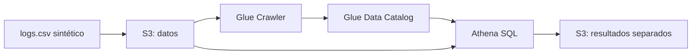

# 1.12. Laboratorio AWS S3–Glue–Athena

**CE que se trabajan:** b, f, g. Consulta el [texto oficial](ra1.md).

**Al terminar:** seleccionar e integrar almacenamiento, catálogo y motor SQL, comprobar su contrato y medir la explotación.

## El problema: analizar solicitudes de la web del hotel

Dirección quiere conocer qué páginas reciben solicitudes y qué proporción devuelve errores. Una fila será una **solicitud HTTP**, no una persona ni una reserva. No usaremos direcciones IP reales. El ejercicio reinterpreta el laboratorio docente de logs web: el objetivo es justificar la integración de sistemas, no aprender a administrar una plataforma cloud.

| Sistema | Responsabilidad en el análisis | Qué verificamos |
| --- | --- | --- |
| S3 | Objetos CSV de entrada y resultados | Ubicación y separación de prefijos |
| Glue Data Catalog | Esquema y ubicación lógica de la tabla | Columnas, tipos y formato |
| Glue Crawler | Propuesta automática de metadatos | Que la inferencia corresponde al contrato |
| Athena | Consultas SQL sobre datos y catálogo | Resultados, bytes escaneados y duración |



Un bucket contiene objetos identificados por claves; los prefijos simulan carpetas. El catálogo describe los datos, no sustituye a los objetos. Para CE f debes explicar por qué esa combinación responde al problema y qué alternativa local utilizarías.

## 0. Preparar el ensayo

Utiliza el laboratorio AWS Academy o cuenta docente que indique el profesor, su región, rol disponible y workgroup de Athena. El profesor debe comprobar permisos de S3, Glue y Athena y el límite de gasto antes de la sesión. No necesitas contratar una cuenta personal ni crear EC2. Los nombres de botones pueden cambiar; comprueba el recurso y el resultado de cada paso.

Guarda este programa como `generar_logs.py` en una carpeta de trabajo. Utiliza solo Python estándar y crea un fichero nuevo:

```python
import csv
from datetime import datetime, timedelta, timezone

inicio = datetime(2026, 9, 1, 10, tzinfo=timezone.utc)
with open("logs.csv", "x", newline="", encoding="utf-8") as f:
    w = csv.writer(f)
    w.writerow(["instante", "ruta", "pais", "estado"])
    for i in range(1000):
        w.writerow([(inicio + timedelta(seconds=i)).isoformat(),
                    ["/", "/habitaciones", "/reservar", "/contacto"][i % 4],
                    "ES" if i % 2 == 0 else "FR",
                    500 if i % 10 == 0 else 200])
```

Contrato: UTF-8, coma, comillas dobles, una cabecera, instante ISO 8601 UTC y estado HTTP numérico. Referencia manual: 1 000 solicitudes, 250 por ruta, 500 por país y 100 errores (10 %). Son datos artificiales, sin una distribución empresarial realista.

## 1. Situar los objetos en S3

En un bucket del aula, usa un prefijo exclusivo como `ut1-equipo/logs-raw/` y sube únicamente `logs.csv`. Reserva prefijos separados para resultados de Athena y Parquet. No sitúes resultados bajo el prefijo que se rastrea: una lectura posterior podría incorporar sus propias salidas.

Anota la URI `s3://.../ut1-equipo/logs-raw/`, número de objetos y tamaño. Conserva el original local para verificar la extracción.

## 2. Crear y revisar el catálogo

1. Crea una base de datos lógica de Glue para el equipo.
2. Define un crawler limitado al prefijo de entrada, con el rol autorizado y ejecución bajo demanda.
3. Ejecútalo una vez y abre la tabla generada.
4. Contrasta nombres, orden, tipos, delimitador y ubicación con el contrato. Anota el nombre real de tabla: puede diferir de `logs_raw`.
5. Para las consultas siguientes emplea una tabla llamada `logs_raw` o sustituye ese nombre por el real.

### Incidencia didáctica: cabecera y clasificador CSV

Si aparecen nombres genéricos como `col0` o la cabecera se cuenta como un registro, la integración todavía no está validada. Compara las primeras líneas del fichero con el catálogo.

- Define un clasificador CSV de Glue con delimitador coma, símbolo de comillas doble y cabecera presente (`PRESENT`); vincúlalo al crawler.
- Prueba la nueva clasificación con un crawler/tabla de ensayo nuevos, porque cambiar el clasificador no garantiza reclasificar objetos ya procesados.
- Comprueba de nuevo esquema y recuentos. No borres tablas compartidas para forzar un resultado.

El [clasificador CSV de Glue](https://docs.aws.amazon.com/glue/latest/dg/custom-classifier.html) propone metadatos; la propiedad de lectura de cabeceras debe ser coherente también en Athena. Son comprobaciones relacionadas, pero distintas.

## 3. Consulta verificable en Athena

Selecciona región, catálogo y base de datos correctos. Configura una ubicación de resultados separada, salvo que el workgroup ya la imponga. Crea esta **tabla externa de referencia** para contrastar la inferencia del crawler, con nombre nuevo, sustituyendo `BUCKET_AULA` y el prefijo por los asignados:

```sql
CREATE EXTERNAL TABLE logs_raw_control (
  instante STRING,
  ruta STRING,
  pais STRING,
  estado STRING
)
ROW FORMAT SERDE 'org.apache.hadoop.hive.serde2.OpenCSVSerde'
WITH SERDEPROPERTIES ('separatorChar'=',', 'quoteChar'='"')
STORED AS TEXTFILE
LOCATION 's3://BUCKET_AULA/ut1-equipo/logs-raw/'
TBLPROPERTIES ('skip.header.line.count'='1');
```

El nombre de la clase SerDe pertenece al lector usado por Athena; no implica impartir administración Hadoop. Leer como texto permite detectar conversiones fallidas explícitamente. La [documentación Open CSV SerDe](https://docs.aws.amazon.com/athena/latest/ug/csv-serde.html) explica la omisión de cabecera y limitaciones de tipos. Los ficheros de este ejercicio no contienen saltos de línea dentro de campos.

Usa `logs_raw_control` para las consultas de referencia; repítelas sobre la tabla del crawler tras verificar su esquema:

```sql
SELECT COUNT(*) AS solicitudes,
       COUNT_IF(TRY_CAST(estado AS INTEGER) IS NULL) AS estados_invalidos,
       COUNT_IF(TRY(from_iso8601_timestamp(instante)) IS NULL) AS fechas_invalidas
FROM logs_raw_control;

SELECT ruta, COUNT(*) AS solicitudes,
       COUNT_IF(TRY_CAST(estado AS INTEGER) >= 400) AS errores,
       100.0 * COUNT_IF(TRY_CAST(estado AS INTEGER) >= 400) / COUNT(*) AS porcentaje_error
FROM logs_raw_control
GROUP BY ruta
ORDER BY ruta;
```

Debes obtener 1 000 solicitudes y cero conversiones inválidas. `/` y `/reservar` tienen 50 errores cada una; las otras rutas, cero. Verifica además países y franjas horarias con `from_iso8601_timestamp(instante)`. Una consulta que se ejecuta sin error no demuestra que el catálogo sea correcto.

## 4. Comparar explotación CSV y Parquet

Crea una tabla derivada con un prefijo nuevo y vacío; si el workgroup impone otra ubicación, sigue la configuración docente y omite `external_location` cuando corresponda:

```sql
CREATE TABLE logs_parquet
WITH (
  format = 'PARQUET',
  external_location = 's3://BUCKET_AULA/ut1-equipo/logs-parquet-01/'
) AS
SELECT instante, ruta, pais, TRY_CAST(estado AS INTEGER) AS estado
FROM logs_raw_control;
```

No ejecutes la conversión hasta resolver inválidos. CTAS crea datos y metadatos; repetir exige una tabla y ubicación nuevas. Véanse los [ejemplos oficiales de CTAS](https://docs.aws.amazon.com/athena/latest/ug/ctas-examples.html).

Ejecuta la misma consulta de recuento por ruta para `pais = 'ES'` sobre ambas tablas. Son 500 solicitudes: 250 a `/` y 250 a `/reservar`. Registra el identificador de consulta, resultado, tiempo y bytes escaneados. Desactiva la reutilización de resultados para comparar lecturas o registra explícitamente que se ha reutilizado el resultado. `LIMIT` no es una garantía de reducción de todos los bytes escaneados.

| Ensayo | Filas del resultado | Bytes escaneados | Duración | Reutilización | Coste estimado |
| --- | --- | --- | --- | --- | --- |
| CSV | Comprobadas | Consola/estadísticas | Observada | Sí/no | Según condiciones del aula |
| Parquet | Las mismas | Consola/estadísticas | Observada | Sí/no | Según condiciones del aula |
| Conversión CTAS | 1 000 filas escritas | Registrar aparte | Observada | No aplicable | Añadir a la comparación |

Para consultas bajo modalidad por datos escaneados, estima a partir de los bytes facturables y tarifa vigente; considera mínimos/redondeos, moneda y modalidad del workgroup. Añade almacenamiento, solicitudes y crawler. No confundas crédito docente con coste cero. Con 1 000 filas, mínimos y sobrecostes pueden dominar; no prometemos ahorro. La [optimización de lecturas en Athena](https://docs.aws.amazon.com/athena/latest/ug/performance-tuning-data-optimization-techniques.html) sirve como referencia técnica, sin profundizar en diseño de almacenamiento.

## 5. Entrega y cierre

Entrega diagrama de sistemas, contrato, incidencia y corrección, consultas, resultados comprobados y comparación de costes. Explica qué ocurriría si el catálogo apuntara a un prefijo equivocado o incorporara una cabecera como dato. Al terminar, conserva evidencias y sigue las instrucciones del aula para retirar únicamente los recursos de tu ensayo; no dejes crawlers programados.

!!! example "Comprobación y alternativa de aula"
    Debes distinguir dónde están los datos, dónde se describen y quién ejecuta SQL. Si no hay acceso AWS, trabaja con una demostración docente y sus métricas o reproduce consultas localmente; identifica esa modalidad en la entrega. Una simulación local no acredita una integración AWS ejecutada ni aporta bytes cloud medidos.

El vídeo docente «Introducción Práctica AWS S3 Glue Athena» del 02/12/2025 es un apoyo opcional en Moodle cuando esté disponible. No sustituye este guion. No se publica una URL inventada ni se incorpora el vídeo al repositorio; consulta [referencias](referencias.md).
