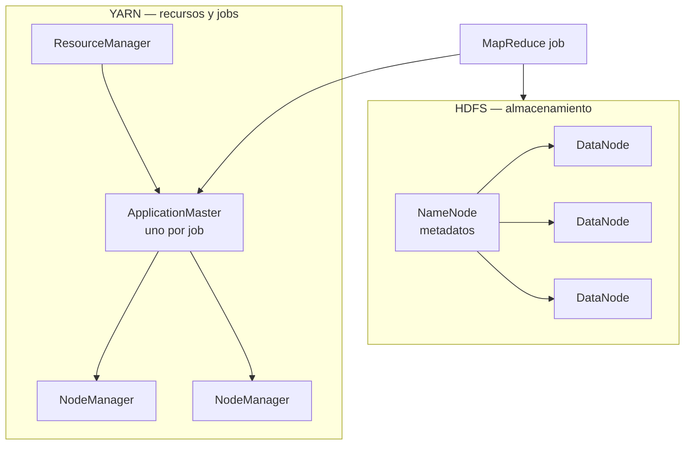

# Entorno Docker (apoyo) y clúster Hadoop

Guion de aula: eXe *Manual para Docker en Big Data* (clúster Hadoop en contenedores) y el PDF *Despliegue de un clúster mediante contenedores Docker* (Tomás Fernández Pena, CC BY-SA 4.0).

Docker **no** es un criterio propio del RA1. Este material es un **laboratorio de Hadoop en contenedores**: NameNode, YARN, DataNodes y un MapReduce de ejemplo. Sirve para **reproducir** un entorno distribuido en un solo PC y para el criterio **f)** (elegir e integrar sistemas) cuando el profesor lo pide.

Los ficheros pesados del aula (`Hadoop_cluster_profesor.zip`, `Hadoop_con_Docker.pdf`) **no** se copian a git; se descargan desde Moodle. Aquí queda la chuleta, la arquitectura, el guion paso a paso, el vídeo y el enunciado.

Licencia de partida del eXe: [CC BY-SA 4.0](https://creativecommons.org/licenses/by-sa/4.0/).

## 1. Qué problema resuelve

Instalar pandas, Java 8, Hadoop 3.3.6 y tres versiones de Python en el sistema del centro termina en conflictos de versiones, permisos y variables de entorno. Un **contenedor** empaqueta la receta (SO + Java + Hadoop + scripts). Un **Compose** levanta varias piezas —el clúster— con un solo fichero YAML.

| Concepto | En una frase |
| --- | --- |
| **Imagen** | Receta inmutable (`ubuntu`, `namenode-image:latest`) |
| **Contenedor** | Esa receta **en marcha** (una “máquina” aislada) |
| **Dockerfile** | Instrucciones `FROM` / `RUN` / `COPY` / `CMD` para construir una imagen |
| **Volumen** | Dato **fuera** del contenedor (persiste aunque borres el contenedor) |
| **Puerto** | Cómo entras desde el navegador (HDFS `9870`, YARN `8088`) |
| **Compose** | Varios servicios descritos juntos en `docker-compose.yml` |
| **Red** | Cómo se hablan NameNode, Resource Manager y workers (`hadoop-net`) |

No guardes secretos (claves AWS, tokens) en la imagen ni en el `compose` que subes a Moodle.

!!! tip "Docker ≠ venv"
    Para pandas y el generador de logs de [1.7](laboratorio-aws.md), un venv local basta. Usa Docker cuando toque el clúster Hadoop o un `docker-compose.yml` de aula.

```sh
python -m venv .venv
source .venv/bin/activate   # Windows: .venv\Scripts\activate
pip install pandas pyarrow faker
```

## 2. Objetivos de aprendizaje

Al terminar el manual y la actividad deberías poder:

- Identificar los componentes clave de un clúster Hadoop (HDFS, YARN, MapReduce).
- Usar Docker para simular un entorno distribuido en un solo equipo.
- Construir imágenes con Dockerfile y levantar servicios con Compose.
- Comprobar HDFS y YARN en las interfaces web.
- Lanzar un job MapReduce de ejemplo (cálculo de π) y leer el resultado.

## 3. Arquitectura de Hadoop (antes de picar Docker)

Hadoop es un framework open-source para aplicaciones distribuidas con Big Data. Procesa volúmenes enormes en clusters de hardware barato (*commodity hardware*). Tres piezas:

| Pieza | Qué hace |
| --- | --- |
| **HDFS** | Almacenamiento distribuido de ficheros grandes |
| **YARN** | Planificación de tareas y negociación de recursos |
| **MapReduce** | Modelo de procesamiento paralelo Map + Reduce |

Ventajas que el PDF destaca: bajo coste, facilidad de uso relativa y tolerancia a fallos (réplicas de bloques).



### 3.1. HDFS

**HDFS** (Hadoop Distributed File System) está pensado para ficheros **muy grandes** en hardware barato.

| Ventaja | Inconveniente |
| --- | --- |
| Alto ancho de banda | Latencia elevada |
| Fiabilidad por replicación | Poco eficiente con muchos ficheros pequeños |

**Demonios:**

- **NameNode**: guarda metadatos (qué ficheros existen, en qué bloques están, dónde viven las réplicas). **No** almacena los datos.
- **DataNodes**: guardan los bloques. No saben nada de “ficheros”; solo bloques.

**Conceptos de aula:**

| Propiedad | Valor por defecto | Fichero |
| --- | --- | --- |
| Tamaño de bloque | 128 MB | `hdfs-site.xml` → `dfs.blocksize` |
| Réplicas por bloque | 3 | `dfs.replication` |
| Metadatos del NameNode | `file://${hadoop.tmp.dir}/dfs/name` | `dfs.namenode.name.dir` |
| Datos del DataNode | `file://${hadoop.tmp.dir}/dfs/data` | `dfs.datanode.data.dir` |

**Interfaces HDFS:**

1. Línea de comandos: `hdfs dfs …`
2. Web: `http://localhost:9870`
3. API Java (fuera del alcance de UT1)

Comandos que usarás en la práctica:

| Comando | Significado |
| --- | --- |
| `hdfs dfs -ls <path>` | Lista ficheros |
| `hdfs dfs -mkdir -p <path>` | Crea directorio |
| `hdfs dfs -put <local> <dst>` | Sube de local a HDFS |
| `hdfs dfs -get <src> <local>` | Baja de HDFS a local |
| `hdfs dfs -rm -r <path>` | Borra recursivamente |

Más: [HDFS Commands](https://hadoop.apache.org/docs/stable/hadoop-project-dist/hadoop-hdfs/HDFSCommands.html), [FileSystem Shell](https://hadoop.apache.org/docs/stable/hadoop-project-dist/hadoop-common/FileSystemShell.html).

### 3.2. YARN

**YARN** (*Yet Another Resource Negotiator*) gestiona recursos y planifica jobs. Tres demonios:

| Demonio | Rol |
| --- | --- |
| **ResourceManager (RM)** | Planificador global; reparte recursos entre aplicaciones |
| **NodeManager (NM)** | Uno por nodo worker; monitoriza recursos locales |
| **ApplicationMaster (AM)** | Uno por aplicación; pide contenedores al RM y coordina tareas |

!!! warning "Contenedor YARN ≠ contenedor Docker"
    En YARN, un “contenedor” es una **JVM** con memoria y CPU reservadas. **No** confundir con un contenedor Docker. En esta práctica montas Hadoop **dentro** de Docker; YARN reparte trabajo **dentro** de esas JVM.

Propiedades útiles (`yarn-site.xml`):

- `yarn.resourcemanager.hostname`: host del ResourceManager.
- `yarn.nodemanager.resource.memory-mb`: memoria reservable en un nodo.
- `yarn.scheduler.minimum-allocation-mb` / `maximum-allocation-mb`: límites por contenedor YARN.

Comandos:

| Comando | Uso |
| --- | --- |
| `yarn jar …` | Lanza un job desde un JAR |
| `yarn application -list` | Aplicaciones en curso |
| `yarn node -list` | Nodos registrados |
| `yarn top` | Uso del clúster en tiempo real |

Más: [YARN Commands](https://hadoop.apache.org/docs/stable/hadoop-yarn/hadoop-yarn-site/YarnCommands.html).

### 3.3. MapReduce (reconocimiento)

Modelo *data-parallel*: los datos de entrada son pares clave/valor en HDFS; **Map** procesa bloques en paralelo en los nodos donde viven; **Reduce** agrega resultados.

Ejemplo **WordCount** (del PDF):

```text
map(key, value):
  for each word w in value:
    emit(w, 1)

reduce(key, values):
  emit(key, sum(values))
```

En la actividad no programas WordCount: ejecutas el ejemplo **`pi`** del JAR de MapReduce, que aproxima π con Monte Carlo.

## 4. Chuleta Docker (del eXe)

### 4.1. Comandos básicos e instalación

**Linux (Ubuntu)** — del eXe:

```sh
sudo apt update
sudo apt install docker.io
docker --version
sudo systemctl status docker
```

**macOS / Windows**: instala [Docker Desktop](https://www.docker.com/products/docker-desktop/) y comprueba `docker --version`. Asigna al menos **8 GB de RAM** al motor Docker (Settings → Resources).

En Linux, los comandos suelen ir con `sudo` si tu usuario no está en el grupo `docker`.

### 4.2. Gestión de imágenes

```sh
docker images                    # listar imágenes locales
docker pull <nombre_imagen>      # descargar del Hub (ej.: docker pull ubuntu)
docker rmi <id_imagen>           # eliminar imagen
docker build -t <nombre> .       # construir desde Dockerfile en el directorio actual
docker image prune               # borrar imágenes no usadas
```

### 4.3. Gestión de contenedores

```sh
docker run -it ubuntu /bin/bash  # contenedor interactivo (-it = terminal + stdin)
docker ps                        # contenedores en ejecución
docker ps -a                     # todos (incluidos parados)
docker stop <id>                 # parar
docker rm <id>                   # eliminar
docker container prune           # eliminar contenedores parados
```

### 4.4. Dockerfiles

Sintaxis básica:

```dockerfile
FROM <imagen_base>
RUN <comando>
COPY <origen> <destino>
CMD [ "comando", "parametros" ]
```

| Instrucción | Función |
| --- | --- |
| `FROM` | Imagen base |
| `RUN` | Ejecuta comandos al **construir** la imagen |
| `COPY` | Copia ficheros del host al contenedor |
| `CMD` | Comando por defecto al **arrancar** el contenedor |

Ejemplo del eXe (Python en Ubuntu):

```dockerfile
FROM ubuntu:20.04
RUN apt-get update && apt-get install -y python3
COPY ./app /usr/src/app
CMD [ "python3", "/usr/src/app/app.py" ]
```

Construir: `docker build -t mi-imagen .` (el `.` es el directorio del Dockerfile).

### 4.5. Docker Compose

En instalaciones recientes el plugin se invoca como **`docker compose`** (con espacio). El eXe escribe `docker-compose` (binario antiguo); en muchos equipos funcionan **ambos**.

```sh
docker compose up -d             # levantar servicios en segundo plano
docker compose down              # parar y eliminar contenedores del stack
docker compose stop              # parar sin borrar
docker compose start             # reiniciar servicios parados
docker compose up --scale dnnm=4 -d   # escalar workers (ver guion del PDF)
```

Linux (paquete aparte, eXe): `sudo apt install docker-compose`.

### 4.6. Redes y volúmenes

```sh
docker network create <nombre_red>
docker run --network <nombre_red> -it ubuntu
docker run -v <nombre_volumen>:/path/en/contenedor ubuntu
```

Los volúmenes persisten datos entre reinicios. En el clúster de aula, HDFS guarda bloques en rutas como `/var/data/hadoop/hdfs` **dentro** de cada contenedor; en un despliegue real usarías volúmenes nombrados.

### 4.7. Comandos útiles

```sh
docker exec -it <id_contenedor> /bin/bash   # shell dentro de un contenedor en marcha
docker logs <id_contenedor>                 # logs
docker stats                                # CPU/RAM por contenedor
```

**Resumen rápido** (todo junto):

```sh
docker --version
docker pull ubuntu
docker images
docker run -it ubuntu /bin/bash
docker ps
docker ps -a
docker stop <id>
docker rm <id>
docker exec -it <id> /bin/bash
docker logs <id>
docker stats
docker build -t mi-imagen .
docker compose up -d
docker compose down
docker network create mi-red
```

## 5. Materiales de Moodle

Descarga desde el eXe (sección *Archivos*):

| Fichero | Contenido |
| --- | --- |
| `Hadoop_cluster_profesor.zip` | Dockerfiles, XML de configuración, scripts de arranque y `docker-compose.yml` |
| `Hadoop_con_Docker.pdf` | Guion de 28 diapositivas (Tomás Fernández Pena) |

Estructura del ZIP (referencia):

```text
Hadoop_cluster_profesor/
├── Base/Dockerfile              → imagen hadoop-base-image (Java 8 + Hadoop 3.3.6)
├── NameNode/                    → namenode-image
├── ResourceManager/             → resourcemanager-image
├── DataNode-NodeManager/        → dnnm-image (DataNode + NodeManager)
└── docker-compose.yml
```

La imagen base instala **Hadoop 3.3.6** sobre Ubuntu, crea el usuario `hdadmin` y el grupo `hadoop`. Cada servicio copia sus `*-site.xml` y un script `start-daemons.sh` que mantiene el contenedor vivo mientras el demonio corre.

## 6. Guion paso a paso (PDF + ZIP del profesor)

Sigue el PDF en Moodle; aquí va el mapa condensado. Puedes hacerlo **a mano** (contenedor a contenedor) o **automatizado** (Compose al final).

### Parte A — Imagen base

1. Descomprime `Hadoop_cluster_profesor.zip`.
2. Entra en `Hadoop_cluster_profesor/Base/`.
3. Construye la imagen base:

```sh
docker build -t hadoop-base-image .
docker image ls
```

### Parte B — NameNode

1. Carpeta `NameNode/`: revisa `Dockerfile` y `Config-files/` (`core-site.xml`, `hdfs-site-namenode.xml`, `start-daemons-namenode.sh`).
2. Construye:

```sh
docker build -t namenode-image .
```

3. Crea la red del clúster:

```sh
docker network create hadoop-net
docker network inspect hadoop-net
```

4. Arranca el NameNode (UI HDFS en el puerto 9870):

```sh
docker container run --rm --init --detach --name namenode \
  --network=hadoop-net --hostname namenode -p 9870:9870 namenode-image
```

5. Abre `http://localhost:9870`. Entra al contenedor:

```sh
docker container exec -ti namenode /bin/bash
hdfs   # comprueba que responde
exit
```

El script del profesor **formatea** el NameNode (`hdfs namenode -format -nonInteractive`) si hace falta y crea `/user/hdadmin` y `/tmp/hadoop-yarn/staging`.

### Parte C — ResourceManager

1. Carpeta `ResourceManager/`: revisa `Dockerfile` y configs YARN/MapReduce.
2. Construye:

```sh
docker build -t resourcemanager-image .
```

3. Arranca (UI YARN en 8088):

```sh
docker container run --rm --init --detach --name resourcemanager \
  --network=hadoop-net --hostname resourcemanager -p 8088:8088 resourcemanager-image
```

4. Abre `http://localhost:8088`.

### Parte D — DataNodes / NodeManagers

1. Carpeta `DataNode-NodeManager/`: un contenedor ejecuta **dos** demonios (DataNode + NodeManager).
2. Construye:

```sh
docker build -t dnnm-image .
```

3. Levanta **cuatro** workers (como en el PDF):

```sh
docker container run --rm --init --detach --name dnnm1 \
  --network=hadoop-net --hostname dnnm1 dnnm-image
docker container run --rm --init --detach --name dnnm2 \
  --network=hadoop-net --hostname dnnm2 dnnm-image
docker container run --rm --init --detach --name dnnm3 \
  --network=hadoop-net --hostname dnnm3 dnnm-image
docker container run --rm --init --detach --name dnnm4 \
  --network=hadoop-net --hostname dnnm4 dnnm-image
```

4. En las UIs de HDFS y YARN comprueba que aparecen **4** nodos vivos.

### Parte E — Probar HDFS

Dentro del NameNode:

```sh
docker container exec -ti namenode /bin/bash
dd if=/dev/urandom of=fich300M bs=1M count=300
hdfs dfs -put fich300M /user/hdadmin
rm fich300M
exit
```

En la UI: **Utilities → Browse the filesystem**. Preguntas del PDF:

- ¿En cuántos bloques se ha partido el fichero (~300 MB)?
- ¿En qué DataNodes viven las réplicas?

### Parte F — Probar MapReduce (π)

Dentro del ResourceManager (comando del PDF; equivalente al del eXe):

```sh
docker container exec -ti resourcemanager /bin/bash
export MR_EXAMPLES=$HADOOP_HOME/share/hadoop/mapreduce
yarn jar $MR_EXAMPLES/hadoop-mapreduce-examples-*.jar pi 16 1000
exit
```

En `http://localhost:8088` el job debe quedar **FINISHED**. Anota:

- ¿En qué nodo corrió el Application Master?
- ¿Cuántos contenedores MapReduce se lanzaron?
- Valor aproximado de π impreso en consola.

Variante del enunciado eXe (más map tasks / más precisión):

```sh
hadoop jar $HADOOP_HOME/share/hadoop/mapreduce/hadoop-mapreduce-examples.jar pi 16 10000
```

### Parte G — Automatizar con Compose

El `docker-compose.yml` del ZIP define `namenode`, `resourcemanager` y `dnnm` en la red `hadoop-net`. Para no levantar todo a mano:

```sh
# Parar contenedores manuales si los tienes
docker container stop dnnm1 dnnm2 dnnm3 dnnm4 namenode resourcemanager

cd Hadoop_cluster_profesor
docker compose up --scale dnnm=4 -d
docker compose ps
```

Parar / reiniciar / destruir:

```sh
docker compose stop
docker compose start
docker compose down
```

Ejemplo simplificado del compose (el del ZIP es similar):

```yaml
version: '3.1'

networks:
  hadoop-net:
    driver: bridge

services:
  namenode:
    build: ./NameNode
    image: namenode-image:latest
    container_name: namenode
    hostname: namenode
    ports:
      - "9870:9870"
    networks:
      - hadoop-net

  resourcemanager:
    build: ./ResourceManager
    image: resourcemanager-image:latest
    container_name: resourcemanager
    hostname: resourcemanager
    ports:
      - "8088:8088"
    networks:
      - hadoop-net

  dnnm:
    build: ./DataNode-NodeManager
    image: dnnm-image:latest
    depends_on:
      - namenode
      - resourcemanager
    networks:
      - hadoop-net
```

## 7. Vídeo de ayuda

[Instalación de Apache Hadoop con Docker](https://youtu.be/f6FJ91f-qpA) (Tomás Fernández Pena, USC). Resume NameNode, DataNodes, YARN, Compose y la prueba MapReduce (π).

**Resumen del vídeo** (eXe *Ayuda para la actividad*):

| Bloque | Idea clave |
| --- | --- |
| Contexto | Desplegar un clúster Hadoop en un PC con contenedores Docker |
| Docker | Imágenes, volúmenes, redes, Dockerfile, Compose |
| Componentes | NameNode (metadatos HDFS), DataNodes (bloques), YARN (RM + NM) |
| Despliegue | Dockerfile por rol + `docker-compose.yml` para orquestar |
| Prueba | UI web + job MapReduce (π) monitorizado en YARN |
| Cierre | Un comando (`docker compose up`) levanta todo el stack |

## 8. Actividad — Montaje de un clúster Hadoop con Docker

**Objetivo:** montar un clúster Hadoop distribuido con Docker: NameNode, Resource Manager (YARN), DataNodes y NodeManagers, y ejecutar un MapReduce de ejemplo.

**Requisitos previos:**

- Conocimiento básico de Docker y Compose (sección 4).
- Reconocer HDFS, YARN y MapReduce (sección 3).
- Equipo con **≥ 8 GB de RAM** y Docker Desktop (macOS/Windows) o Docker en Linux.

### Instrucciones (enunciado eXe)

1. **Entorno:** instala Docker; comprueba `docker --version`.
2. **Imágenes:** Dockerfile sobre Ubuntu que instale Hadoop; configura **NameNode** y **Resource Manager**.
3. **Compose:** `docker-compose.yml` con NameNode, Resource Manager, DataNodes y NodeManagers en una red Docker; expón las UIs.
4. **HDFS:** crea directorios; abre HDFS en `localhost:9870`.
5. **Workers:** DataNodes y NodeManagers que reciban tareas YARN y almacenen bloques.
6. **Prueba MapReduce:**

```sh
hadoop jar /path/to/hadoop/share/hadoop/mapreduce/hadoop-mapreduce-examples.jar pi 16 10000
```

(o la variante `yarn jar …` de la sección 6).

7. **Monitoreo:** YARN en `localhost:8088`; comprueba participación de DataNodes.

### Entrega (Moodle)

- [ ] Capturas de HDFS (`9870`) y YARN (`8088`) con nodos vivos.
- [ ] Breve descripción de los pasos seguidos.
- [ ] `Dockerfile`(s) y `docker-compose.yml` utilizados.
- [ ] Resultado del cálculo de π (consola o captura).

### Criterios de evaluación (eXe)

| Criterio | Qué se mira |
| --- | --- |
| Despliegue | Clúster levantado con roles correctos y red funcional |
| MapReduce | Job `pi` **FINISHED** visible en YARN |
| Documentación | Ficheros de configuración claros y entrega ordenada |

### Checklist de implementación

- [ ] Imagen `hadoop-base-image` construida sin errores.
- [ ] Red `hadoop-net` creada; hostnames `namenode`, `resourcemanager`, `dnnmN` resolven entre contenedores.
- [ ] Puertos `9870` y `8088` accesibles desde el navegador.
- [ ] Al menos **un** DataNode registrado (el PDF pide **cuatro**).
- [ ] Directorio `/user/hdadmin` existe en HDFS.
- [ ] Job π ejecutado; valor numérico razonable (~3.14…).
- [ ] `docker compose down` limpia contenedores al terminar (no dejes el clúster comiendo RAM).

## 9. Errores frecuentes y precisiones

| Síntoma | Causa probable | Qué hacer |
| --- | --- | --- |
| UI 9870/8088 no carga | Puertos no mapeados o contenedor caído | `docker ps`; revisa `-p` o `ports:` en compose |
| 0 DataNodes vivos | Workers arrancados antes que NN/RM o red distinta | Misma red `hadoop-net`; orden: NN → RM → dnnm |
| `Connection refused` entre contenedores | Hostname incorrecto en XML | `core-site.xml` debe apuntar a `namenode`; RM a `resourcemanager` |
| NameNode pide formatear | Volumen vacío la primera vez | Normal; el script del profesor formatea con `-nonInteractive` |
| Clúster lentísimo | Poca RAM para Docker Desktop | Sube memoria a 8 GB+; reduce workers a 1–2 para pruebas |
| `permission denied` en Linux | Usuario fuera del grupo docker | `sudo` o añade tu usuario al grupo `docker` |
| Confundes “contenedor” | Jerga YARN vs Docker | YARN reparte **JVMs**; Docker empaqueta **SO+Java+Hadoop** |

**Erratas del material original:**

- El comentario del Dockerfile base dice “versión 3.1.1” pero instala **3.3.6** (el `ENV` manda).
- El eXe mezcla `docker-compose` (v1) y `docker compose` (plugin v2); usa el que tengas instalado.
- El enunciado eXe usa `hadoop jar`; en Hadoop 3 con YARN es más habitual `yarn jar` (ambos pueden funcionar según configuración).
- “Nodos maestros” en plural: en este lab hay **un** NameNode y **un** ResourceManager; la alta disponibilidad (varios NN) no entra en UT1.

## 10. Criterio f) en el RA1

!!! tip "Criterio f), sin marear"
    Elegir S3 + Glue + Athena **es** integrar sistemas en el [laboratorio de logs](laboratorio-aws.md). Elegir Docker + Hadoop **es otro** sistema, el de este manual. No los mezcles en la misma frase de examen como si fueran el mismo oficio: uno es **análisis serverless en nube**; el otro es **simular un clúster on-prem con contenedores**.

## 11. Referencias

- [Docker Documentation](https://docs.docker.com/)
- [Apache Hadoop](https://hadoop.apache.org/)
- [HDFS Architecture Guide](https://hadoop.apache.org/docs/stable/hadoop-project-dist/hadoop-hdfs/HdfsDesign.html)
- [MapReduce Tutorial](https://hadoop.apache.org/docs/stable/hadoop-mapreduce-client/hadoop-mapreduce-client-core/MapReduceTutorial.html)
- PDF de aula: *Despliegue de un clúster mediante contenedores Docker* (Moodle)
- Vídeo: [Instalación de Apache Hadoop con Docker](https://youtu.be/f6FJ91f-qpA)
