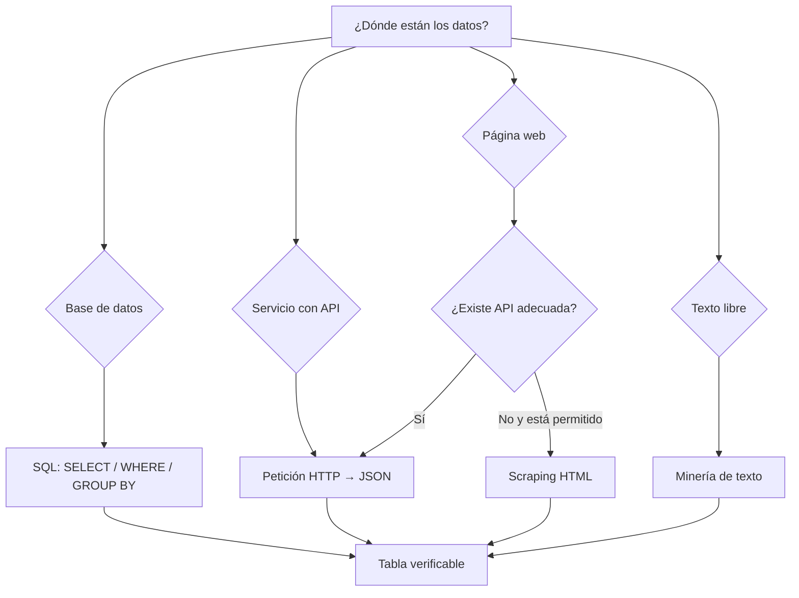

# 1.3. Extracción de información

Guion de aula: eXe *Técnicas y procesos de extracción de información*. Licencia de partida [CC BY-SA 4.0](https://creativecommons.org/licenses/by-sa/4.0/).

Tener datos no significa tener información útil. **Extraer información** es:

1. localizar los datos en una o varias fuentes;
2. seleccionar solo lo que responde a la pregunta;
3. transformarlo en una estructura que se pueda entender y analizar;
4. comprobar que el resultado es correcto.

Eso desarrolla el criterio **b)**. Relacionar después varias fuentes extraídas desarrolla **d)**.

<figure markdown="block">
{ width="72%" }
<figcaption>Portada del eXe. La fuente puede ser un fichero, una base de datos, una API o una web; el resultado útil es una tabla verificable, no la descarga en bruto.</figcaption>
</figure>

Cuaderno de síntesis que aparece en la portada del eXe: [Técnicas y procesos de extracción de información](https://colab.research.google.com/drive/1JvpH-IoMbgZzOoRdAXq2zTusWKUXLk74?usp=sharing).

## 1. Objetivos de aprendizaje

Al terminar serás capaz de:

- distinguir datos **estructurados**, **semiestructurados** y **no estructurados**;
- elegir entre SQL, API, *web scraping* y minería de texto;
- explicar por qué extraer es solo el primer paso;
- limpiar duplicados y errores, normalizar formatos y transformar columnas;
- construir un flujo pequeño: fuente → extracción → preparación → resumen o gráfico.

!!! success "La evidencia mínima"
    **Pregunta concreta + fuente + método + selección + comprobación.**  
    “He usado pandas” no demuestra extracción si no dices qué buscabas, qué columnas seleccionaste y qué resultado obtuviste.

## 2. Datos e información no son lo mismo

Los datos cotidianos —notas, compras, ventas, encuestas, publicaciones o logs— solo ganan valor cuando permiten responder una pregunta.

| Tipo | Cómo lo reconoces | Fuentes | Resultado habitual |
| --- | --- | --- | --- |
| **Estructurado** | Esquema fijo, filas y columnas | SQL, CSV, Excel | Tabla filtrada o agregada |
| **Semiestructurado** | Claves o etiquetas; el esquema puede variar | JSON, XML, logs | Campos seleccionados y tabulados |
| **No estructurado** | No trae columnas de negocio | Texto libre, imagen, audio, HTML visual | Entidades, palabras, producto/precio |

Ejemplo del eXe:

- **Fuente:** una web de noticias.
- **Extracción:** titular, fecha y autor de cada noticia.
- **Resultado:** una tabla.
- **Preguntas:** noticias por día, autores más activos, temas frecuentes.

La tabla no aparece sola: en HTML hay que localizar selectores; en texto libre, reconocer entidades o términos.

## 3. Elegir el método de extracción



### 3.1. SQL

Cuando el dato ya está en una base relacional (MySQL, PostgreSQL, SQL Server…), **no descargues la base entera**: selecciona en el servidor.

```sql
SELECT nombre, edad
FROM clientes
WHERE ciudad = 'Madrid'
ORDER BY edad DESC;
```

Lectura:

- `SELECT nombre, edad`: solo esas columnas;
- `FROM clientes`: tabla de origen;
- `WHERE ciudad = 'Madrid'`: solo esas filas;
- `ORDER BY edad DESC`: mayores primero.

También es extracción resumir:

```sql
SELECT ciudad, COUNT(*) AS total_clientes
FROM clientes
GROUP BY ciudad
ORDER BY total_clientes DESC;
```

**Cuándo:** datos en una BD y volumen que ese motor puede filtrar eficientemente. Haz el `WHERE` y el `GROUP BY` **antes** de traer el resultado a Python.

### 3.2. APIs

Una API es el “**camarero digital**” del eXe: haces un pedido (*request*) y recibes una respuesta (*response*), normalmente JSON.

Ventajas:

- datos actualizados;
- estructura predecible y documentada;
- recogida automatizable (cada hora o cada día).

Una respuesta JSON sigue siendo **semiestructurada**, no una tabla. La API garantiza un contrato, pero tú eliges campos y construyes el DataFrame.

Ejemplos: Open-Meteo, OpenWeather, Google Maps y servicios de reservas. El ejemplo de X/Twitter del eXe exige hoy autenticación, permisos y respetar sus condiciones; no presupongas acceso gratuito.

Buenas prácticas:

- **timeout:** una petición no puede quedarse esperando para siempre;
- **reintentos:** la red y los códigos `429`/`5xx` fallan;
- **caché:** no pidas cien veces la misma previsión;
- **estado HTTP:** comprueba el resultado antes de interpretar;
- **parámetros separados:** evita construir URLs a mano;
- **secretos fuera del código:** tokens en variables de entorno, nunca en GitHub.

Ejemplo mínimo con una API REST:

```python
import pandas as pd
import requests

url = "https://api.open-meteo.com/v1/forecast"
params = {
    "latitude": 43.3828,
    "longitude": -3.2204,
    "hourly": "temperature_2m",
    "forecast_days": 1,
    "timezone": "Europe/Madrid",
}

response = requests.get(url, params=params, timeout=20)
response.raise_for_status()
payload = response.json()

hourly = pd.DataFrame(
    {
        "date": pd.to_datetime(payload["hourly"]["time"]),
        "temperature_2m": payload["hourly"]["temperature_2m"],
    }
)
```

### 3.3. Web scraping

El *scraping* lee el **HTML** de una página y extrae elementos. Caso del eXe: nombre y precio de productos → CSV para comparar tiendas o estudiar cambios.

Herramientas:

- **BeautifulSoup:** HTML ya presente en la respuesta;
- `pandas.read_html`: tablas HTML;
- **Selenium:** último recurso si el dato solo aparece tras ejecutar JavaScript o pulsar botones.

Ejemplo autocontenido:

```python
from bs4 import BeautifulSoup
import pandas as pd

html = """
<article class="producto"><h2>Teclado</h2><span class="precio">29,90 €</span></article>
<article class="producto"><h2>Ratón</h2><span class="precio">14,50 €</span></article>
"""

soup = BeautifulSoup(html, "html.parser")
filas = []
for item in soup.select("article.producto"):
    filas.append(
        {
            "producto": item.select_one("h2").get_text(strip=True),
            "precio": item.select_one(".precio").get_text(strip=True),
        }
    )

df_productos = pd.DataFrame(filas)
```

!!! warning "Antes de scrapear"
    1. Busca una API o descarga oficial.  
    2. Revisa términos de uso, `robots.txt`, frecuencia de peticiones y protección de datos.  
    3. No eludas inicio de sesión, CAPTCHA ni controles de acceso.  
    4. Guarda la fecha y URL de origen: el HTML cambia y tus selectores pueden romperse.

### 3.4. Minería de texto

Trabaja con comentarios, reseñas, correos o publicaciones. Puede:

- extraer palabras clave;
- clasificar sentimiento (positivo, negativo, neutro);
- detectar temas;
- reconocer entidades (personas, lugares, productos).

Ejemplo del eXe: opiniones de un producto —¿predominan las positivas? ¿se repiten “envío”, “calidad” o “precio”?—.

En esta UT basta **reconocer el método y tabular una salida**; no entrenas un modelo de lenguaje.

## 4. De la extracción al *data wrangling*

Lo extraído suele llegar con errores, incompleto, en formatos distintos o duplicado. El *data wrangling* lo deja ordenado y analizable.

| Fase | Qué haces | Ejemplo |
| --- | --- | --- |
| **Limpieza** | Duplicados, erratas y faltantes | `Madird` / `Mdrid` → `Madrid` |
| **Normalización** | Un solo formato | Fechas a `datetime`; decimal con punto |
| **Transformación** | Nuevas columnas, agrupaciones, códigos | Sí/No → 1/0; nacimiento → edad |

Dato didáctico del eXe: se suele citar que **aproximadamente el 80 %** del tiempo de un proyecto se dedica a preparar y el 20 % al análisis. No es una ley universal; la idea importante es: **si el dato está mal, el análisis también**.

El detalle completo —nulos, *joins*, outliers, escalado y versión PySpark— está en [1.4 Preproceso](preproceso.md).

!!! warning "Fecha interna frente a fecha visible"
    Conserva la columna como `datetime` para calcular. Usa `dt.strftime("%d/%m/%Y")` solo al **presentar**, porque `strftime` vuelve a convertirla en texto.

## 5. Herramientas básicas

| Herramienta | Cuándo | Límite |
| --- | --- | --- |
| Excel / Sheets | Filtros, reemplazos, `SI`, `CONTAR`, `SUMAR.SI`, tablas dinámicas | Pocas filas y poca automatización |
| **pandas** | CSV, Excel, JSON; limpiar, agrupar y exportar | Un solo equipo |
| `requests` | API HTTP → JSON | Hay que gestionar fallos y autenticación |
| BeautifulSoup | HTML estático | Los selectores se rompen si cambia la web |
| Selenium | Web con interacción JavaScript | Más lento y frágil |
| Pentaho, Talend, NiFi | ETL periódico entre sistemas | Se estudia como herramienta profesional; la evidencia de esta UT es código/consulta |

Excel sirve para **ver** 200 filas. Cuando crece el dato o quieres repetir el proceso, usa pandas; cuando no cabe en memoria, el salto conceptual está en [1.4](preproceso.md).

## 6. Ejemplo 1 — CSV estructurado

Fuente: [clientes.csv](../assets/practicas/clientes.csv). Pregunta: clientes de Madrid **y** mayores de 30 años.

```python
import pandas as pd

df = pd.read_csv("clientes.csv")

resultado = (
    df.loc[
        (df["ciudad"].str.strip().str.casefold() == "madrid")
        & (df["edad"] > 30),
        ["nombre", "edad", "ciudad"],
    ]
    .sort_values("edad", ascending=False)
)

print(resultado)
print("filas extraídas:", len(resultado))
```

El `&` es la conjunción de [1.2](fundamentos.md). Se seleccionan **filas y columnas**, se ordena y se cuenta: eso es extracción verificable.

- Cuaderno: [1CPaRcZNcPMXLAwHdfv6KEuQpBUz1G1j_](https://colab.research.google.com/drive/1CPaRcZNcPMXLAwHdfv6KEuQpBUz1G1j_?usp=sharing)
- Fuente RAW: [clientes.csv en GitHub](https://raw.githubusercontent.com/josedavidmi/iabd-sbd/refs/heads/main/clientes.csv)

## 7. Ejemplo 2 — Open-Meteo semiestructurado { #ejemplo-2-api-meteorologica-semiestructurado }

El eXe usa el cliente generado por Open-Meteo: la respuesta separa marcas temporales y valores de temperatura. Hay que unir ambos arrays en un DataFrame.

Instalación en Colab:

```python
!pip -q install openmeteo-requests requests-cache retry-requests
```

Ejemplo profesional con **caché y reintentos**, para Castro Urdiales:

```python
import openmeteo_requests
import pandas as pd
import requests_cache
from retry_requests import retry

cache = requests_cache.CachedSession(".cache", expire_after=3600)
session = retry(cache, retries=5, backoff_factor=0.2)
openmeteo = openmeteo_requests.Client(session=session)

url = "https://api.open-meteo.com/v1/forecast"
params = {
    "latitude": 43.3828,
    "longitude": -3.2204,
    "hourly": "temperature_2m",
    "forecast_days": 1,
    "timezone": "Europe/Madrid",
}

response = openmeteo.weather_api(url, params=params)[0]
hourly = response.Hourly()
temperaturas = hourly.Variables(0).ValuesAsNumpy()

fechas = pd.date_range(
    start=pd.to_datetime(hourly.Time(), unit="s", utc=True),
    end=pd.to_datetime(hourly.TimeEnd(), unit="s", utc=True),
    freq=pd.Timedelta(seconds=hourly.Interval()),
    inclusive="left",
).tz_convert("Europe/Madrid")

hourly_dataframe = pd.DataFrame(
    {"date": fechas, "temperature_2m": temperaturas}
)

print(hourly_dataframe)
print("máxima:", hourly_dataframe["temperature_2m"].max())
print("mínima:", hourly_dataframe["temperature_2m"].min())
```

Qué se refuerza:

1. JSON/API = fuente semiestructurada con contrato.
2. Extracción = pedir solo `temperature_2m`.
3. Transformación obligatoria = tiempo + valores → dos columnas.
4. Fiabilidad = caché y reintentos.
5. Validación = 24 horas y la misma longitud en fechas y temperaturas.

Cuaderno: [13w9YOpfMhjh49lAb3UY2MOpfw_UVrA1H](https://colab.research.google.com/drive/13w9YOpfMhjh49lAb3UY2MOpfw_UVrA1H?usp=sharing).

## 8. Ejemplo 3 — Web no estructurada

Objetivo del eXe: productos y precios de una tienda.

1. Identifica la página y comprueba si existe API.
2. Inspecciona el HTML y localiza selectores.
3. Extrae `producto` y `precio`.
4. Normaliza el precio (`"29,90 €"` → `29.90`).
5. Guarda una tabla con `producto`, `precio`, `fuente` y `fecha_extraccion`.
6. Verifica manualmente una muestra.

Más adelante podrás comparar tiendas o cambios de precio. Sin `fuente` y fecha, el dato no es auditable.

## 9. Actividad 1 — Limpieza con pandas (b y d) { #actividad-1-limpieza-con-pandas-b-y-d }

Material: [clientes_actividad.csv](../assets/practicas/clientes_actividad.csv) · [URL RAW](https://raw.githubusercontent.com/josedavidmi/iabd-sbd/refs/heads/main/clientes_actividad.csv).

### Tareas

1. Nuevo Colab; `import pandas as pd`.
2. Carga la URL RAW en un DataFrame `df`.
3. **Antes de limpiar**, registra filas, duplicados, valores de `ciudad` y tipos.
4. Elimina duplicados completos con `drop_duplicates()`.
5. Corrige `Madird`, `Mdrid`, `Valenca`, `Barcleona`.
6. Convierte `fecha_registro` con `pd.to_datetime`.
7. Genera el total de clientes por ciudad con `value_counts()` o `groupby().size()`.
8. Comprueba y explica el resultado.

Esqueleto:

```python
import pandas as pd

url = "https://raw.githubusercontent.com/josedavidmi/iabd-sbd/refs/heads/main/clientes_actividad.csv"
df = pd.read_csv(url)
filas_iniciales = len(df)

print("duplicados:", df.duplicated().sum())
print(df["ciudad"].value_counts(dropna=False))

df = df.drop_duplicates()
df["ciudad"] = df["ciudad"].replace(
    {
        "Madird": "Madrid",
        "Mdrid": "Madrid",
        "Valenca": "Valencia",
        "Barcleona": "Barcelona",
    }
)
df["fecha_registro"] = pd.to_datetime(
    df["fecha_registro"], format="mixed", dayfirst=True, errors="coerce"
)

resumen = (
    df.groupby("ciudad", dropna=False)
      .size()
      .rename("total_clientes")
      .sort_values(ascending=False)
)

print(resumen)
print("filas:", filas_iniciales, "→", len(df))
print("fechas inválidas:", df["fecha_registro"].isna().sum())
```

!!! info "Compatibilidad de pandas"
    `format="mixed"` requiere pandas moderno. Si el entorno antiguo no lo admite, quítalo y conserva `dayfirst=True, errors="coerce"`; después inspecciona las fechas convertidas a `NaT`.

Planifica esta actividad con la plantilla de [1.6](planificacion.md). La explicación detallada de cada operación está en [1.4](preproceso.md).

### Evidencia de la actividad 1

- [ ] DataFrame cargado desde la fuente RAW.
- [ ] Recuento antes/después de deduplicar.
- [ ] Ciudades corregidas y comprobadas.
- [ ] Fechas como `datetime`, con inválidas contadas.
- [ ] Tabla final de clientes por ciudad.
- [ ] Dos o tres líneas: qué cambió y por qué importa.

## 10. Actividad 2 — API pública Open-Meteo

Actúa como analista: extrae el pronóstico horario de **Santander**:

- latitud `43.440829950828544`;
- longitud `-3.8223838944785076`;
- variable `temperature_2m`;
- `forecast_days = 1`.

### Tareas

1. Configura `openmeteo_requests` con caché y reintentos.
2. Ejecuta la petición y guarda la respuesta.
3. Accede a `response.Hourly()`.
4. Extrae marcas temporales y temperaturas.
5. Construye columnas **Hora** y **Temperatura (°C)**.
6. Muestra el DataFrame completo.
7. Calcula máxima y mínima con `max()` y `min()`.
8. Escribe una interpretación breve y verifica que hay 24 observaciones.

### Evidencia de la actividad 2

- [ ] Parámetros visibles (coordenadas, variable y un día).
- [ ] Caché y reintentos configurados.
- [ ] DataFrame horario legible.
- [ ] Máxima y mínima calculadas.
- [ ] Número de marcas de tiempo = número de temperaturas.
- [ ] Interpretación de dos o tres líneas.

!!! note "Dos ciudades distintas, a propósito"
    El **ejemplo resuelto** del eXe usa Castro Urdiales (`43.3828`, `−3.2204`). La **actividad que entregas** pide Santander (`43.440829950828544`, `−3.8223838944785076`). Cambiar las coordenadas demuestra que no te limitas a ejecutar la solución.

## 11. Errores y precisiones del eXe

1. **“La API proporciona datos estructurados”.** Más preciso: la respuesta JSON es **semiestructurada**, aunque su contrato sea predecible.
2. **OpenWeather / X / Google Maps** pueden requerir clave, plan de pago o permisos. Open-Meteo es el caso de aula porque permite esta consulta pública.
3. **Scraping no equivale a dato no estructurado.** HTML tiene estructura técnica; lo que no trae es una tabla de negocio estable. Los selectores dependen del diseño de la web.
4. **`pd.to_datetime()` con fechas mezcladas:** añade `dayfirst=True`, `errors="coerce"` y, en pandas moderno, `format="mixed"`. Cuenta los `NaT`.
5. **`dt.strftime()` es presentación:** convierte la fecha de nuevo a texto. Conserva el `datetime` si vas a ordenar o calcular.
6. **`groupby().count()` cuenta no nulos por columna.** Para número de filas usa `groupby().size()` o `value_counts()`.
7. La cifra **80/20** es orientativa, no una métrica universal.

## 12. Referencias para consultar

El paquete eXe no incorpora bibliografía propia. Para implementar los ejemplos, usa la documentación oficial:

- [pandas — documentación](https://pandas.pydata.org/docs/)
- [Open-Meteo API](https://open-meteo.com/en/docs)
- [Requests — guía rápida](https://requests.readthedocs.io/en/latest/user/quickstart/)
- [Beautiful Soup 4](https://www.crummy.com/software/BeautifulSoup/bs4/doc/)

!!! success "Al terminar 1.3"
    Puedes responder en un minuto: **qué pregunta**, **qué fuente**, **qué método**, **qué campos**, **qué controles** y **qué tabla o resumen** entregas. Ese razonamiento vale más que decir únicamente el nombre de una librería.

El ETL inicial de clientes está en [1.1](ciclo-analisis.md). Todos los enlaces: [Cuadernos Colab](cuadernos.md).
