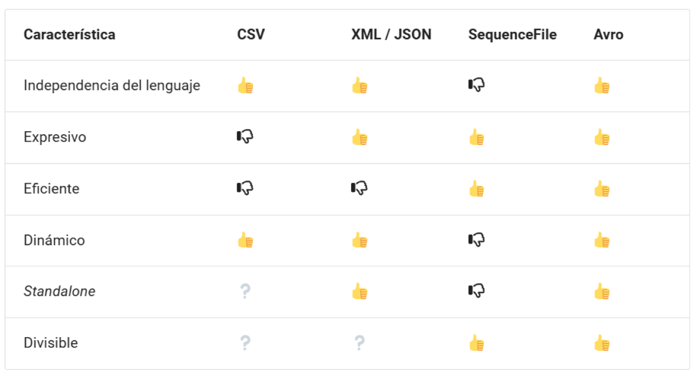
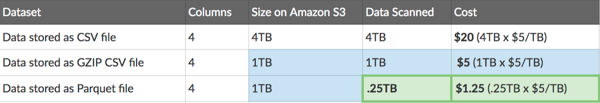
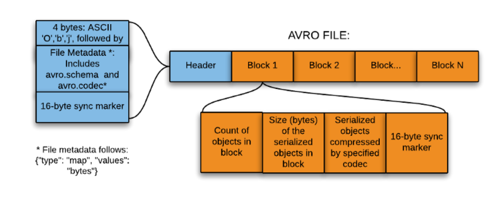
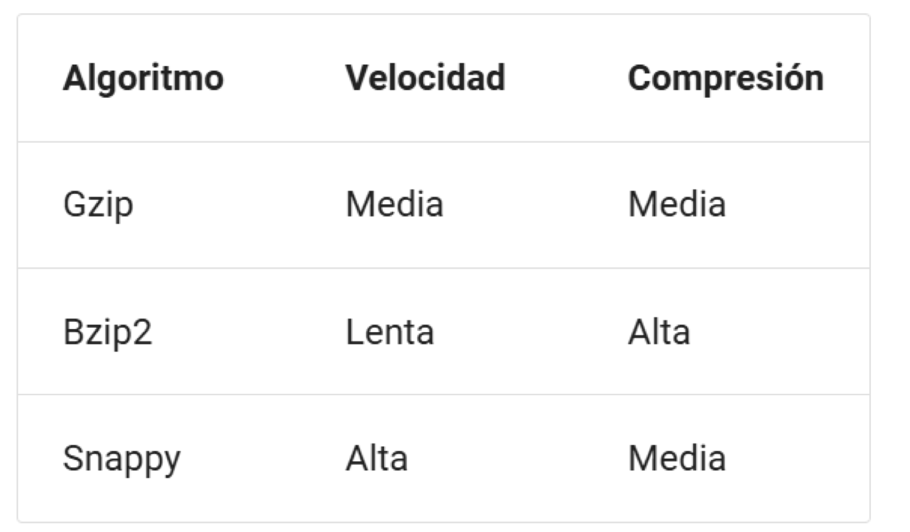
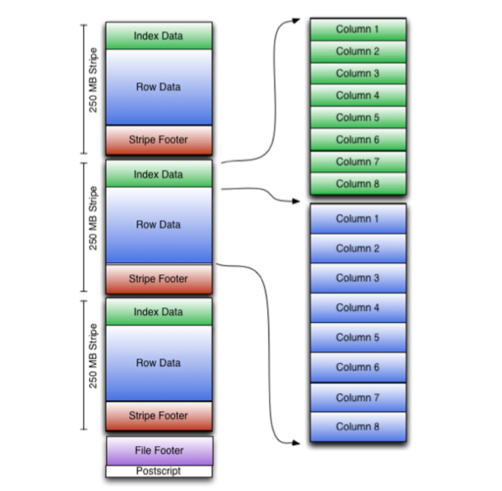
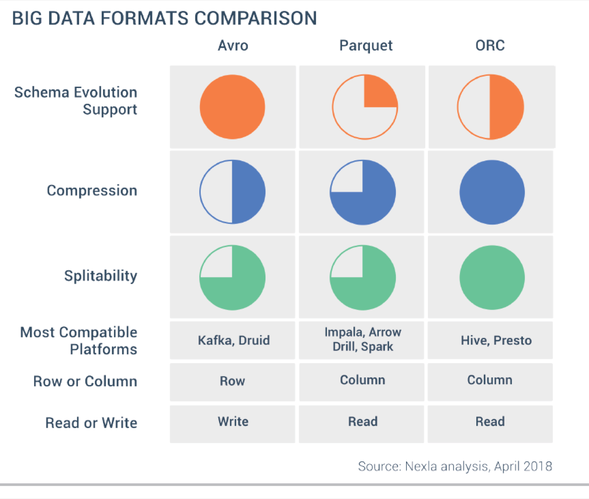

# 1.5. Formatos de datos para el análisis

Este apartado trabaja el criterio **c)**: formatos de datos para el análisis.

En BDA elegiste el formato de **la carga**. Aquí eliges el formato para **consultar y combinar**. Un mal formato no se nota en 200 filas; en Athena se paga **cada lunes**.

A medida que los datos recorren los distintos [pipelines](https://es.wikipedia.org/wiki/Arquitectura_en_pipeline_(inform%C3%A1tica)), toca gestionar la [serialización](https://es.wikipedia.org/wiki/Serializaci%C3%B3n) entre formatos y convertir de uno a otro sin perder tiempo ni información. Ese es el oficio de este apartado.

Vídeo introductorio (Avro, Parquet, ORC): [YouTube DafzYp5XRmA](https://youtu.be/DafzYp5XRmA).

## 1. Propiedades de un buen formato

Un formato ideal para Big Data cumple, en lo posible:

| Propiedad | Qué significa | Por qué importa |
| --- | --- | --- |
| **Independencia del lenguaje** | Lo leen Python, Java, Scala… | El dato sobrevive al script que lo creó |
| **Expresividad** | Admite estructuras complejas y **anidadas** | Un JSON de API no es una tabla plana |
| **Eficiencia** | Rápido y compacto | Menos disco, menos red, menos factura |
| **Dinamismo** | Definir tipos nuevos sin reescribir los programas | El esquema **evoluciona**: llega una columna más |
| **Standalone** | Autocontenido: el fichero lleva su esquema | No dependes de un `.txt` con las columnas |
| **Divisible (*splittable*)** | Se puede trocear en fragmentos | Hadoop, Spark o Athena lo procesan **en paralelo** |

La última es la que más gente olvida. Un JSON gigante con un único array `[...]` **no** se parte bien: el motor no sabe dónde cortar sin romper la sintaxis. Por eso en Big Data se prefiere un objeto por línea (JSONL) o directamente un binario partible.

<figure markdown="block">
{ width="100%" }
<figcaption>Los pulgares no son una nota: son un “esto lo cumple / esto no”. Avro los cumple todos; CSV falla en expresividad y eficiencia, y los interrogantes de <em>standalone</em> y divisible dependen de cómo lo generes.</figcaption>
</figure>

!!! info "¿Y SequenceFile?"
    Aparece en la figura porque es el binario clásico de Hadoop: pares clave-valor, divisible y eficiente, pero **atado a Java** y sin esquema legible. Hoy se usa poco fuera de Hadoop puro. En esta UT no lo trabajamos: se cita para entender de dónde viene Avro.

### Ventajas de elegir bien

- **Rendimiento:** lecturas y escrituras optimizadas.
- **Fragmentación:** el fichero se divide y se procesa en paralelo.
- **Esquemas evolutivos:** añadir o renombrar columnas sin rehacer el sistema.
- **Compresión:** menos tamaño y menos tiempo de transferencia.

## 2. Texto frente a binario

| Familia | Ejemplos | Fuerte en | Flojo en |
| --- | --- | --- | --- |
| **Texto** | CSV, XML, JSON | Depurar a ojo, Excel, APIs, compatibilidad | Espacio y velocidad |
| **Binario** | Avro, Parquet, ORC | Volumen, clúster, coste de escaneo | No lo abres con el bloc de notas |

Los de texto son **más lentos y más grandes**, pero más expresivos y compatibles. Los binarios rinden mejor y ocupan menos a cambio de necesitar una librería para leerlos.

Regla de aula: **texto mientras depuras, binario cuando el fichero crece o la consulta se repite.**

## 3. Filas frente a columnas

CSV, XML, JSON y **Avro** guardan el registro **junto** (orientados a filas). Parquet y ORC guardan **la columna junta**.

```text
Tabla:  nombre  | altura | edad

Por FILAS (CSV, Avro):
  Carlos,180,44 | Juan,175,null

Por COLUMNAS (Parquet, ORC):
  Carlos,Juan   | 180,175 | 44,null
```

### JSON frente a JSONL

Un JSON estándar reparte los pares clave-valor en varias líneas. **JSONL** (JSON Lines) guarda **un objeto por línea**, así que se trocea y se procesa en paralelo.

```json
{
  "empleados": [
    { "nombre": "Carlos", "altura": 180, "edad": 44 },
    { "nombre": "Juan", "altura": 175, "edad": null }
  ]
}
```

```json
{"nombre": "Carlos", "altura": 180, "edad": 44}
{"nombre": "Juan", "altura": 175, "edad": null}
```

!!! warning "`None` es de Python, no de JSON"
    En un fichero JSON el valor vacío se escribe **`null`** (minúscula). `None` solo vale dentro del código Python; un parser de JSON lo rechaza.

### Por qué gana el columnar en análisis

Si el informe usa `hotel` e `importe` de una tabla de 80 columnas, el columnar **no lee** las otras 78. Y comprime mejor, porque los valores contiguos son del mismo tipo (y cada columna puede llevar su propia codificación).

**Ventajas:** datos homogéneos juntos, acceso selectivo, mucha compresión.

**Desventajas:** reconstruir **un** registro obliga a leer varias columnas; **actualizar** un valor implica descomprimir, modificar y volver a comprimir. Se mitiga con particionado y *clustering*, pero actualizar una fila sigue siendo caro.

Consecuencia directa: las bases **columnares no** sirven para carga transaccional. La caja del hotel (OLTP) se apoya en almacenamiento por filas. Parquet es el almacén del **análisis**, no el de recepción.

### Tamaño y coste

Athena cobra del orden de **5 USD por TB escaneado** (consulta el precio vigente; la cifra cambia, el razonamiento no). Y **1 TB de CSV puede quedar en torno a 130 GB en Parquet**.

<figure markdown="block">
{ width="100%" }
<figcaption>Figura de Openbridge. Mismo dataset de cuatro columnas, misma pregunta sobre <strong>una</strong> columna. Gzip baja el <em>almacenamiento</em>; Parquet baja además el <strong>dato escaneado</strong>, y eso es lo que factura Athena: de 20 $ a 1,25 $.</figcaption>
</figure>

Fíjate en el detalle: el CSV comprimido ocupa lo mismo que el Parquet (1 TB), pero **escanea 1 TB** porque hay que descomprimir el fichero entero. El Parquet escanea 0,25 TB: solo la columna preguntada.

## 4. Avro (filas + esquema)

[Apache Avro](https://avro.apache.org/) es un formato **por filas**, binario y compacto. Los datos van en binario; el **esquema va en JSON** en la cabecera del fichero. Compacidad de binario, esquema legible.

Características:

- **Compresión por bloques.**
- **Divisible**, así que se procesa en paralelo.
- Muy extendido en el ecosistema Hadoop y con soporte en las nubes principales.
- El esquema **viaja con el dato**: al leer un `.avro` siempre sabes qué contiene.

### Estructura del fichero

<figure markdown="block">
{ width="100%" }
<figcaption>La <strong>cabecera</strong> lleva el esquema (<code>avro.schema</code>) y el códec (<code>avro.codec</code>). Los <strong>bloques</strong> repiten un marcador de sincronía de 16 bytes: ese marcador es lo que permite cortar el fichero y repartirlo entre nodos.</figcaption>
</figure>

### Tipos de datos

- **Primitivos:** `null`, `boolean`, `int`, `long`, `float`, `double`, `bytes`, `string`.
- **Compuestos:** `record`, `enum`, `array`, `map`, `union`, `fixed`.

Esquema de aula, [empleado.avsc](../assets/practicas/empleado.avsc):

```json
{
  "type": "record",
  "namespace": "sbd.ut1",
  "name": "Empleado",
  "fields": [
    { "name": "nombre", "type": "string" },
    { "name": "altura", "type": "float" },
    { "name": "edad", "type": ["null", "int"], "default": null }
  ]
}
```

`"type": ["null", "int"]` es un **union**: `edad` admite entero **o** vacío. Sin ese union, un registro sin `edad` falla al escribir. Los nombres de campo deben coincidir exactamente entre el esquema y los registros; consulta las [comprobaciones](#9-comprobaciones-y-errores-frecuentes).

### Avro y Python (librería de referencia)

```sh
pip install avro
```

```python
import copy
import json

import avro.schema
from avro.datafile import DataFileReader, DataFileWriter
from avro.io import DatumReader, DatumWriter

# 1. Leemos el esquema
schema = avro.schema.parse(open("empleado.avsc", "rb").read())

# 2. Escribimos un fichero con ese esquema
with open("empleados.avro", "wb") as f:
    writer = DataFileWriter(f, DatumWriter(), schema)
    writer.append({"nombre": "Carlos", "altura": 180, "edad": 44})
    writer.append({"nombre": "Juan", "altura": 175})  # edad ausente: vale por el union
    writer.close()

# 3. Lo leemos y recuperamos también el esquema embebido
with open("empleados.avro", "rb") as f:
    reader = DataFileReader(f, DatumReader())
    metadata = copy.deepcopy(reader.meta)
    schema_del_fichero = json.loads(metadata["avro.schema"])
    empleados = [empleado for empleado in reader]
    reader.close()

print(schema_del_fichero)
print(empleados)
```

Lo importante del paso 3: el esquema **sale del propio fichero**, no de tu código. Eso es *standalone*.

### Fastavro

Para volumen, [fastavro](https://fastavro.readthedocs.io/) rinde mejor: parte de su código está compilado con Cython.

```sh
pip install fastavro
```

```python
import copy
import json

import fastavro

with open("empleado.avsc", "rb") as f:
    schema = fastavro.parse_schema(json.load(f))

empleados = [
    {"nombre": "Carlos", "altura": 180, "edad": 44},
    {"nombre": "Juan", "altura": 175},
]

with open("empleadosf.avro", "wb") as f:
    fastavro.writer(f, schema, empleados)

with open("empleadosf.avro", "rb") as f:
    reader = fastavro.reader(f)
    metadata = copy.deepcopy(reader.metadata)
    print(json.loads(metadata["avro.schema"]))
    print([empleado for empleado in reader])
```

### Fastavro con pandas

Caso: leer un CSV de ventas, quedarse con Alemania y persistir en Avro. CSV de apoyo: [pdi_sales.csv](https://aitor-medrano.github.io/iabd/de/resources/pdi_sales.csv) (separador `;`).

```python
import pandas as pd
from fastavro import parse_schema, writer

df = pd.read_csv("pdi_sales.csv", sep=";")
df["Zip"] = df["Zip"].str.strip()      # limpieza: códigos postales con espacios
df = df[df.Country == "Germany"]        # filtro del caso

schema = parse_schema(
    {
        "name": "Sales",
        "namespace": "sbd.ut1",
        "type": "record",
        "fields": [
            {"name": "ProductID", "type": "int"},
            {"name": "Date", "type": "string"},
            {"name": "Zip", "type": "string"},
            {"name": "Units", "type": "int"},
            {"name": "Revenue", "type": "float"},
            {"name": "Country", "type": "string"},
        ],
    }
)

with open("ger_sales.avro", "wb") as f:
    writer(f, schema, df.to_dict("records"))
```

Aquí el esquema lo escribes **tú**: Avro no adivina tipos como hacía el crawler de [1.7](laboratorio-aws.md). Si `Units` llega con nulos, `"int"` revienta y necesitas `["null", "int"]`.

### Cuadernos Avro (hacer los tres)

Copia cada cuaderno a tu Drive. En los dos primeros **adjunta** `empleado.avsc`; en el tercero, el CSV de ventas.

| Cuaderno | Qué haces | Enlace |
| --- | --- | --- |
| Avro (librería de referencia) | Instalar `avro`, escribir dos empleados en `empleados.avro` y leer registros y esquema | [Avro: escritura y lectura de empleados](https://colab.research.google.com/drive/1zxfPwEdHjaYHjkKjPOwXuj9fXGD8Anc1?usp=sharing) |
| Fastavro | El mismo caso con `fastavro`, en `empleadosf.avro`; sin cronometraje comparativo | [Fastavro: escritura y lectura de empleados](https://colab.research.google.com/drive/1z0ZsCX2Ws-3kSFLQEJS74CDkkot--Y-n?usp=sharing) |
| Fastavro + pandas | Leer `pdi_sales.csv`, quitar espacios de `Zip`, filtrar Alemania y escribir `sales.avro` | [Pandas y fastavro: ventas de Alemania](https://colab.research.google.com/drive/1zaM4132cmUIsOWL5rbiCre5dCIyVL1RC?usp=sharing) |

Usa el [esquema `empleado.avsc` de estos apuntes](../assets/practicas/empleado.avsc), con los campos `nombre`, `altura` y `edad` en minúscula. Ambos cuadernos lo leen desde la carpeta de trabajo; no lo descargan automáticamente. El tercer cuaderno necesita que subas [`pdi_sales.csv`](https://aitor-medrano.github.io/iabd/de/resources/pdi_sales.csv), con separador `;`.

Son ejemplos de escritura y lectura, no pruebas comparativas de rendimiento. Si quieres comparar velocidad, añade mediciones con el mismo dataset y entorno. En el tercer cuaderno, «Ejercicio 3: Limpiar el fichero» deja una celda vacía para continuar: el código anterior ya recorta `Zip` y filtra Alemania; no realiza una limpieza general de nulos o duplicados.

## 5. Compresión

La idea es simple: los algoritmos buscan **redundancia y repetición** y recodifican para eliminarla.

**Beneficios:** menos espacio, lectura más rápida (menos bytes que mover) y menos tráfico de red.

**Contrapartida:** comprimir y descomprimir **cuesta CPU y tiempo**. En Big Data suele ganar el códec **rápido**, no el que más aprieta.

<figure markdown="block">
{ width="75%" }
<figcaption><strong>Snappy</strong> es el habitual en Big Data: comprime medio y va rápido. <strong>Bzip2</strong> aprieta más pero se arrastra. Elige según lo que te duela: disco o reloj.</figcaption>
</figure>

En fastavro el códec es un parámetro:

```python
fastavro.writer(f, schema, records, codec="deflate")   # gzip/deflate: más pequeño
fastavro.writer(f, schema, records, codec="snappy")    # más rápido
```

`snappy` necesita la librería del sistema. Si `pip install python-snappy` falla, instala antes `libsnappy-dev` (en Colab, `!apt-get -qq install -y libsnappy-dev`) o usa `codec="zstandard"`.

### Tamaños reales (ventas de Alemania)

Cifras, con el mismo subconjunto de datos:

| Fichero | Tamaño |
| --- | --- |
| `ger_sales.csv` | 9,7 MiB |
| `ger_sales.avro` (sin comprimir) | 6,9 MiB |
| `ger_sales-snappy.avro` | 2,8 MiB |
| `ger_sales-gzip.avro` | 1,9 MiB |
| `ger_sales.parquet` | 2,3 MiB |
| `ger_sales-snappy.parquet` | 2,3 MiB |
| `ger_sales-gzip.parquet` | 1,6 MiB |
| `ger_sales.orc` | 6,98 MiB |

Tres lecturas que valen más que memorizar los números:

1. **Avro sin comprimir ya baja de 9,7 a 6,9 MiB**: el binario ahorra por sí solo.
2. **`ger_sales.parquet` y `ger_sales-snappy.parquet` pesan igual** porque Snappy **es el códec por defecto** de pandas/PyArrow al escribir Parquet. No es casualidad ni error.
3. **El ORC sale grande (6,98 MiB)** porque `to_orc` escribe **sin comprimir** por defecto. Con `zlib` baja mucho. El formato no comprime solo: hay que pedirlo.

## 6. Parquet (columnas)

[Apache Parquet](https://parquet.apache.org/) es columnar, pensado para Hadoop y compatible con casi todo *framework* y lenguaje. Como Avro, es **autodescriptivo**: el esquema va embebido. Brilla con datasets de **muchas columnas** de los que solo preguntas unas pocas.

**Ventajas**

- **Compresión alta:** en torno al 75 % con Snappy (cifra de catálogo, no de examen).
- **Lecturas eficientes:** solo recorre las columnas necesarias, así que baja la E/S de disco.

### Estructura del fichero

```text
Fichero Parquet
├── "PAR1"                        ← número mágico (4 bytes)
├── Row group 0
│   ├── Columna a → páginas (cabecera + niveles + valores)
│   └── Columna b → páginas
├── Row group 1
│   └── …
└── Footer                        ← metadatos AL FINAL
    ├── versión y esquema
    ├── por columna: tipo, ruta, codificación, códec,
    │   nº de valores, offsets, tamaño comprimido
    ├── longitud del footer (4 bytes)
    └── "PAR1"
```

Los datos van en **grupos de filas** (*row groups*) y, dentro de cada grupo, **por columnas**: por eso se comprime a nivel de columna. Los metadatos se escriben **al final**, lo que permite escribir de una sola pasada; al leer, el motor va al footer, mira las estadísticas y **se salta** los bloques que no necesita.

### Parquet con pandas

```python
import pandas as pd

df = pd.read_csv("pdi_sales.csv", sep=";")
df["Zip"] = df["Zip"].str.strip()
df = df[df.Country == "Germany"]

df.to_parquet("pdi_sales.parquet")

df_parquet = pd.read_parquet("pdi_sales.parquet")
solo = pd.read_parquet("pdi_sales.parquet", columns=["Country", "Revenue"])
```

`columns=` es el criterio **c)** en una línea: **no escanees lo que no preguntas**. Es lo mismo que hace Athena cuando el `SELECT` nombra dos columnas de cuarenta.

### Parquet con PyArrow

[PyArrow](https://arrow.apache.org/docs/python/) es el motor que hay debajo de pandas. Tiene [libro de recetas](https://arrow.apache.org/cookbook/py/) propio.

```sh
pip install pyarrow
```

Desde un diccionario de columnas, declarando el esquema:

```python
import pyarrow as pa
import pyarrow.parquet as pq

schema = pa.schema([("nombre", pa.string()), ("altura", pa.float32()), ("edad", pa.int32())])

empleados = {
    "nombre": ["Carlos", "Juan"],
    "altura": [180.0, 175.0],
    "edad": [44, None],
}

tabla = pa.Table.from_pydict(empleados, schema)
pq.write_table(tabla, "empleados.parquet")

tabla2 = pq.read_table("empleados.parquet")
print(tabla2.schema)
print(tabla2)
```

Desde JSON. PyArrow lee **JSONL** (un objeto por línea), no un array envolvente:

```json
{ "nombre": "Carlos", "altura": 180, "edad": 44 }
{ "nombre": "Juan", "altura": 175 }
```

```python
import pyarrow.parquet as pq
from pyarrow import json

tabla = json.read_json("empleados.json")
pq.write_table(tabla, "empleados-json.parquet")

print(pq.read_table("empleados-json.parquet").schema)
```

Eso cierra el círculo del apartado 3: el fichero de entrada **tiene** que ser JSONL. Un JSON con `{"empleados": [...]}` no lo lee así.

## 7. ORC

[Apache ORC](https://orc.apache.org/) (*Optimized Row Columnar*) es columnar como Parquet, pero optimizado para **Hive**: alta compresión (zlib), tipos simples de Hive (`datetime`, `decimal`…) y complejos (`struct`, `list`, `map`, `union`), compatible con HiveQL.

!!! note "ORC y OCR son conceptos distintos"
    El formato es **ORC**. *OCR* significa reconocimiento óptico de caracteres.

<figure markdown="block">
{ width="60%" }
<figcaption>Las <strong>tiras</strong> (por defecto en torno a 250 MB) llevan índice, datos y pie con estadísticas cacheadas (recuento, máximos, mínimos, suma de cada columna). Esas estadísticas son lo que permite descartar una tira entera sin leerla.</figcaption>
</figure>

Con pandas (desde la versión 1.5):

```python
import pandas as pd

df_orc = pd.read_orc("pdi_sales.orc")
df_orc.to_orc("pdi_sales_pd.orc")

# Por defecto NO comprime; hay que pedirlo:
df_orc.to_orc("pdi_sales_zlib.orc", engine_kwargs={"compression": "zlib"})
```

Con PyArrow:

```python
import pandas as pd
import pyarrow as pa
import pyarrow.orc as orc

df = pd.read_csv("pdi_sales.csv", sep=";")
df["Zip"] = df["Zip"].str.strip()
df = df[df.Country == "Germany"]

tabla = pa.Table.from_pandas(df, preserve_index=False)
orc.write_table(tabla, "ger_sales.orc")
```

## 8. Comparando formatos

Cada formato tiene su punto fuerte:

- **Escrituras.** Los de filas rinden más: añadir un registro es apéndice, no reorganizar columnas.
- **Lecturas parciales.** Si consultas un subconjunto de columnas, gana el columnar: no recupera el registro entero.
- **Compresión.** Gana el columnar: los datos del mismo tipo están contiguos y cada columna usa su codificación.
- **Evolución del esquema.** Gana **Avro**: añadir, borrar o renombrar columnas es su especialidad, y el esquema en JSON es fácil de gestionar (admite más de una versión).
- **Anidados con consultas sobre subcolumnas.** Gana **Parquet**, por su estructura de páginas y niveles.
- **Ecosistema.** ORC → Hive. Parquet → Spark, Athena, Arrow, Impala. Avro → Kafka.

<figure markdown="block">
{ width="85%" }
<figcaption>Figura del análisis de Nexla (2018). Fíjate en las dos últimas filas, que resumen el apartado: Avro es <strong>fila</strong> y está orientado a <strong>escritura</strong>; Parquet y ORC son <strong>columna</strong> y están orientados a <strong>lectura</strong>. Los círculos son valoraciones relativas: los tres son divisibles, ORC simplemente lo hace con más holgura.</figcaption>
</figure>

### Cómo elegir (guion de aula)

| Necesidad | Formato |
| --- | --- |
| Que lo abra un compañero (o Excel) | CSV / JSON |
| Volcado por líneas que se pueda trocear | **JSONL** |
| Cola de mensajes o esquema que crece | **Avro** |
| Informe de tres columnas / Athena / Spark | **Parquet** |
| Tablas Hive | **ORC** (Parquet si el stack es Spark) |
| Actualizar una reserva en recepción | Ni Parquet ni ORC como almacén operativo |

!!! tip "Puente con el laboratorio"
    En [1.7](laboratorio-aws.md) Athena escanea S3. Un CSV con cabecera mal leída (`col1`…`col5`) es un fallo de **calidad**. El mismo volumen en texto, cuando ya sabes que el informe pide tres columnas, es un fallo de **coste**. Los dos se evalúan en el criterio **g)** ([costes y calidad](costes-calidad.md)).

## 9. Comprobaciones y errores frecuentes

Antes de ejecutar el código, revisa estas comprobaciones:

1. **Esquema Avro con mayúsculas.** Si un esquema declara `Nombre`, `Altura`, `Edad`, pero el código escribe `{"nombre": ..., "altura": ..., "edad": ...}`. Los nombres de campo **distinguen mayúsculas**: no coinciden. El [empleado.avsc de este repo](../assets/practicas/empleado.avsc) usa minúsculas en los dos sitios.
2. **`Edad` sin `null`.** Con `{ "name": "Edad", "type": "int" }` el registro de Juan (que no trae edad) falla al escribir. Hace falta el union `["null", "int"]` con `default: null`.
3. **`None` en ficheros JSON.** Se escribe `null`.
4. **Alturas y edades cruzadas** en el ejemplo de PyArrow: `"altura": [180, 44]` y `"edad": [None, 34]` deja a Juan midiendo 44. Además declara `altura` como `int32` cuando en el resto del tema es `float`.
5. **Los tamaños de compresión no son del CSV.** 6,9 MiB es el **Avro sin comprimir**; el CSV son 9,7 MiB. Las cifras de 1,9 y 2,8 MiB son gzip y Snappy sobre ese Avro.
6. **Los ejemplos de `AvroWriter(hdfs_client, …)` y `write_dataframe(hdfs_client, …)`** son de la API de **HDFS**, no de fastavro en local ni en Colab. Para un fichero normal, el códec va como parámetro de `fastavro.writer`.
7. **ORC y OCR.** ORC es un formato de datos; OCR es reconocimiento óptico de caracteres.

## Actividad 1 — Parquet (aula)

Convierte [clientes.csv](../assets/practicas/clientes.csv) a Parquet y lee **solo** `ciudad`. Compara el tamaño en disco con `os.path.getsize` y explica por qué Athena preferiría ese fichero.

## Actividad 2 — Kaggle, retrasos de vuelos (criterio c)

*(RA1 / CE c — 2 puntos en el enunciado.)*

Con Python y [Kaggle](https://www.kaggle.com/), crea un notebook a partir del dataset de [retrasos y cancelaciones de vuelos 2009–2018](https://www.kaggle.com/datasets/yuanyuwendymu/airline-delay-and-cancellation-data-2009-2018). Elige **un** fichero anual (campos separados por `,`), transforma los datos y persiste:

| Fichero | Contenido |
| --- | --- |
| `air<año>.parquet` | El CSV completo en Parquet |
| `air<año>.orc` | El CSV completo en ORC |
| `air<año>_snappy.orc` | El CSV en ORC comprimido con Snappy |
| `air<año>_small.avro` | Solo `FL_DATE`, `OP_CARRIER` y `DEP_DELAY`, en Avro |
| `air<año>_small.parquet` | Las mismas tres columnas, en Parquet |

Selección de columnas en pandas:

```python
df_small = df[["FL_DATE", "OP_CARRIER", "DEP_DELAY"]]
```

Tamaños y tiempos:

```python
import os
import time

inicio = time.time()
df.to_parquet("air2018.parquet")
print("segundos:", time.time() - inicio)
print("bytes:", os.path.getsize("air2018.parquet"))
```

El tamaño también se ve en el panel derecho de Kaggle, en *Output*.

**Entrega:** captura del cuaderno y una **celda Markdown con la tabla** de tamaños y tiempos, para poder compararlos de un vistazo. Si al compartir, Kaggle pide confirmar la cuenta con datos personales que no quieres dar, descarga el `.ipynb` y adjúntalo en Moodle.

!!! warning "Cuenta de Kaggle"
    Registrado y gratis, las instancias dan del orden de **30 GB de RAM y 73 GB de disco** durante 12 horas (cifras que Kaggle cambia cada cierto tiempo). Sin registrarte, en torno a 1 GB de RAM: el dataset **no cabe**.

    Si el portátil o la instancia se quedan cortos, trabaja con una muestra (por ejemplo 100 000 filas) y **documenta el recorte**. Lo que se evalúa es **elegir el formato según la pregunta**, no terminar el dataset entero.

Solución de referencia (profesorado): [notebook Kaggle dmiprof01](https://www.kaggle.com/code/dmiprof01/fork-of-trabajo-actividad-de-formato-de-datos).

## Bibliografía

- [Formatos de datos (Aitor Medrano, IABD)](https://aitor-medrano.github.io/iabd/de/formatos.html)
- [An Introduction to Big Data Formats (Nexla, PDF)](https://webcdn.nexla.com/n3x_ctx/uploads/2018/05/An-Introduction-to-Big-Data-Formats-Nexla.pdf)
- [Introduction to Data Serialization in Apache Hadoop (XenonStack)](https://www.xenonstack.com/blog/data-serialization-hadoop)
- [Handling Avro files in Python](https://www.perfectlyrandom.org/2019/11/29/handling-avro-files-in-python/)
- [Big Data File Formats Demystified (Datanami)](https://www.datanami.com/2018/05/16/big-data-file-formats-demystified/)
- [Apache Parquet: How to be a hero with the open-source columnar data format (openbridge)](https://blog.openbridge.com/how-to-be-a-hero-with-powerful-parquet-google-and-amazon-f2ae0f35ee04)

!!! success "Al terminar 1.5"
    Sabes decir, para un caso concreto: si va por filas o por columnas, qué formato eliges, qué códec y **por qué** — nombrando el dato escaneado, la evolución del esquema o quién va a abrir el fichero. Y sabes que un binario no comprime solo: el códec se pide.

Índice de cuadernos: [Cuadernos Colab](cuadernos.md).
