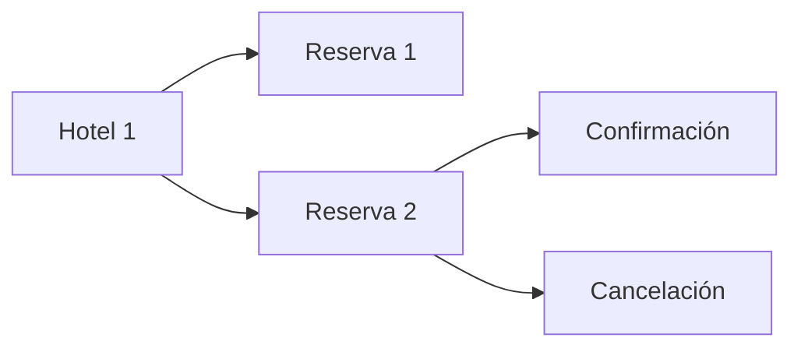

# 1.2. Fundamentos matemáticos y algorítmicos

**CE que se trabajan:** a, g. Consulta el [texto oficial](ra1.md).

**Al terminar:** representar conjuntos y relaciones, formular predicados y comparar algoritmos.

## Conjuntos y relaciones con nombres conocidos

Sea R el conjunto de reservas y H el de hoteles. Cada reserva contiene un `id_hotel` que debe corresponder a un elemento de H. La relación es muchas reservas a un hotel. Su representación tabular permite un join; no obliga a que el resultado conserve el número de filas si el catálogo contiene claves repetidas.

- **Unión:** reúne elementos; en datos hay que decidir si se conservan duplicados.
- **Intersección:** identifica claves presentes en ambas fuentes.
- **Diferencia:** descubre reservas sin hotel conocido.
- **Función:** asigna una salida a cada entrada; una normalización de canal debe ser determinista.

## Predicados y lógica

Un predicado decide si un registro cumple una condición. `noches > 0 AND canal = 'web'` exige ambas. `OR` permite cualquiera. `NOT` niega.

| A | B | A AND B | A OR B |
| --- | --- | --- | --- |
| verdadero | verdadero | verdadero | verdadero |
| verdadero | falso | falso | verdadero |
| falso | verdadero | falso | verdadero |
| falso | falso | falso | falso |

Un nulo no equivale a cero. En SQL, comparar con un nulo puede producir desconocido: usa `IS NULL` para detectarlo. Una fila cuyo filtro no es verdadero no se conserva. Decide el tratamiento de los ausentes antes de calcular.

## Algoritmos y complejidad

Para localizar el hotel de cada reserva podemos recorrer todo el catálogo cada vez:

```python
for reserva in reservas:
    for hotel in hoteles:
        if reserva['id_hotel'] == hotel['id_hotel']:
            print(reserva['id_reserva'], hotel['hotel'])
```

Con n reservas y m hoteles, se realizan n × m comparaciones: **O(nm)**. Otra estrategia construye un diccionario:

```python
por_id = {h['id_hotel']: h['hotel'] for h in hoteles}
for reserva in reservas:
    nombre = por_id.get(reserva['id_hotel'])
```

Con claves únicas y búsqueda hash de coste medio constante, el trabajo esperado es **O(n+m)** y el diccionario consume **O(m)** memoria. No es una garantía universal de tiempo constante ni describe todos los joins de Spark.

O(n) crece proporcionalmente a las filas; una ordenación por comparaciones suele requerir O(n log n). La notación expresa crecimiento, no segundos. Red, disco, serialización y distribución también influyen.

## Tarea para practicar en clase

Para 1 000 000 de reservas y 200 hoteles, compara el número aproximado de pasos de las dos estrategias. Después explica qué sucede si dos hoteles comparten identificador.

??? success "Comprueba tu respuesta"
    La búsqueda anidada realiza 200 millones de comparaciones. La estrategia de diccionario requiere aproximadamente 200 inserciones y un millón de búsquedas, bajo sus supuestos. Una clave repetida sobrescribe una entrada: antes de construir el diccionario hay que validar unicidad.

En [integración](integracion.md) trasladaremos estas ideas a DataFrames. No cargues un catálogo arbitrariamente grande en memoria solo porque el ejemplo pequeño permite hacerlo.

## Conjuntos, relaciones y funciones: pasar del dibujo al código

En un conjunto no hay elementos repetidos. Una tabla sí puede repetir filas: `UNION ALL` o `unionByName` apilan registros, mientras que una unión matemática elimina repeticiones. La diferencia afecta a los totales.

```python
reservas_hotel = {1, 2, 99}
catalogo = {1, 2}
print(reservas_hotel & catalogo)  # {1, 2}: claves conocidas
print(reservas_hotel - catalogo)  # {99}: clave sin correspondencia
```

Una relación es un subconjunto del producto cartesiano. Si R tiene seis reservas y H dos hoteles, R × H tiene doce pares posibles; la condición de igualdad de clave selecciona los pares válidos. Una relación reserva→hotel será una función total si cada reserva tiene exactamente un hotel. No tiene que ser inyectiva: varias reservas pueden ir al mismo hotel. Una clave huérfana rompe la totalidad; un catálogo ambiguo rompe la unicidad de la salida.

La normalización `strip().lower()` es una función determinista, pero no reversible: « WEB » y «web» producen el mismo resultado. Conserva el original si necesitas auditar el cambio.

## Grafos y dependencias

Un grafo representa vértices y aristas. En el caso hotelero los vértices pueden ser hoteles, reservas y eventos; las aristas indican pertenencia. El grado de una reserva respecto a eventos puede ser mayor que uno: anticipa el riesgo de multiplicar filas.



En el plan del proyecto, las aristas significan «debe terminar antes». Un ciclo impediría establecer una secuencia válida: si integrar espera al informe y el informe espera a integrar, hay que descomponer las tareas. No necesitamos aquí algoritmos avanzados de grafos.

## Secuencias, decisiones e invariantes

Un algoritmo define pasos y condiciones de terminación. En nuestro análisis: leer → validar → integrar → calcular → escribir. Una **invariante** es una propiedad que debe seguir siendo cierta, como «una fila por reserva» antes y después de añadir el hotel. Expresa el predicado de aceptación: clave presente AND noches positivas AND importe no negativo. Con nulos, comprueba presencia explícitamente antes de comparar.

## Práctica Python: medir dos soluciones equivalentes

Ejecuta con Python estándar. El ejemplo mide también la construcción del índice y comprueba que ambas salidas coinciden.

```python
from timeit import repeat

for n in (1000, 5000, 10000):
    hoteles = [{"id": i, "nombre": f"Hotel {i}"} for i in range(200)]
    reservas = [{"hotel": i % 200} for i in range(n)]

    def anidado():
        return [h["nombre"] for r in reservas for h in hoteles
                if r["hotel"] == h["id"]]

    def indexado():
        indice = {h["id"]: h["nombre"] for h in hoteles}
        return [indice[r["hotel"]] for r in reservas]

    assert len({h["id"] for h in hoteles}) == len(hoteles)
    assert anidado() == indexado()
    for f in (anidado, indexado):
        tiempos = repeat(f, number=1, repeat=3)
        print(n, f.__name__, tiempos)
```

Entrega una tabla de tiempos, el número teórico de comparaciones y la memoria adicional del diccionario. Duplica también el número de hoteles para observar el papel de m. No concluyas que un algoritmo siempre es mejor a partir de una sola duración: ambos generan además una lista de O(n) elementos. La mejora esperada depende de unicidad y búsqueda hash media; un join distribuido añade transferencia y coordinación.
