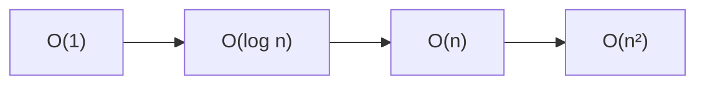

# 1.2. Fundamentos matemáticos y algoritmos

Los datos no solo se guardan: hay que **organizarlos, recorrerlos y analizarlos**. Para hacerlo con millones de filas hacen falta dos piezas (criterio **a)**):

- **Matemática discreta:** representar el dato como conjuntos, relaciones, funciones y grafos.
- **Algoritmos:** la secuencia de pasos. Su **complejidad** dice si el paso escala o se vuelve inviable.

Buscar un número en una lista de 10 elementos es fácil. En 10 millones ya no vale “mirar uno a uno” si puedes partir por la mitad.

Cuadernos de aula (opcionales): [conjuntos y grafos](https://colab.research.google.com/drive/1LZkMTdbtTa_XFnw_9ZzDI0HUoFlr0lpl?usp=sharing), [búsqueda lineal y binaria](https://colab.research.google.com/drive/1QMJKYknyyv_-pyOQ5WaNdqCZZ2u8KyPS?usp=sharing).

## Conjuntos

Un conjunto es una colección de elementos bien definidos. Operaciones que **ya usas** al cruzar datasets:

| Operación | Idea | En el hotel / clientes |
| --- | --- | --- |
| Unión A ∪ B | Lo que está en A **o** en B | Todos los huéspedes de web y OTA |
| Intersección A ∩ B | Lo común | Quien compró producto X **y** Y |
| Diferencia A − B | En A y no en B | Reservas **sin** cobro |
| Producto cartesiano A × B | Todos los pares | Rara vez lo quieres entero: explota |

En pandas, un *inner join* se parece a una intersección por clave; un *outer*, a una unión con nulos; filtrar “reservas sin cobro” es una diferencia.

## Relaciones, funciones y lógica

Una **relación** conecta elementos: *Juan es amigo de Ana*; *esta reserva pertenece a este hotel*.

Una **función** asigna a cada entrada una sola salida: `f(usuario) → edad`. En preproceso es recodificar, estandarizar unidades, calcular un score.

La **lógica** filtra. Una proposición es verdadera o falsa. Operadores:

- AND (∧): las dos.
- OR (∨): al menos una.
- NOT (¬): lo contrario.

```text
P: edad > 18
Q: compras > 5
VIP = P ∧ Q
```

En pandas: `df[(df["ciudad"] == "Madrid") & (df["edad"] > 30)]`. Esa línea **es** lógica algorítmica aplicada al dato.

## Grafos

Nodos (objetos) y aristas (relaciones). Encajan cuando la pregunta es *quién se conecta con quién*: comunidades en redes, rutas logísticas, productos que se compran juntos. No hace falta Gephi en esta UT: sí reconocer que un join muchos-a-muchos **es** un grafo disfrazado de tabla.

## Lógica algorítmica

Un algoritmo es una secuencia **finita**, **determinada** y con **entradas y salidas**.

```text
Inicio
  Leer lista de importes
  Sumar
  Dividir entre el número de elementos
  Mostrar media
Fin
```

Eso, en Python, es un `for` o un `df["importe"].mean()`. El criterio a) no pide recitar Knuth: pide **ver el coste** del paso cuando n crece.

## Complejidad (Big-O)

No medimos segundos de tu portátil. Medimos **cómo crece** el trabajo cuando n (filas, nodos, eventos) se hace enorme.

| Orden | Nombre | Intuición | Ejemplo |
| --- | --- | --- | --- |
| O(1) | Constante | Un paso, da igual n | Buscar en un `dict` / tabla hash |
| O(log n) | Logarítmico | Partes por la mitad | Búsqueda binaria (lista **ordenada**) |
| O(n) | Lineal | Un pase | Recorrer el CSV |
| O(n²) | Cuadrático | Cada uno con todos | Comparar cada reserva con todas las demás |

Con 1 000 000 de elementos, lineal son ~10⁶ pasos; binaria, ~20; cuadrática, ~10¹². Por eso un doble bucle “para detectar duplicados” **no** es el plan en Big Data: usas `drop_duplicates`, un hash o una ventana.



O(1) es una raya plana. O(log n) se aplana pronto. O(n) sube sin parar. O(n²) se vuelve inviable.

!!! failure "Trampa de aula"
    «Como pandas es rápido, la complejidad da igual.» pandas **esconde** el bucle. Si tu idea es O(n²), el clúster también pagará shuffle y tiempo. El criterio a) es elegir la operación, no el logo.

## Representar la información

Listas, conjuntos, diccionarios, tablas (DataFrame) y grafos son **estructuras**. Eliges la que hace barata la pregunta: filtrar por clave → diccionario; agregar por ciudad → tabla; “quién conoce a quién” → grafo.

!!! example "En voz alta"
    Tienes 5 millones de logs y quieres las visitas de una IP. ¿Recorres el fichero cada vez (O(n) por consulta) o indexas/particionas por IP? Esa es la pregunta de complejidad aplicada al análisis.

## Actividad breve

Estudio de logística (el mismo caso de integración): modela **conjuntos** (clientes, pedidos entregados, retrasados) y **una** relación (pedido–ruta). Di qué operación responde “pedidos retrasados de clientes VIP”. No hace falta programarlo todavía; en [1.4](preproceso.md) lo conviertes en un join.
