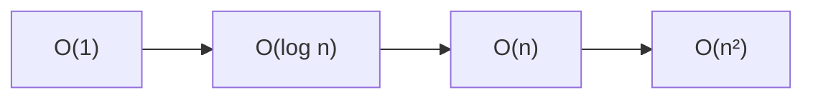

# 1.2. Fundamentos matemáticos y algoritmos

!!! warning "Mismo cuaderno de arranque que el eXe"
    Antes de los ejemplos de este tema, el eXe de *Técnicas de análisis* / *Fundamentos* pide el Colab **Inicio con Python**:

    **[14JeRxBG1KoCPKAJGbQyWnSoG_NuiLkxJ](https://colab.research.google.com/drive/14JeRxBG1KoCPKAJGbQyWnSoG_NuiLkxJ?usp=sharing)** · [página](inicio-python.md)

Los datos no solo se guardan: hay que **organizarlos, recorrerlos y analizarlos**. Para hacerlo con millones de filas hacen falta dos piezas (criterio **a)**):

Al terminar serás capaz de: reconocer matemática discreta aplicada a datos; comprender lógica algorítmica; identificar complejidad (por qué un O(n²) no escala); aplicar un grafo o un filtro lógico sencillo.

- **Matemática discreta:** representar el dato como conjuntos, relaciones, funciones y grafos.
- **Algoritmos:** la secuencia de pasos. Su **complejidad** dice si el paso escala o se vuelve inviable.

Buscar un número en una lista de 10 elementos es fácil. En 10 millones ya no vale “mirar uno a uno” si puedes partir por la mitad.

Sigue el apartado en Colab (paquete *Fundamentos matemáticos y algoritmos*):

- Matemática discreta: [1LZkMTdbtTa_XFnw_9ZzDI0HUoFlr0lpl](https://colab.research.google.com/drive/1LZkMTdbtTa_XFnw_9ZzDI0HUoFlr0lpl?usp=sharing)
- Combinatoria: [1lOe3pA0-L7iGGNWAmDtZwt1ZxXv4L-zO](https://colab.research.google.com/drive/1lOe3pA0-L7iGGNWAmDtZwt1ZxXv4L-zO?usp=sharing)
- Miniproyecto del tema: [1YYxgnXcdUw0_qgwGdYeGwvOjxh-dLlsj](https://colab.research.google.com/drive/1YYxgnXcdUw0_qgwGdYeGwvOjxh-dLlsj?usp=sharing)

## Conjuntos

Un conjunto es una colección de elementos bien definidos. Operaciones que **ya usas** al cruzar datasets:

| Operación | Idea | En el hotel / clientes |
| --- | --- | --- |
| Unión A ∪ B | Lo que está en A **o** en B | Todos los huéspedes de web y OTA |
| Intersección A ∩ B | Lo común | Quien compró producto X **y** Y |
| Diferencia A − B | En A y no en B | Reservas **sin** cobro |
| Producto cartesiano A × B | Todos los pares | Rara vez lo quieres entero: explota |

En pandas, un *inner join* se parece a una intersección por clave; un *outer*, a una unión con nulos; filtrar “reservas sin cobro” es una diferencia.

## Relaciones, funciones y lógica

Una **relación** conecta elementos: *Juan es amigo de Ana*; *esta reserva pertenece a este hotel*.

Una **función** asigna a cada entrada una sola salida: `f(usuario) → edad`. En preproceso es recodificar, estandarizar unidades, calcular un score.

La **lógica** filtra. Una proposición es verdadera o falsa. Operadores:

- AND (∧): las dos.
- OR (∨): al menos una.
- NOT (¬): lo contrario.

```text
P: edad > 18
Q: compras > 5
VIP = P ∧ Q
```

En pandas: `df[(df["ciudad"] == "Madrid") & (df["edad"] > 30)]`. Esa línea **es** lógica algorítmica aplicada al dato.

## Grafos

Nodos (objetos) y aristas (relaciones). Encajan cuando la pregunta es *quién se conecta con quién*: comunidades en redes, rutas logísticas, productos que se compran juntos. No hace falta Gephi en esta UT: sí reconocer que un join muchos-a-muchos **es** un grafo disfrazado de tabla.

## Lógica algorítmica

Un algoritmo es una secuencia **finita**, **determinada** y con **entradas y salidas**.

```text
Inicio
  Leer lista de importes
  Sumar
  Dividir entre el número de elementos
  Mostrar media
Fin
```

Eso, en Python, es un `for` o un `df["importe"].mean()`. El criterio a) no pide recitar Knuth: pide **ver el coste** del paso cuando n crece.

## Complejidad (Big-O)

No medimos segundos de tu portátil. Medimos **cómo crece** el trabajo cuando n (filas, nodos, eventos) se hace enorme.

| Orden | Nombre | Intuición | Ejemplo |
| --- | --- | --- | --- |
| O(1) | Constante | Un paso, da igual n | Buscar en un `dict` / tabla hash |
| O(log n) | Logarítmico | Partes por la mitad | Búsqueda binaria (lista **ordenada**) |
| O(n) | Lineal | Un pase | Recorrer el CSV |
| O(n²) | Cuadrático | Cada uno con todos | Comparar cada reserva con todas las demás |

Con 1 000 000 de elementos, lineal son ~10⁶ pasos; binaria, ~20; cuadrática, ~10¹². Por eso un doble bucle “para detectar duplicados” **no** es el plan en Big Data: usas `drop_duplicates`, un hash o una ventana.



O(1) es una raya plana. O(log n) se aplana pronto. O(n) sube sin parar. O(n²) se vuelve inviable.

Cuadernos de complejidad del eXe:

- Teoría y notación: [1InYuv7O8DWM0g4mFHRIpw3-LGPrfYlxu](https://colab.research.google.com/drive/1InYuv7O8DWM0g4mFHRIpw3-LGPrfYlxu?usp=sharing)
- Búsqueda lineal frente a binaria: [1QMJKYknyyv_-pyOQ5WaNdqCZZ2u8KyPS](https://colab.research.google.com/drive/1QMJKYknyyv_-pyOQ5WaNdqCZZ2u8KyPS?usp=sharing)
- Tiempos en listas pequeñas y enormes: [1mZfjK-IH2qmyKHnUe2LU6kiarKepmveX](https://colab.research.google.com/drive/1mZfjK-IH2qmyKHnUe2LU6kiarKepmveX?usp=sharing)

!!! failure "Trampa de aula"
    «Como pandas es rápido, la complejidad da igual.» pandas **esconde** el bucle. Si tu idea es O(n²), el clúster también pagará shuffle y tiempo. El criterio a) es elegir la operación, no el logo.

## Combinatoria (visión aplicada)

Estudia cuántas formas hay de ordenar o elegir:

- Producto cartesiano: todos los pares entre conjuntos.
- Permutaciones: el orden **sí** importa.
- Combinaciones: el orden **no** importa.

Aplicación: escenarios, optimización, “clientes que compraron A también compraron B”. Cuaderno: [combinatoria](https://colab.research.google.com/drive/1lOe3pA0-L7iGGNWAmDtZwt1ZxXv4L-zO?usp=sharing).

La teoría de grupos (asociatividad, neutro, inverso) aparece más adelante en cifrado y en álgebra lineal de ML; en UT1 basta el nombre.

## Representar la información

Un **dataset** es un conjunto estructurado: cada fila es una observación (cliente, compra, sensor) y cada columna un atributo. En Big Data puede tener millones de filas: por eso pandas, Spark o Hadoop.

| Estructura | Idea | Ejemplo |
| --- | --- | --- |
| Vector | Secuencia ordenada | Temperaturas `[20, 21, 23, 22]` |
| Matriz | Tabla filas × columnas | Usuario × producto en un recomendador |
| Tabla de decisión | Reglas en forma tabular | Edad>18 ∧ compras>5 → VIP |
| Árbol | Jerarquía | Categorías de Amazon |
| Grafo | Relaciones | Red social, rutas |
| Tabla hash | Búsqueda ~O(1) | `dict` de Python |

Cuaderno: [vectores, matrices y estructuras](https://colab.research.google.com/drive/1W1yXeDfUYtK2BtPVmWIHRrnu7oD1EihK?usp=sharing).

!!! example "En voz alta"
    Tienes 5 millones de logs y quieres las visitas de una IP. ¿Recorres el fichero cada vez (O(n) por consulta) o indexas/particionas por IP?

## Actividades del eXe (hacer en Colab)

**1. Conjuntos y lógica.** A = {Ana, Juan, Marta, Luis} compraron X; B = {Marta, Luis, Sofía, Pedro} compraron Y. Calcula A ∪ B, A ∩ B, A − B.

Premium si edad > 25 **y** compras > 10:

| Cliente | Edad | Compras |
| --- | --- | --- |
| Ana | 28 | 12 |
| Juan | 22 | 15 |
| Marta | 30 | 8 |
| Luis | 35 | 20 |
| Sofía | 24 | 5 |

**2. Matriz** (Móvil / Portátil / Auriculares):

| | Móvil | Portátil | Auriculares |
| --- | --- | --- | --- |
| Ana | 2 | 1 | 3 |
| Juan | 0 | 2 | 1 |
| Marta | 3 | 0 | 2 |
| Luis | 1 | 1 | 4 |

¿Quién compró más en total? ¿Qué producto es el más popular?

**3. Combinatoria.** Entrantes {Sopa, Ensalada, Gazpacho, Croquetas} × platos {Pollo, Pescado, Pasta}. Escribe **todas** las combinaciones (1+1). Solución esperada: **12**.

**4. Árbol.** Si edad > 25 y compras > 5 → descuento. Aplícalo a Ana 28/12, Juan 22/3, Marta 19/6, Luis 35/4.

El anexo Word de *Técnicas de análisis* (Tema 2) incluye además este Colab de apoyo: [1zLLp2cZTXoTCLczo8ibElVPZX7eIZEPx](https://colab.research.google.com/drive/1zLLp2cZTXoTCLczo8ibElVPZX7eIZEPx?usp=sharing).

## Estudio de logística

Completa las celdas `# --- TU CÓDIGO AQUÍ ---` del cuaderno de conjuntos, relaciones, funciones, lógica y grafos:

[1cWbe73qRxhDEDg5FCM-Fdwj8GvIVLj58](https://colab.research.google.com/drive/1cWbe73qRxhDEDg5FCM-Fdwj8GvIVLj58?usp=sharing)

## Solución de referencia (profesorado)

- [14PapYsQgCl1E8a2Nm1mKHrGNOTQ14dVd](https://colab.research.google.com/drive/14PapYsQgCl1E8a2Nm1mKHrGNOTQ14dVd?usp=sharing)
- [1H0_0yrT77FVNvCoxepL4bRy-dHlhf6ij](https://colab.research.google.com/drive/1H0_0yrT77FVNvCoxepL4bRy-dHlhf6ij?usp=sharing)

Índice de todos los cuadernos: [Cuadernos Colab](cuadernos.md).

## Resumen del tema (eXe)

- Matemática discreta (conjuntos, relaciones, combinatoria, grafos) modela el dato.
- Un algoritmo es una secuencia finita de pasos con entradas y salidas.
- La complejidad dice si el paso escala.
- Estructuras: vectores, matrices, grafos, árboles, tablas de decisión.
- El modelado sigue en [modelado](modelado.md); extraer, en [1.3](extraccion.md).
