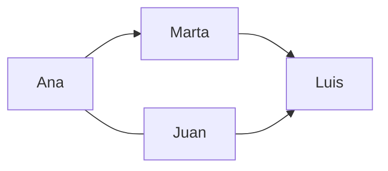
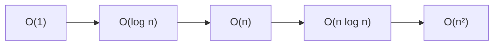

# 1.2. Fundamentos matemáticos y algoritmos

!!! warning "Cuaderno de inicio"
    Antes de los ejemplos de este tema, consulta el Colab **Inicio con Python**:

    **[Inicio con Python](https://colab.research.google.com/drive/14JeRxBG1KoCPKAJGbQyWnSoG_NuiLkxJ?usp=sharing)** · [página](inicio-python.md)

Los datos no solo se guardan: hay que **organizarlos, recorrerlos y analizarlos**. Para hacerlo con millones de filas hacen falta dos piezas (criterio **a)**):

Al terminar serás capaz de:

- reconocer matemática discreta aplicada a datos;
- traducir una regla de negocio a lógica y a código;
- identificar la complejidad temporal y espacial de una solución;
- explicar por qué O(n²) no escala;
- elegir entre lista, matriz, conjunto, diccionario, árbol o grafo;
- aplicar un grafo o un filtro lógico sencillo.

- **Matemática discreta:** representar el dato como conjuntos, relaciones, funciones y grafos.
- **Algoritmos:** la secuencia de pasos. Su **complejidad** dice si el paso escala o se vuelve inviable.

Buscar un número en una lista de 10 elementos es fácil. En 10 millones ya no vale “mirar uno a uno” si puedes partir por la mitad.

Sigue el apartado en el cuaderno de Colab de *Fundamentos matemáticos y algoritmos*:

- Matemática discreta: [Matemática discreta aplicada a Big Data](https://colab.research.google.com/drive/1LZkMTdbtTa_XFnw_9ZzDI0HUoFlr0lpl?usp=sharing)
- Combinatoria: [Combinatoria con menús](https://colab.research.google.com/drive/1lOe3pA0-L7iGGNWAmDtZwt1ZxXv4L-zO?usp=sharing)
- Repaso y miniproyecto de compras (resuelto): [Miniproyecto de compras y relaciones entre productos](https://colab.research.google.com/drive/1YYxgnXcdUw0_qgwGdYeGwvOjxh-dLlsj?usp=sharing)

## Conjuntos

La matemática discreta estudia objetos **contables**: bits, listas, conjuntos, relaciones y grafos. Frente al cálculo continuo, encaja de forma natural con lo que almacena un ordenador.

Un **conjunto** es una colección de elementos bien definidos, sin orden y sin repetidos. Operaciones que **ya usas** al cruzar datasets:

| Operación | Idea | En el hotel / clientes |
| --- | --- | --- |
| Unión A ∪ B | Lo que está en A **o** en B | Todos los huéspedes de web y OTA |
| Intersección A ∩ B | Lo común | Quien compró producto X **y** Y |
| Diferencia A − B | En A y no en B | Reservas **sin** cobro |
| Producto cartesiano A × B | Todos los pares | Rara vez lo quieres entero: explota |

En pandas, un *inner join* se parece a una intersección por clave; un *outer*, a una unión con nulos; filtrar “reservas sin cobro” es una diferencia.

Ejemplo:

```python
A = {"Ana", "Juan", "Marta", "Luis"}       # compraron X
B = {"Marta", "Luis", "Sofía", "Pedro"}    # compraron Y

print("unión:", A | B)
print("intersección:", A & B)
print("solo X:", A - B)
print("todos los pares:", {(a, b) for a in A for b in B})
```

Si `|A| = 4` y `|B| = 4`, entonces `|A × B| = 16`. Con dos tablas de un millón de filas, el producto cartesiano puede generar **10¹² pares**: nunca hagas un `CROSS JOIN` por accidente.

## Relaciones, funciones y lógica

Una **relación** conecta elementos: *Juan es amigo de Ana*; *esta reserva pertenece a este hotel*. Formalmente, una relación entre A y B es un subconjunto de `A × B`: no todos los pares tienen por qué estar conectados.

Una **función** asigna a **cada** elemento del dominio una sola salida en el codominio: `f(usuario) → edad`. Distintos usuarios pueden tener la misma edad; lo que no puede tener un usuario son dos edades distintas en la misma función. En [preproceso](preproceso.md) es recodificar, estandarizar unidades o calcular un *score*.

La **lógica** filtra. Una proposición es verdadera o falsa. Operadores:

- AND (∧): las dos.
- OR (∨): al menos una.
- NOT (¬): lo contrario.

```text
P: edad > 18
Q: compras > 5
VIP = P ∧ Q
```

En pandas: `df[(df["ciudad"] == "Madrid") & (df["edad"] > 30)]`. Esa línea **es** lógica algorítmica aplicada al dato.

Tabla de verdad que evita confundir AND con OR:

| P | Q | P ∧ Q | P ∨ Q | ¬P |
| --- | --- | --- | --- | --- |
| F | F | F | F | V |
| F | V | F | V | V |
| V | F | F | V | F |
| V | V | V | V | F |

!!! warning "Paréntesis en pandas"
    Python usa `&`, `|` y `~` con Series. Cada comparación va entre paréntesis:

    ```python
    premium = df[(df["edad"] > 25) & (df["compras"] > 10)]
    ```

    No uses `and` / `or` con Series: pandas no puede reducir una columna completa a un único verdadero o falso.

## Grafos

Un grafo se escribe `G = (V, E)`:

- `V` (*vertices*): nodos u objetos;
- `E` (*edges*): aristas o relaciones.

Encaja cuando la pregunta es *quién se conecta con quién*: comunidades en redes, rutas logísticas y productos que se compran juntos.

| Tipo de grafo | Pregunta | Ejemplo |
| --- | --- | --- |
| No dirigido | ¿Existe relación mutua? | Ana — Juan son amigos |
| Dirigido | ¿Quién apunta a quién? | Ana → Juan lo sigue |
| Ponderado | ¿Cuánto cuesta la conexión? | Santander → Bilbao: 102 km |



En Python, una lista de adyacencia evita almacenar todas las parejas:

```python
red = {
    "Ana": {"Juan", "Marta"},
    "Juan": {"Ana", "Luis"},
    "Marta": {"Luis"},
    "Luis": set(),
}

vecinos_de_ana = red["Ana"]
```

No hace falta Gephi en esta UT. Sí reconocer que una tabla de aristas (`origen`, `destino`, `peso`) representa un grafo y que un *join* muchos-a-muchos puede generar muchas conexiones.

## Lógica algorítmica

Un algoritmo es una secuencia **ordenada**, **finita**, **no ambigua** y con **entradas y salidas**.

```text
Inicio
  Leer lista de importes
  Sumar
  Dividir entre el número de elementos
  Mostrar media
Fin
```

Una traducción segura:

```python
def media(numeros):
    if not numeros:
        raise ValueError("No se puede calcular la media de una lista vacía")

    total = 0
    for numero in numeros:
        total += numero
    return total / len(numeros)
```

Eso también puede escribirse `df["importe"].mean()`. La llamada de pandas es más corta, pero el motor todavía tiene que recorrer los valores.

!!! note "«Determinista», con precisión"
    Para iniciarse, significa que cada paso está claramente definido. En informática también existen **algoritmos aleatorizados**; siguen siendo algoritmos aunque la misma entrada pueda recorrer caminos distintos.

## Complejidad (Big-O)

La complejidad mide **tiempo o memoria** en función del tamaño de entrada `n`. No medimos los segundos concretos de tu portátil —dependen del hardware y la implementación—, sino **cómo crece** el trabajo cuando aumentan filas, nodos o eventos.

| Orden | Nombre | Intuición | Ejemplo |
| --- | --- | --- | --- |
| O(1) | Constante | El coste no crece con n | Acceder por clave en un `dict`, **en promedio** |
| O(log n) | Logarítmico | Partes por la mitad | Búsqueda binaria (lista **ordenada**) |
| O(n) | Lineal | Un pase | Recorrer el CSV |
| O(n log n) | Casi lineal | Divide y combina | Ordenación eficiente |
| O(n²) | Cuadrático | Cada uno con todos | Comparar cada reserva con todas las demás |

Con 1 000 000 de elementos, lineal son ~10⁶ pasos; binaria, ~20; `n log₂n`, ~20 millones; cuadrática, ~10¹². Por eso un doble bucle “para detectar duplicados” **no** es el plan en Big Data: usas `drop_duplicates`, una tabla hash o una ventana.



O(1) es una raya plana. O(log n) crece muy despacio. O(n) sube proporcionalmente. O(n²) se vuelve inviable.

### Lineal frente a binaria

```python
def busqueda_lineal(datos, objetivo):
    for posicion, valor in enumerate(datos):
        if valor == objetivo:
            return posicion
    return -1


def busqueda_binaria(datos_ordenados, objetivo):
    izquierda, derecha = 0, len(datos_ordenados) - 1
    while izquierda <= derecha:
        centro = (izquierda + derecha) // 2
        if datos_ordenados[centro] == objetivo:
            return centro
        if datos_ordenados[centro] < objetivo:
            izquierda = centro + 1
        else:
            derecha = centro - 1
    return -1
```

Para 16 elementos, binaria necesita como máximo unas 4 comparaciones; para un millón, unas 20.

!!! warning "La búsqueda binaria no ordena gratis"
    Exige una colección **ya ordenada**. Si primero ordenas, pagas O(n log n). Para **una sola búsqueda**, recorrer O(n) puede ser más barato; para miles de consultas sobre la misma colección, ordenar o indexar sí compensa.

!!! note "Tabla hash: O(1) esperado"
    `set` y `dict` suelen buscar en O(1), pero no garantizan literalmente un paso ni O(1) en el peor caso: hay colisiones, redimensionados y coste de calcular el *hash*. El coste constante es una intuición útil del caso promedio, no una garantía absoluta.

### Cuadernos de complejidad

- [Big-O: teoría y curvas de crecimiento](https://colab.research.google.com/drive/1InYuv7O8DWM0g4mFHRIpw3-LGPrfYlxu?usp=sharing): explicación de Big-O y curvas teóricas. La curva cuadrática está dividida por 100 y el eje vertical limitado a 100; el gráfico ilustra tendencias, no segundos medidos.
- [Búsquedas en listas, conjuntos y diccionarios](https://colab.research.google.com/drive/1mZfjK-IH2qmyKHnUe2LU6kiarKepmveX?usp=sharing): búsqueda lineal y binaria en lista ordenada, seguida de búsquedas en `set` y `dict`.
- [Búsquedas, memoria y alternativa con Dask](https://colab.research.google.com/drive/1QMJKYknyyv_-pyOQ5WaNdqCZZ2u8KyPS?usp=sharing): amplía la comparación con un caso de agotamiento de RAM, una versión que libera cada colección antes de crear la siguiente y un ejemplo con Dask. La parte sobre PySpark es explicativa; no contiene un laboratorio ejecutable de Spark.

!!! warning "Ajusta el tamaño antes de ejecutar"
    El cuaderno de listas empieza con `n = 200_000_000`; su segundo ejemplo usa `200_000_00`, que son **20 millones**, aunque el comentario dice 200 millones. El de memoria utiliza 100 y 80 millones. En tu copia, cambia **cada asignación de `n`** a `100_000` para la primera prueba. En el ejemplo Dask, reduce también `CHUNK_SIZE` a `10_000`. Ejecuta por bloques y aumenta el tamaño solo después de observar el consumo de memoria.

En el ejemplo Dask, el acceso por índice no es una búsqueda hash. La llamada a `np.searchsorted` tampoco constituye por sí sola una medición comparable de búsqueda binaria distribuida. Utiliza las funciones explícitas sobre listas para comparar algoritmos, y el bloque Dask para observar el procesamiento por bloques.

!!! failure "Trampa de aula"
    «Como pandas es rápido, la complejidad da igual.» pandas **esconde** el bucle. Si tu idea es O(n²), el clúster también pagará shuffle y tiempo. El criterio a) es elegir la operación, no el logo.

## Combinatoria (visión aplicada)

Estudia cuántas formas hay de ordenar o elegir:

- **Producto cartesiano:** todos los pares entre conjuntos; `|A × B| = |A| · |B|`.
- **Permutaciones:** ordenar todos los elementos; `n!`.
- **Variaciones:** elegir y ordenar `k`; `n! / (n-k)!`.
- **Combinaciones:** elegir `k` sin importar el orden; `n! / (k!(n-k)!)`.

¿Código PIN `123` y `321` cuentan distinto? Sí: importa el orden. ¿Un comité formado por Ana, Luis y Marta cambia por escribir Marta, Ana y Luis? No: es la misma combinación.

```python
from itertools import combinations, permutations, product

entrantes = ["Sopa", "Ensalada", "Gazpacho", "Croquetas"]
platos = ["Pollo", "Pescado", "Pasta"]

menus = list(product(entrantes, platos))      # 4 · 3 = 12
ordenes = list(permutations(["A", "B", "C"])) # 3! = 6
parejas = list(combinations(["A", "B", "C"], 2))
```

Aplicación: escenarios, optimización, “clientes que compraron A también compraron B”. Cuaderno: [combinatoria](https://colab.research.google.com/drive/1lOe3pA0-L7iGGNWAmDtZwt1ZxXv4L-zO?usp=sharing).

### Teoría de grupos (reconocimiento)

Un grupo es un conjunto con una operación **cerrada** y asociativa, con elemento neutro e inverso para cada elemento. La teoría formal es avanzada; aparece en cifrado y en simetrías. Conviene precisar que **vectores y matrices no son por sí solos teoría de grupos**. En UT1 basta reconocer el concepto.

## Representar la información

Un **dataset** es un conjunto organizado de datos. En una tabla, cada fila es una observación (cliente, compra, sensor en un instante) y cada columna, un atributo (edad, precio, fecha). No todo dataset tiene que ser tabular: una colección de imágenes etiquetadas también lo es.

En Big Data puede contener millones o miles de millones de observaciones: por eso la estructura elegida afecta a memoria, recorrido y búsqueda.

| Estructura | Idea | Ejemplo |
| --- | --- | --- |
| Vector | Secuencia ordenada | Temperaturas `[20, 21, 23, 22]` |
| Matriz | Tabla filas × columnas | Usuario × producto en un recomendador |
| Tabla de decisión | Reglas en forma tabular | Edad>18 ∧ compras>5 → VIP |
| Árbol | Jerarquía | Categorías de Amazon |
| Grafo | Relaciones | Red social, rutas |
| Tabla hash | Búsqueda ~O(1) | `dict` de Python |

Cuaderno: [vectores, matrices y estructuras](https://colab.research.google.com/drive/1W1yXeDfUYtK2BtPVmWIHRrnu7oD1EihK?usp=sharing).

### Vector y matriz en Python

```python
import numpy as np

temperaturas = np.array([20, 21, 23, 22])
print("media:", temperaturas.mean())

compras = np.array(
    [
        [2, 1, 3],  # Ana
        [0, 2, 1],  # Juan
        [3, 0, 2],  # Marta
        [1, 1, 4],  # Luis
    ]
)

print("total por cliente:", compras.sum(axis=1))
print("total por producto:", compras.sum(axis=0))
```

`axis=1` suma a lo largo de las columnas (una cifra por fila/cliente). `axis=0` baja por las filas (una cifra por columna/producto).

### Tabla de decisión

| Edad > 18 | Compras > 5 | VIP |
| --- | --- | --- |
| Sí | Sí | Sí |
| Sí | No | No |
| No | Sí o no | No |

Es la misma regla que `edad > 18 AND compras > 5`, expresada para que negocio pueda revisarla sin leer Python.

!!! example "En voz alta"
    Tienes 5 millones de logs y quieres las visitas de una IP. ¿Recorres el fichero cada vez (O(n) por consulta) o indexas/particionas por IP?

## Actividades (hacer en Colab)

**1. Conjuntos y lógica.** Objetivo: practicar operaciones con conjuntos y aplicar una regla lógica a clientes. A = {Ana, Juan, Marta, Luis} compraron X; B = {Marta, Luis, Sofía, Pedro} compraron Y. Calcula A ∪ B, A ∩ B, A − B.

Premium si edad > 25 **y** compras > 10:

| Cliente | Edad | Compras |
| --- | --- | --- |
| Ana | 28 | 12 |
| Juan | 22 | 15 |
| Marta | 30 | 8 |
| Luis | 35 | 20 |
| Sofía | 24 | 5 |

**2. Matriz** (Móvil / Portátil / Auriculares). Objetivo: representar datos bidimensionales y extraer totales por fila y columna:

| | Móvil | Portátil | Auriculares |
| --- | --- | --- | --- |
| Ana | 2 | 1 | 3 |
| Juan | 0 | 2 | 1 |
| Marta | 3 | 0 | 2 |
| Luis | 1 | 1 | 4 |

¿Quién compró más en total? ¿Qué producto es el más popular?

**3. Combinatoria.** Objetivo: contar y enumerar posibilidades en un caso real. Entrantes {Sopa, Ensalada, Gazpacho, Croquetas} × platos {Pollo, Pescado, Pasta}. Primero calcula cuántos menús pueden formarse y después escribe **todas** las combinaciones (1+1). Solución esperada: **12**.

**4. Árbol.** Objetivo: representar una regla de negocio como árbol de decisión. Dibuja las dos decisiones y sus ramas. Si edad > 25 y compras > 5 → descuento. Aplícalo a Ana 28/12, Juan 22/3, Marta 19/6, Luis 35/4.

??? check "Autocorrección: abre después de intentarlo"
    **Actividad 1**

    - `A ∪ B = {Ana, Juan, Marta, Luis, Sofía, Pedro}`.
    - `A ∩ B = {Marta, Luis}`.
    - `A − B = {Ana, Juan}`.
    - Premium (`edad > 25` **y** `compras > 10`): **Ana y Luis**.

    **Actividad 2**

    - Total por cliente: Ana 6, Juan 3, Marta 5, Luis 6. Máximo: **empate entre Ana y Luis**.
    - Total por producto: móvil 6, portátil 4, auriculares 10. Más popular: **auriculares**.

    **Actividad 3**

    - `4 entrantes × 3 platos = 12 menús`.

    **Actividad 4**

    - Solo **Ana** recibe descuento: Luis supera la edad, pero no `compras > 5`; Marta supera compras, pero no edad. Es AND, no OR.

### Plantilla de entrega

En una sola celda Markdown, antes del código:

```markdown
## Problema
(Qué se pregunta)

## Representación elegida
(conjunto, matriz, tabla, árbol o grafo; por qué)

## Algoritmo
(pasos o pseudocódigo)

## Complejidad
(orden Big-O y qué significa cuando crece n)

## Resultado
(valor obtenido y una comprobación)
```

El cuaderno de **tipos de datos y fundamentos** repasa tipos, mutabilidad y serialización JSON; después desarrolla conjuntos, lógica, grafos, matrices, combinatoria y búsquedas. Termina con **tres actividades distintas** de las cuatro anteriores: conjuntos de tiendas, matriz de recomendaciones 4×4 y suma de números pares con análisis de complejidad. El árbol de clasificación con scikit-learn es una ampliación. Enlace: [Tipos de datos y fundamentos en Python](https://colab.research.google.com/drive/1zLLp2cZTXoTCLczo8ibElVPZX7eIZEPx?usp=sharing).

## Miniproyecto de compras

El [Miniproyecto de compras y relaciones entre productos](https://colab.research.google.com/drive/1YYxgnXcdUw0_qgwGdYeGwvOjxh-dLlsj?usp=sharing) repite primero los ejemplos de matemática discreta y después presenta **«Mini-proyecto integrador: de transacciones a conocimiento»**. El código ya está resuelto: genera 5.000 cestas simuladas para 200 clientes y 12 productos, analiza intersecciones de clientes, construye un grafo de co-compra, calcula clientes VIP y representa ventas y productos.

Una fila representa un producto de una cesta, por lo que habrá más de 5.000 filas. Para relacionar productos, el código agrupa por **cliente y fecha**, no por un identificador único de ticket. El criterio VIP utiliza gasto y número de **líneas** por encima del percentil 80. Ejecuta los bloques, modifica un parámetro y explica cómo afecta al resultado.

## Estudio de logística

Completa las celdas `# --- TU CÓDIGO AQUÍ ---` del cuaderno de conjuntos, relaciones, funciones, lógica y grafos:

[Logística: cuaderno de actividades](https://colab.research.google.com/drive/1cWbe73qRxhDEDg5FCM-Fdwj8GvIVLj58?usp=sharing)

No conviertas el cuaderno en cinco ejercicios aislados. Cuenta una historia:

1. **Conjuntos:** pedidos atendidos por cada centro y operaciones entre ellos.
2. **Relaciones:** asignación de camiones a rutas y propiedades de esa relación.
3. **Funciones:** peso, coste y tarifa de los pedidos, con recargos.
4. **Lógica:** pedidos urgentes, pesados, peligrosos y orden de prioridad.
5. **Grafos:** centros conectados por carreteras y centralidad de grado; el grafo base no asigna pesos a las aristas.

Evidencia:

- [ ] Todas las celdas `TU CÓDIGO AQUÍ` están completadas.
- [ ] Cada salida tiene una frase que la interpreta.
- [ ] La estructura elegida está justificada.
- [ ] Hay al menos una comprobación del resultado.
- [ ] Se explica la complejidad de una búsqueda o recorrido.

## Solución de referencia (profesorado)

- Las cuatro actividades de esta página (conjuntos, matriz, menús y descuento), resueltas: [Cuatro actividades resueltas de fundamentos](https://colab.research.google.com/drive/14PapYsQgCl1E8a2Nm1mKHrGNOTQ14dVd?usp=sharing).
- Logística resuelta: [Logística: tareas resueltas](https://colab.research.google.com/drive/1H0_0yrT77FVNvCoxepL4bRy-dHlhf6ij?usp=sharing).

En la matriz de compras hay empate entre **Ana y Luis** (6 unidades). El cuaderno resuelto muestra un solo nombre con `idxmax()`; la respuesta completa debe mencionar a ambos.

Úsalas **después** de intentar el problema. Una solución que se ejecuta pero que no puedes explicar no demuestra el criterio **a)**.

Índice de todos los cuadernos: [Cuadernos Colab](cuadernos.md).

## Correcciones y precisiones

1. **Permutación frente a variación.** Si se eligen `k` de `n` y el orden importa, son **variaciones**; una permutación ordena los `n` elementos.
2. **Tabla hash O(1).** Es coste esperado o promedio, no una garantía absoluta.
3. **Búsqueda binaria.** Los ~20 pasos para un millón presuponen una lista **ordenada**; ordenar desde cero cuesta O(n log n).
4. **Algoritmo determinista.** Es una propiedad útil para iniciarse, pero existen algoritmos aleatorizados. El requisito general es que los pasos estén definidos.
5. **Teoría de grupos.** La operación debe cumplir el **cierre**; además, álgebra lineal no es sinónimo de teoría de grupos.
6. **Dataset.** Un dataset no se limita a filas y columnas. Una colección de imágenes o grafos también puede ser un dataset.
7. **Gráfico de complejidad.** La curva O(n²) está dividida por 100 y el eje vertical corta las curvas al llegar a 100. Sirve como intuición, pero no para comparar valores reales; por eso aquí se dan órdenes y cifras explícitas.
8. En la actividad de matriz, “quién compró más productos” significa **más unidades en total**, no más categorías distintas.

## Referencias para consultar

Para implementar los ejemplos:

- [Python — conjuntos](https://docs.python.org/3/library/stdtypes.html#set-types-set-frozenset)
- [Python — `itertools`](https://docs.python.org/3/library/itertools.html)
- [Python — complejidad temporal de estructuras](https://wiki.python.org/moin/TimeComplexity)
- [NumPy — introducción y creación de arrays](https://numpy.org/doc/stable/user/absolute_beginners.html)

## Resumen del tema

- Matemática discreta (conjuntos, relaciones, combinatoria, grafos) modela el dato.
- Un algoritmo es una secuencia finita de pasos con entradas y salidas.
- La complejidad dice si el paso escala.
- Estructuras: vectores, matrices, grafos, árboles, tablas de decisión.
- El modelado sigue en [modelado](modelado.md); extraer, en [1.3](extraccion.md).

!!! success "Al terminar 1.2"
    Ante un problema sabes elegir una representación, escribir una regla o algoritmo, estimar cómo crece su coste y comprobar el resultado. Eso es aplicar matemática discreta y lógica algorítmica al dato, no memorizar símbolos.
