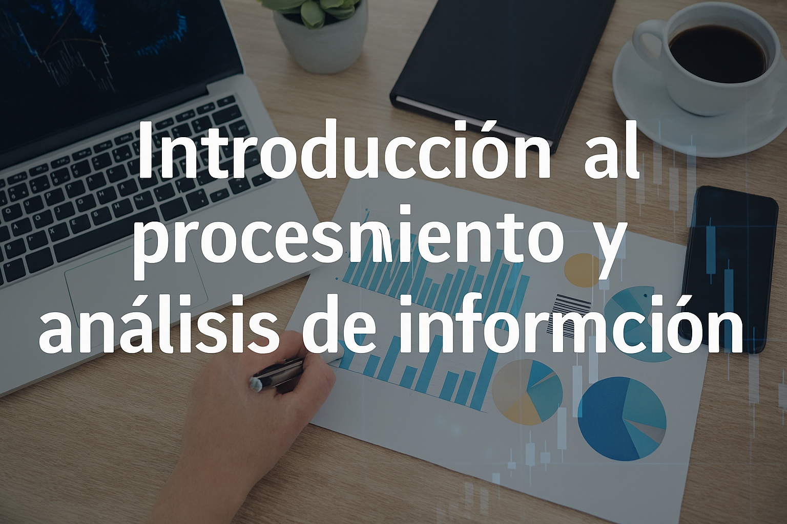

# Introducción al procesamiento y análisis de información

Este tema sigue el material utilizado en clase: primero los conceptos y después la actividad práctica con los cuadernos de Google Colab del profesor.

## Contenido del tema

- [1. Introducción: el valor de los datos](valor-datos.md)
- [2. Conceptos básicos](conceptos-basicos.md)
- [3. Arquitecturas de sistemas de datos (visión general)](arquitecturas.md)
- [4. Ejemplos de aplicación en la vida real](ejemplos.md)
- [5. Resumen del tema](resumen.md)
- [6. Actividad práctica (nivel inicial)](actividad.md)
- [Solución Profesor](solucion-profesor.md)

## Cómo trabajar el tema

Lee los apartados en orden. En la actividad encontrarás el cuaderno «Inicio con Python» y, en su página propia, la solución del profesor. Son los mismos enlaces del material original; los cuadernos siguen alojados en Google Colab.

No es necesario preparar el laboratorio local de Spark para empezar este tema. Sigue las indicaciones del profesor para trabajar con sus cuadernos.

[1. Introducción: el valor de los datos →](valor-datos.md)

---

Material docente original aportado por el profesor, procedente de eXeLearning. Se conserva la licencia [Creative Commons Reconocimiento–CompartirIgual 4.0](https://creativecommons.org/licenses/by-sa/4.0/). Adaptación de formato para estos apuntes.
