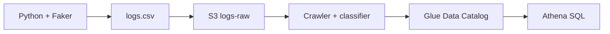

# 1.7. Laboratorio: logs web en AWS (S3 + Glue + Athena)

Una tienda online quiere saber **qué páginas se visitan más**, **desde qué países** y **en qué franjas**. Los servidores generan CSV (`timestamp`, `ip`, `url`, `country`, `user_agent`). Hay que almacenar barato, catalogar el esquema y consultar con SQL **sin montar un servidor de base de datos**.

Eso cierra **f)** (elegir e integrar sistemas) y **g)** (coste y calidad).

El laboratorio se hace en **AWS Academy** (Learner Lab), con la región y el rol que indique el profesor (`LabRole` suele ser el de aula). No copies claves de cuentas personales al cuaderno ni al git.

## Mini-mapa

| Servicio | Qué es | En la práctica |
| --- | --- | --- |
| **S3** | Almacén de **objetos** (ficheros), no una BD | Guardas `logs.csv` (lago sencillo) |
| **Glue Data Catalog** | Fichas: bases, tablas, columnas, tipos, ruta | Sabes qué hay en el bucket |
| **Crawler** | Recorre S3 y **adivina** el esquema | Crea `logs_raw` |
| **Athena** | SQL *serverless* sobre S3 | `GROUP BY url` sin EC2 |

Athena usa el catálogo. En el mundo real cobra por **dato escaneado**, no por hora de máquina. Por eso el formato de [1.5](formatos.md) no es un capricho.



## Parte 0 — Generar el CSV

En tu máquina (no en AWS): Python 3 y `pip install faker`. Script de aula: [generar_logs.py](../assets/practicas/generar_logs.py).

```sh
python generar_logs.py
```

Debe crear `logs.csv` con cabecera exacta:

```text
timestamp,ip,url,country,user_agent
```

Ábrelo en un editor de texto, no solo en Excel (Excel a veces rompe la cabecera). Ni líneas en blanco ni comentarios encima.

## Parte 1 — Subir a S3

1. Consola → S3 → *Create bucket*.
2. Nombre único, minúsculas: `bd-logs-tu-nombre`.
3. Región: la del laboratorio.
4. Carpeta `logs-raw/` → *Upload* de `logs.csv`.

S3 no interpreta columnas: guarda el objeto. El significado viene después.

## Parte 2 — Glue: base, classifier y crawler

### Base de datos

Glue → Data Catalog → Databases → *Add database*: `bd_logs_db`.

### Classifier CSV (calidad del esquema)

Sin esto, el crawler a menudo crea `col1`…`col5` y trata la cabecera como **una fila más**.

1. Glue → Classifiers → *Add classifier* → CSV.
2. Nombre `csv-logs-web`. Delimitador `,`. **Contains header: PRESENT**.
3. Guarda.

Eso es el criterio **g)** en pequeño: el sistema tiene que **reconocer** el contrato del fichero.

### Crawler

1. Crawlers → *Create crawler*, nombre `crawler-logs-web`.
2. Origen S3: la carpeta `logs-raw/` de tu bucket.
3. Asocia el classifier `csv-logs-web`.
4. IAM: el rol de Academy.
5. Destino: base `bd_logs_db`.
6. *Create* y **Run**. Espera *Completed*.

En Tables abre `logs_raw` (o el nombre que haya salido). Debes ver `timestamp`, `ip`, `url`, `country`, `user_agent`, no `col1`.

!!! failure "Si ves col1…col5"
    1. Comprueba la primera línea del CSV en texto plano.  
    2. Arreglo rápido: *Edit schema* y renombra.  
    3. Arreglo correcto: classifier `PRESENT`, **borra** la tabla, vuelve a lanzar el crawler.

## Parte 3 — Athena

1. Misma región que S3 y Glue.
2. La primera vez, *settings*: bucket (o carpeta `athena-results/`) para la salida.
3. Catálogo por defecto, base `bd_logs_db`, tabla `logs_raw`.

```sql
SELECT *
FROM bd_logs_db.logs_raw
LIMIT 10;

SELECT COUNT(*) AS total_registros
FROM bd_logs_db.logs_raw;

SELECT url, COUNT(*) AS visitas
FROM bd_logs_db.logs_raw
GROUP BY url
ORDER BY visitas DESC;

SELECT country, COUNT(*) AS visitas
FROM bd_logs_db.logs_raw
GROUP BY country
ORDER BY visitas DESC;
```

Captura una consulta y su resultado si Moodle lo pide. Eso es **descriptivo** ([1.1](ciclo-analisis.md)): qué **ya** pasó en los logs.

## Reflexión (entrega f y g)

Tres a cinco líneas por pregunta:

1. ¿Por qué S3 y no una BD relacional para estos logs?
2. ¿Qué problema resuelven el crawler y el catálogo?
3. ¿Por qué Athena y no un PostgreSQL en EC2 para este caso?
4. ¿En qué sentido la solución es **eficaz y eficiente** (coste / calidad)? Incluye cabecera reconocida y, si puedes, qué cambiarías (Parquet, partición por fecha) cuando el CSV deje de ser de juguete.

!!! success "Evidencia"
    Bucket con el objeto, tabla con **nombres de negocio**, SQL que responde visitas por URL/país, y un párrafo de coste/calidad. Un pantallazo de S3 vacío no demuestra f).
