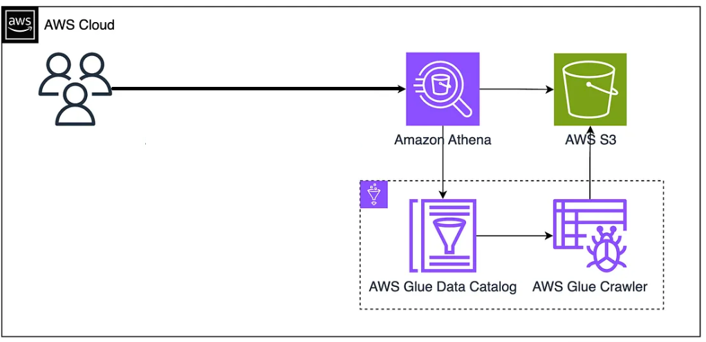
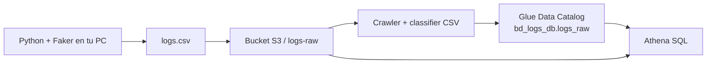

# 1.7. Laboratorio: logs web en AWS (S3 + Glue + Athena)

En este laboratorio analizarás logs web con S3, Glue y Athena. También resolverás un problema habitual de integración: que Glue detecte `col1`…`col5` en lugar de la cabecera del CSV.

Se hace en **AWS Academy** (Learner Lab), con la región y el rol que indique el profesor (`LabRole` suele ser el de aula). No copies claves de cuentas personales al cuaderno ni al git. **No hay Colab de este laboratorio**: el CSV se genera en tu máquina y el resto es consola de AWS.

Cierra el criterio **f)** (seleccionar e integrar sistemas que cubren el problema) y el **g)** (coste y calidad para que la implementación sea eficaz y eficiente).

Vídeo de aula (Educantabria / SharePoint): [laboratorio de logs web en AWS (S3, Glue, Athena)](https://educantabria-my.sharepoint.com/:v:/g/personal/jose_martin_educantabria_es/IQA_J2q1KXh9TbFUekUIK95zAY6sW6S5HnwHYyYyzhuF5Rc?nav=eyJyZWZlcnJhbEluZm8iOnsicmVmZXJyYWxBcHAiOiJPbmVEcml2ZUZvckJ1c2luZXNzIiwicmVmZXJyYWxBcHBQbGF0Zm9ybSI6IldlYiIsInJlZmVycmFsTW9kZSI6InZpZXciLCJyZWZlcnJhbFZpZXciOiJNeUZpbGVzTGlua0NvcHkifX0&e=dsJfm6).

!!! warning "Learner Lab"
    La sesión de Academy **caduca**. Cuando se apaga, suelen desaparecer bucket, tablas y consultas. Trabaja con el lab **arrancado**, no mezcles la región del laboratorio con una cuenta personal, y guarda las capturas **antes** de cerrar.

## Qué vas a montar

La figura muestra el recorrido de la práctica. Léela antes de pulsar nada en la consola.

<figure markdown="block">
{ width="100%" }
<figcaption>Arquitectura del laboratorio (AWS Cloud). Consultáis con Athena. Athena no adivina el CSV: pregunta al Glue Data Catalog (nombres y tipos de columna) y lee los bytes en S3. El Glue Crawler es quien ha recorrido el bucket y ha escrito esas fichas en el catálogo.</figcaption>
</figure>

Dos lecturas del mismo dibujo, para que las flechas no te líen:

| Momento | Qué ocurre |
| --- | --- |
| **Preparación** (tú, ahora) | Generas `logs.csv` → lo subes a **S3** → lanzas el **crawler** → el crawler escribe una tabla en el **Data Catalog**. |
| **Consulta** (Athena) | Tú escribes SQL → **Athena** mira el catálogo (*qué columnas hay, dónde está el fichero*) → **escanea S3** y te devuelve filas. |

Glue también tiene ETL y DataBrew. **En esta práctica no los usamos.** Solo Data Catalog + crawler.



## Conceptos clave

Hay que entender **qué es cada pieza** antes de crearlas. Si no, el asistente de Glue es una ristra de *Next* sin criterio **f)**.

### 1. Amazon S3

**Qué es.** Servicio de almacenamiento de **objetos** en la nube de AWS. Guarda ficheros (objetos) dentro de contenedores llamados **buckets**. Escala mucho y, por GB, es barato.

**Ideas clave**

- **No es una base de datos.** Guarda archivos completos (`.csv`, `.json`, imágenes…), no filas y columnas. S3 no sabe qué es `url` ni `country`.
- Cada bucket vive en una **región** (por ejemplo `us-east-1` o la que traiga el Learner Lab) y el nombre es **único en todo AWS**.
- En Big Data se usa como **data lake**: el sitio central donde se deja el bruto. Luego otros servicios (Glue, Athena, Spark…) leen **desde** S3, sin copiar a un disco de EC2.

**Para qué lo usamos aquí**

- Guardar el `logs.csv` generado con Python.
- Ese bucket es el “almacén de logs” (un lago sencillo).
- Glue y Athena leerán los datos **directamente** desde S3.

### 2. AWS Glue (Data Catalog + crawler)

**Data Catalog.** Catálogo de **metadatos**: un libro de fichas de tus datos. No guarda las 500 visitas; guarda:

- qué bases de datos **lógicas** tienes (`bd_logs_db` no es un PostgreSQL);
- qué tablas hay;
- para cada tabla: nombre de columnas, tipo, **ubicación en S3**, formato (CSV, Parquet…).

**Crawler.** Recorre (*crawl*) datos en S3 (u otras fuentes), **detecta el esquema** (columnas y tipos) y crea o actualiza tablas en el catálogo.

**Ideas clave**

- Sin catálogo, S3 solo tiene archivos sueltos. Athena no puede hacer `SELECT url` sobre un objeto que no tiene ficha.
- Con catálogo, Athena puede decir `SELECT * FROM bd_logs_db.logs_raw` aunque físicamente eso sea un CSV (o varios) en un bucket.
- El crawler **adivina**. A veces adivina mal la cabecera: salen `col1`…`col5`. Eso no es un detalle: es un problema de calidad relacionado con el criterio **g)**.

**Para qué lo usamos aquí**

- Base lógica `bd_logs_db`.
- Crawler que escanea `logs-raw/`, detecta el esquema de `logs.csv` y crea `logs_raw`.
- Gracias a eso, Athena hace SQL sobre los logs.

### 3. Amazon Athena

**Qué es.** Servicio **serverless** de consultas SQL en AWS. SQL directo sobre datos en S3. No montas ni administras servidores ni una instancia de base de datos.

**Ideas clave**

- Usa el Glue Data Catalog para saber qué bases, tablas, columnas y tipos existen.
- En una cuenta real cobra por la **cantidad de datos que escanea** cada consulta, no por hora de máquina encendida. En Academy el coste lo absorbe el lab; el criterio **g)** se evalúa igual: ¿harías esto con un CSV de 200 GB?
- Encaja en análisis exploratorio, consultas *ad hoc* y escenarios de data lake.

**Para qué lo usamos aquí**

- `SELECT * FROM logs_raw LIMIT 10;`
- `SELECT url, COUNT(*) FROM logs_raw GROUP BY url;`
- Analizar logs **sin** cargarlos en una BD tradicional y **sin** administrar PostgreSQL/MySQL en EC2.

Por eso el formato de [1.5](formatos.md) no es un capricho: un CSV enorme se paga cada vez que Athena lo reescanea. En juguete (500 filas) no se nota; en producción, sí.

### 4. Mini-mapa (chuleta)

| Servicio | Qué es | En la práctica |
| --- | --- | --- |
| **S3** | Almacenamiento de objetos (ficheros) | Guardamos `logs.csv` (datos de entrada) |
| **Glue Data Catalog + crawler** | Catálogo de metadatos + robot que detecta el esquema | El crawler recorre `logs.csv` en S3 y crea la tabla `logs_raw` |
| **Athena** | Motor SQL serverless sobre S3 usando el catálogo | Consultas: visitas por URL, país, franja horaria |

## 1. Contexto

Una pequeña tienda online quiere entender mejor el comportamiento de sus usuarios:

- Qué páginas se visitan más.
- Desde qué países llegan las visitas.
- En qué franjas horarias hay más tráfico.

Los servidores web generan ficheros de logs en **CSV** con esta información:

| Campo | Significado |
| --- | --- |
| `timestamp` | Fecha y hora de la visita |
| `ip` | Dirección IP del cliente |
| `url` | Página visitada |
| `country` | País |
| `user_agent` | Navegador / dispositivo |

La empresa quiere una solución sencilla en AWS que permita:

1. Almacenar **grandes volúmenes** de logs de manera barata y escalable.
2. **Catalogar** esos datos (qué columnas tienen y de qué tipo son).
3. Lanzar **consultas SQL** sobre los logs, sin montar ni administrar servidores de bases de datos.
4. Empezar a pensar en **coste y calidad** de la solución.

Eso es exactamente el problema que cubren **f)** y **g)**: no se pide “crear un bucket porque toca”, se pide **elegir S3 + Glue + Athena** frente a “una BD en EC2” y **justificarlo**.

## 2. Objetivo del laboratorio

1. Generar un fichero de logs de ejemplo en tu máquina usando Python.
2. Crear un bucket S3 y subir `logs.csv`.
3. Crear una base de datos y un crawler de AWS Glue que detecte el esquema del CSV y lo registre en el Glue Data Catalog.
4. Usar Amazon Athena para hacer consultas SQL sobre los logs almacenados en S3.
5. Reflexionar: por qué esta combinación de servicios es adecuada, y qué criterios de coste y calidad estás aplicando.

## Parte 0 — Generar `logs.csv` con Python y Faker

Esta parte **no** se hace en AWS. Si el CSV sale mal, Glue no tiene magia que lo arregle.

### Requisitos

En tu ordenador:

- Python 3.
- La librería `faker` (nombres, IP, *user agents* de mentira).

```sh
pip install faker
```

Conviene un entorno virtual, pero no es obligatorio en aula.

### Script

Descarga [generar_logs.py](../assets/practicas/generar_logs.py) o crea el archivo con este contenido:

```python
from faker import Faker
import random
import csv
from datetime import datetime, timedelta, timezone

fake = Faker()

URLS = [
    "/",
    "/home",
    "/productos",
    "/productos/categoria1",
    "/productos/categoria2",
    "/carrito",
    "/checkout",
    "/contacto",
    "/login",
    "/registro",
]

COUNTRIES = ["ES", "FR", "DE", "IT", "PT", "UK", "US"]


def generar_timestamp_ultimos_dias(dias=7):
    """Genera un timestamp aleatorio en los últimos 'dias' días."""
    ahora = datetime.now(timezone.utc)
    delta = timedelta(
        days=random.randint(0, dias),
        hours=random.randint(0, 23),
        minutes=random.randint(0, 59),
        seconds=random.randint(0, 59),
    )
    return (ahora - delta).isoformat()


def generar_logs(num_filas=500, nombre_fichero="logs.csv"):
    with open(nombre_fichero, mode="w", newline="", encoding="utf-8") as f:
        writer = csv.writer(f)
        writer.writerow(["timestamp", "ip", "url", "country", "user_agent"])
        for _ in range(num_filas):
            timestamp = generar_timestamp_ultimos_dias()
            ip = fake.ipv4_public()
            url = random.choice(URLS)
            country = random.choice(COUNTRIES)
            user_agent = fake.user_agent()
            writer.writerow([timestamp, ip, url, country, user_agent])
    print(f"Fichero '{nombre_fichero}' generado con {num_filas} filas.")


if __name__ == "__main__":
    generar_logs(num_filas=500, nombre_fichero="logs.csv")
```

Ejecuta:

```sh
python generar_logs.py
```

Debe crearse `logs.csv` **en la misma carpeta**, con 500 filas más la cabecera.

### Comprobar el fichero (no te saltes esto)

Abre `logs.csv` con un **editor de texto** (VS Code, Notepad++, el bloc de notas). **No** te fíes solo de Excel: al guardar, Excel a veces cambia la coma por `;`, añade una fila en blanco o mete BOM.

La **primera línea** tiene que ser exactamente:

```text
timestamp,ip,url,country,user_agent
```

Debajo, líneas del estilo:

```text
2026-09-14T08:21:03.512345+00:00,203.0.113.10,/productos,ES,Mozilla/5.0 ...
```

- Ni líneas en blanco ni comentarios **antes** de la cabecera.
- Cinco campos separados por coma.
- Sin una fila de título tipo `"Logs de la tienda"`.

Si esto falla, Glue creará `col1`…`col5` o peor. El Word de aula empieza aquí.

## Parte 1 — Subir los logs a S3

1. Entra en tu **Learner Lab** de AWS Academy y espera a que el lab esté *ready*. Abre la *AWS Management Console*.
2. En la barra de búsqueda, escribe **S3** y entra en Amazon S3.
3. Pulsa **Create bucket**.
4. Rellena:
    - **Bucket name:** un nombre único, todo en minúsculas, sin espacios. Ejemplo: `bd-logs-tu-nombre-alumno`. Si el nombre está cogido, AWS te lo dice: añade un sufijo (`-so`, `-2026`, tres cifras).
    - **Region:** deja la que trae el laboratorio. Si creas el bucket en otra región, Glue y Athena “no ven” los datos.
5. Deja el resto por defecto (bloqueo de acceso público, cifrado, etc.) y pulsa **Create bucket**.
6. Haz clic en el bucket recién creado.
7. Crea una carpeta llamada `logs-raw/`. El PDF la marca como opcional; **créala**: el crawler va a apuntar a esa ruta y así no mezcla resultados de Athena ni otros ficheros con el bruto.
8. Entra en `logs-raw/` → **Upload** → **Add files** → selecciona tu `logs.csv` → **Upload**.
9. Comprueba que el objeto aparece, con tamaño distinto de 0. Abre el objeto si quieres y mira *Properties*: la ruta será algo como `s3://bd-logs-tu-nombre-alumno/logs-raw/logs.csv`.

S3 **no** interpreta columnas. Ha guardado un objeto. El significado (cabecera, tipos) llega en Glue.

!!! tip "Nombres de bucket"
    Solo minúsculas, números y guiones. Sin tildes, sin `_` al inicio, sin mayúsculas. `Bd-Logs-José` fallará.

## Parte 2 — Base de datos y crawler en AWS Glue

Orden que evita el problema de aula: **crear el classifier CSV antes de lanzar el crawler**. Si **ya** lanzaste el crawler y ves `col1`…`col5`, salta a [el problema de la cabecera](#el-problema-de-aula-glue-no-lee-la-cabecera).

### 5.1. Crear la base de datos en el Data Catalog

1. Barra de búsqueda de la consola → **Glue** → AWS Glue.
2. Menú izquierdo: **Data Catalog** → **Databases**.
3. **Add database**.
4. Nombre: `bd_logs_db`.
5. **Create**.

Eso no crea un disco ni una instancia. Es solo el **nombre lógico** donde van a colgar las tablas.

### 5.2. Classifier CSV (hazlo ahora, no después del susto)

Sin classifier, el crawler a menudo detecta cinco columnas pero **no** reconoce la primera fila como cabecera. Entonces:

- los nombres de columna salen `col1`, `col2`, `col3`, `col4`, `col5`;
- la línea `timestamp,ip,url,country,user_agent` se trata como **una fila más de datos**.

Eso es exactamente el Word *Descripción del problema*.

1. En Glue, menú izquierdo → **Classifiers** (a veces *Custom classifiers*).
2. **Add classifier** → tipo **CSV**.
3. Rellena:
    - **Name:** `csv-logs-web`
    - **Delimiter:** `,`
    - **Contains header:** **PRESENT**
    - **Quote symbol:** `"` (el valor por defecto vale)
4. El resto, por defecto → guarda.

`Contains header = PRESENT` le dice a Glue, sin adivinanzas: *la primera fila **es** cabecera; úsala como nombres de columna*.

### 5.3. Crear y ejecutar el crawler

1. AWS Glue → **Crawlers**.
2. **Create crawler**.
3. Paso *Crawler details*:
    - Nombre: `crawler-logs-web`.
    - **Next**.
4. Paso *Data sources*:
    - **Add a data source**.
    - Origen: **S3**.
    - *Location of S3 data* → **Browse S3** → carpeta `logs-raw/` de **tu** bucket (la carpeta, no hace falta pinchar el CSV si apuntas al prefijo).
    - **Add data source** → **Next**.
5. *Classifiers* (el nombre exacto del paso cambia según el asistente; busca *Classifier* / *Custom classifiers*):
    - Añade `csv-logs-web`.
6. Paso *IAM role*:
    - El rol que indique el profesor. En AWS Academy suele ser **LabRole**.
    - Si no aparece ningún rol, el lab aún no ha terminado de provisionar: espera y recarga. No crees un rol “por si acaso” con políticas que no entiendes.
    - **Next**.
7. Paso *Output*:
    - *Database:* `bd_logs_db`.
    - **Next**.
8. Revisa el resumen → **Create crawler**.
9. En la lista, selecciona `crawler-logs-web` → **Run crawler**.
10. Espera. Un CSV de 500 filas suele tardar **uno o dos minutos**. Estados que importan:
    - última ejecución **Completed** (o *Succeeded*);
    - el crawler vuelve a *Ready*.
    - *Running* largo (más de 10 min) en este volumen: región distinta, rol sin permiso o ruta S3 mal copiada. Para y revisa.

### 5.4. Comprobar la tabla

*Data Catalog* → **Tables**. Debe haberse creado una tabla (`logs_raw` o un nombre parecido: a veces Glue usa el nombre de la carpeta).

Haz clic y revisa:

| Debes ver | No vale |
| --- | --- |
| Columnas `timestamp`, `ip`, `url`, `country`, `user_agent` | `col1`, `col2`, `col3`, `col4`, `col5` |
| Tipos (casi todo `string` es normal en este CSV) | Una sola columna con todo el renglón |
| *Location* apuntando a `s3://…/logs-raw/` | Otra carpeta o otro bucket |

Si ves `col1`…`col5`, **no sigas a Athena como si nada**: las consultas `GROUP BY url` fallarán o agruparán basura. Arregla el esquema con la sección siguiente.

## El problema de aula: Glue no lee la cabecera

Este problema de reconocimiento de la cabecera ocurre **a menudo** al catalogar los datos.

Creas la tabla con el crawler, vas a **Tables**, abres `logs_raw` (o similar) y **no** aparecen `timestamp`, `ip`, `url`, `country`, `user_agent`. Solo `col1`, `col2`, `col3`, `col4`, `col5`.

Eso es **normal** (y molesto). El crawler ha visto que el CSV tiene **cinco columnas**, pero **no** ha tomado la primera fila como cabecera, así que inventa nombres genéricos. La cabecera se cuela como si fuera una visita más.

No significa automáticamente que el CSV esté mal. Glue **intenta adivinar** si hay cabecera y a veces falla.

### Cosas rápidas a comprobar

1. **Que el CSV tenga cabecera de verdad.** Primera línea, en texto plano: `timestamp,ip,url,country,user_agent`.
2. Alguien abrió el fichero con **Excel** y lo guardó (`;` como separador, cabecera destrozada, o una fila extra).
3. Alguien escribió el CSV **a mano** y se olvidó de la cabecera.
4. **Filas ruidosas** antes de la cabecera: líneas en blanco, comentarios, un título.

Si eso está bien y aun así salen `col1`…`col5`, el problema ya es del crawler / clasificador: no está interpretando la primera fila como cabecera.

### Arreglo rápido: renombrar columnas a mano

Para no bloquear el laboratorio:

1. AWS Glue → *Data Catalog* → **Tables** → abre `logs_raw`.
2. Pestaña **Edit schema** (*Editar esquema*).
3. Renombra:
    - `col1` → `timestamp`
    - `col2` → `ip`
    - `col3` → `url`
    - `col4` → `country`
    - `col5` → `user_agent`
4. Guarda.

En Athena, a partir de ahí:

```sql
SELECT timestamp, ip, url, country, user_agent
FROM bd_logs_db.logs_raw
LIMIT 10;
```

Funciona para **esta** práctica: ya puedes agrupar por `url` y `country`. El catálogo sigue sin haber **aprendido** el contrato del fichero. Si mañana subes otro CSV a la misma carpeta y relanzas el crawler, puedes volver a `col1`.

### Arreglo correcto: classifier y volver a crawlear

Es lo que hay que saber explicar en **g)** y lo que el Word llama opción “pro”.

1. Crea el classifier `csv-logs-web` (si no existe) con **Contains header: PRESENT**, como en el [apartado 5.2](#52-classifier-csv-hazlo-ahora-no-despues-del-susto).
2. **Crawlers** → edita `crawler-logs-web` → asocia el classifier `csv-logs-web` → guarda.
3. En **Tables**, **borra** la tabla `logs_raw` que tiene `col1`…`col5`. Si no la borras, el crawler a menudo **deja el esquema viejo**.
4. Selecciona el crawler → **Run crawler**.
5. Cuando termine, abre la tabla nueva: deben verse `timestamp`, `ip`, `url`, `country`, `user_agent`.

!!! failure "Si ves col1…col5"
    1. CSV en texto plano, primera línea = cabecera, delimitador `,`.  
    2. Workaround de aula: *Edit schema* y renombra.  
    3. Bien hecho: classifier `PRESENT`, **borra** la tabla, vuelve a lanzar el crawler.

## Parte 3 — Consultar los datos con Amazon Athena

### 6.1. Configurar Athena

1. Barra de búsqueda → **Athena** → Amazon Athena (*Query editor*).
2. **Misma región** que S3 y Glue. Si no, el catálogo sale vacío.
3. La primera vez Athena exige un sitio donde **escribir el resultado** de cada consulta (un CSV de salida, no tus logs):
    - **Edit settings** / *Manage settings* (el nombre cambia).
    - Elige **tu** bucket y, si quieres, una carpeta `athena-results/`.
    - **No** uses `logs-raw/` para los resultados: mezclarías bruto con salidas y el crawler se liaría si lo vuelves a lanzar.
    - Guarda.

Sin *query result location* el editor no ejecuta nada. Es el tropiezo típico justo después de Glue.

### 6.2. Seleccionar base de datos y tabla

1. Panel izquierdo **Data**: catálogo por defecto (`AwsDataCatalog`) y base `bd_logs_db`.
2. Pulsa la tabla (`logs_raw`) y mira las columnas **antes** de escribir SQL. Tienen que ser los nombres de negocio. Si ves `col1`, vuelve al problema de la cabecera.
3. Puedes escribir `bd_logs_db.logs_raw` (nombre cualificado) o seleccionar la base y usar solo `logs_raw`. Lo cualificado evita el error *table not found* cuando el desplegable se queda en `default`.

### 6.3. Consultas de ejemplo

Ejecuta cada bloque con **Run** (o ++f5++). Espera a *Succeeded*. Si falla, lee el mensaje: casi siempre es nombre de tabla, columna `col1`, o región.

**Ver algunas filas** (el CSV no está vacío; la cabecera no se ha colado como visita si hiciste el classifier):

```sql
SELECT *
FROM bd_logs_db.logs_raw
LIMIT 10;
```

**Número total de registros** (cerca de 500; si sale 501, la cabecera se contó como dato):

```sql
SELECT COUNT(*) AS total_registros
FROM bd_logs_db.logs_raw;
```

**Visitas por URL** — primera pregunta de la tienda. Ajusta el nombre de la tabla si Glue no la llamó `logs_raw`:

```sql
SELECT url, COUNT(*) AS visitas
FROM bd_logs_db.logs_raw
GROUP BY url
ORDER BY visitas DESC;
```

**Visitas por país** — segunda pregunta:

```sql
SELECT country, COUNT(*) AS visitas
FROM bd_logs_db.logs_raw
GROUP BY country
ORDER BY visitas DESC;
```

**Franjas horarias** — tercera pregunta del contexto. El script guarda timestamps ISO (`2026-09-16T10:31:00+00:00`). Si Glue dejó la columna como `string`:

```sql
SELECT hour(from_iso8601_timestamp(timestamp)) AS hora_utc,
       COUNT(*) AS visitas
FROM bd_logs_db.logs_raw
GROUP BY 1
ORDER BY 1;
```

Si `from_iso8601_timestamp` falla (formato raro), recorta la hora a palo seco:

```sql
SELECT substr(timestamp, 12, 2) AS hora_utc, COUNT(*) AS visitas
FROM bd_logs_db.logs_raw
GROUP BY 1
ORDER BY 1;
```

Si Glue detectó tipo timestamp, basta `hour(timestamp)`.

Esto es análisis **descriptivo** ([1.1](ciclo-analisis.md)): qué **ya** pasó en los logs. No es un modelo predictivo.

Haz **capturas** de una consulta y su resultado si el profesor / Moodle lo pide.

!!! tip "Athena y el coste (criterio g)"
    En producción, `SELECT *` sobre un CSV enorme **escanea todo el objeto**. Aquí hay 500 filas y Academy no te factura la consulta, pero la respuesta de g) tiene que decir: *hoy CSV vale; mañana, [Parquet](formatos.md) y partición por fecha para no releer el histórico cada lunes*.

## 7. Reflexión final (para entregar)

Responde en **3–5 líneas por apartado**. No copies las pistas.

1. ¿Por qué guardamos los logs en S3 y no en una base de datos directamente?
2. ¿Por qué usamos Glue Crawler y Data Catalog? ¿Qué problema nos resuelven?
3. ¿Por qué usamos Athena en lugar de montar una base de datos en una instancia EC2?
4. ¿Por qué esta solución puede considerarse **eficaz y eficiente** (coste / calidad) para este caso sencillo?

Pistas (para estudiar, no para pegar):

1. Los logs crecen cada día y llegan como **ficheros**. S3 escala y es barato por GB. Una BD relacional pide esquema rígido, administración y no es el sitio del **bruto** de un lago.
2. S3 no tiene columnas. El crawler **descubre** el esquema y el catálogo deja una tabla que Athena (y otros servicios) pueden consultar. Sin ficha, el CSV es un objeto opaco. El classifier `PRESENT` es calidad de esquema: nombres de negocio, no `col1`.
3. Athena es serverless: SQL *ad hoc* sin parchear PostgreSQL, sin pagar instancia encendida, sin DBA. Para un análisis exploratorio de logs, montar EC2 es disparar a un mosquito. El inconveniente: cobras (en serio) por **dato escaneado**, no por “tener la BD ahí”.
4. **Eficaz:** responde visitas por URL, país y hora. **Eficiente:** no hay servidor parado; el lago es barato. **Calidad:** cabecera reconocida. Cuando deje de ser juguete: Parquet, particiones `dt=YYYY-MM-DD`, no hacer `SELECT *`.

!!! success "Evidencia de f) y g)"
    1. Bucket con `logs-raw/logs.csv` (objeto visible).  
    2. Tabla en Glue con **nombres de negocio** (`timestamp`…`user_agent`), no `col1`…`col5`.  
    3. Al menos una consulta Athena de visitas por URL o país (captura).  
    4. Párrafo de coste/calidad (pregunta 4).  
    Un pantallazo de S3 vacío, o de Athena sobre `col1`, no demuestra el criterio.

### Checklist de implementación

- [ ] `logs.csv` generado con Python + Faker (500 filas).
- [ ] Cabecera comprobada en **texto plano**.
- [ ] Bucket en la región del lab, carpeta `logs-raw/`, objeto subido.
- [ ] Base `bd_logs_db`.
- [ ] Classifier `csv-logs-web` con **Contains header: PRESENT**.
- [ ] Crawler `crawler-logs-web` asociado al classifier, rol de Academy, ejecución *Completed*.
- [ ] Tabla con cinco columnas de negocio.
- [ ] Athena: *query result location* fuera de `logs-raw/`.
- [ ] `SELECT` de prueba, `COUNT(*)`, visitas por URL y por país.
- [ ] Reflexión escrita (cuatro apartados).
- [ ] Capturas guardadas **antes** de apagar el Learner Lab.
