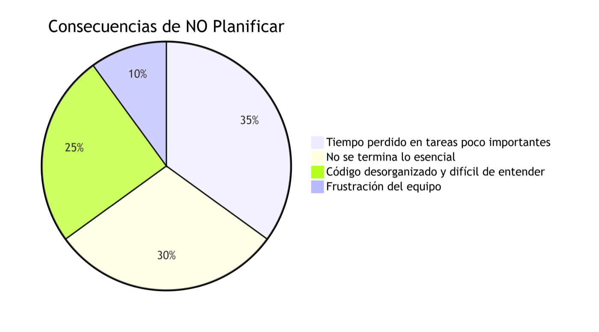
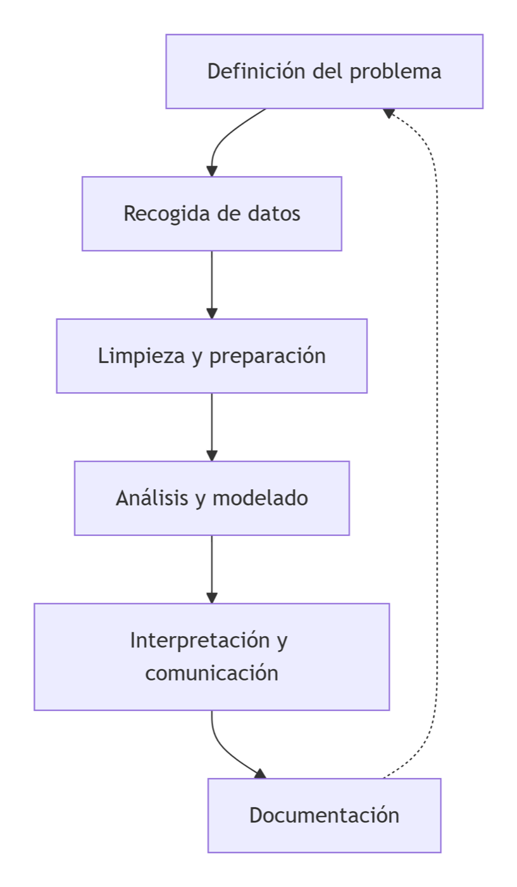
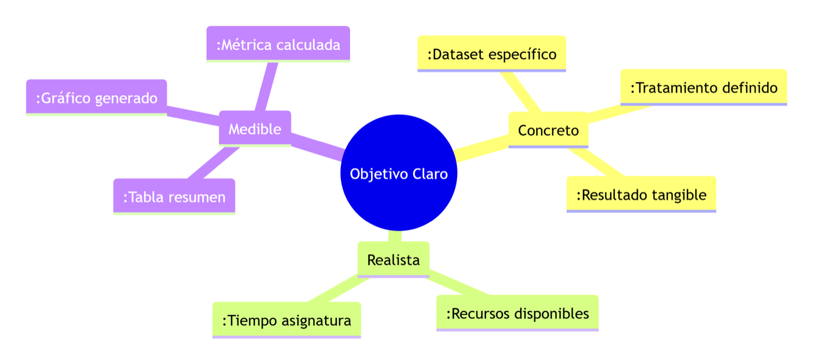
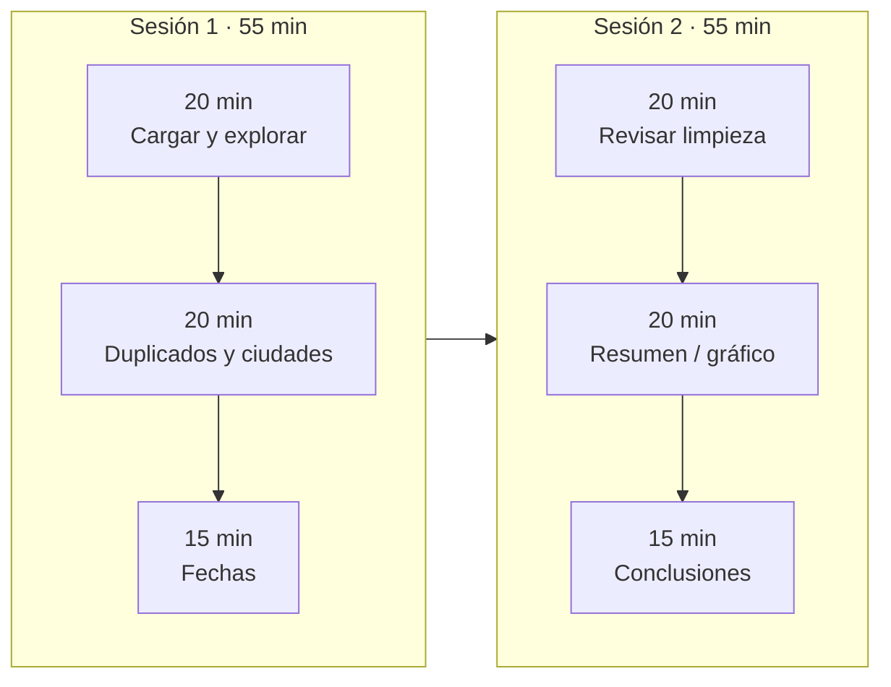
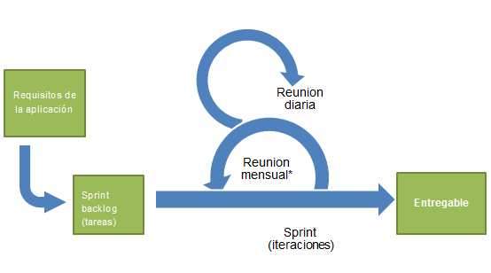

# 1.6. Planificar el análisis (GitHub Projects)

Este apartado trabaja el criterio **e)** mediante mini-sprints, una rúbrica y una actividad con Open-Meteo.

El criterio **e)** no pregunta si sabes Scrum de memoria. Pregunta si **cierras un trabajo de datos a tiempo**: objetivos, prioridades, orden y reloj. Programar pandas sin eso suele dejar el cuaderno a medias y el resumen —lo único que el cliente usa— no existe.

Licencia: [CC BY-SA 4.0](https://creativecommons.org/licenses/by-sa/4.0/).

<figure markdown="block">
{ width="100%" }
<figcaption>El análisis no es solo el código. Hay un tablero, un objetivo y un tiempo cerrado. En clase ese tablero será una celda Markdown o un GitHub Project.</figcaption>
</figure>

## 1. Por qué planificar

En un proyecto de análisis **no basta** con “saber Python” o “usar pandas”. Si no planificas:

- Pierdes tiempo en tareas poco importantes.
- No terminas lo **esencial**.
- El cuaderno acaba siendo un caos que nadie (tú el lunes siguiente) entiende.

El criterio **e)** pide: *establecer objetivos y prioridades, secuenciación y organización del tiempo de realización*. Es organizar un proyecto de datos como un **pequeño proyecto profesional**, no como una tarde de prueba y error.

<figure markdown="block">
{ width="90%" }
<figcaption>Los porcentajes son <strong>didácticos</strong> (no salen de una encuesta): el mensaje es que lo primero que se come el reloj es lo accesorio, y lo que falla al entregar es lo esencial.</figcaption>
</figure>

Ejemplo de aula. Limpiar [clientes_actividad.csv](../assets/practicas/clientes_actividad.csv) parece “una tarde”. Sin plan: tres personas pican el mismo `replace`, nadie genera el recuento por ciudad y el gráfico se come los 55 minutos. Con plan: el grupo sabe qué es **imprescindible** y qué es **ornamento**.

## 2. Ciclo de vida de un proyecto de análisis

Un proyecto típico encaja en estas fases. Planificar es decidir **qué** haces en cada una, **en qué orden** y **cuánto tiempo**.

<figure markdown="block">
{ width="55%" }
<figcaption>La flecha de vuelta existe: al documentar o al ver el gráfico, a veces redefines la pregunta. No es un fallo; es no analizar un dataset sucio “porque ya habíamos empezado el plot”.</figcaption>
</figure>

| Fase | Pregunta | En esta UT |
| --- | --- | --- |
| **Definición** | ¿Qué pregunta? ¿Qué decisión apoyan los datos? | Mini-sprint: una frase de *done* |
| **Recogida / extracción** | ¿CSV, Excel, BD, API? | [1.3](extraccion.md) |
| **Limpieza (*wrangling*)** | Duplicados, erratas, fechas, variables nuevas | [1.4](preproceso.md) |
| **Análisis y modelado** | Resúmenes, agrupaciones, gráficos; modelos solo más adelante | `groupby`, Athena en [1.7](laboratorio-aws.md) |
| **Interpretación** | Conclusiones que otra persona entiende | Celda Markdown final |
| **Documentación** | Orden, código comentado, tablero al día | Issue / Project |

En RA1 el *modelado predictivo* se **reconoce**; no es el entregable de esta unidad.

## 3. Objetivos que se pueden comprobar

Un objetivo responde a: *¿qué debe ser capaz de hacer mi cuaderno cuando esté terminado?*

| Mal | Bien |
| --- | --- |
| “Trabajar los datos.” | “Dejar [clientes_actividad.csv](../assets/practicas/clientes_actividad.csv) sin duplicados, ciudades unificadas y una tabla de clientes por ciudad.” |
| “Mirar el tiempo.” | “Temperaturas horarias de Castro Urdiales: máxima y mínima del día en un DataFrame.” |
| “Usar una API.” | “Combinar el CSV de clientes con Open-Meteo y un resumen por categoría.” |

Tres rasgos. Un objetivo **claro** es a la vez:

<figure markdown="block">
{ width="100%" }
<figcaption>Ignora los dos puntos decorativos de las etiquetas. Concreto = dataset + tratamiento + resultado. Realista = cabe en 1–2 sesiones con lo que ya sabes. Medible = existe la tabla, el gráfico o el recuento; no “lo dejé más o menos limpio”.</figcaption>
</figure>

Eso es el *definition of done* del sprint de aula.

## 4. Esencial frente a deseable

Siempre hay más ideas que tiempo. Distingue:

- **Esenciales:** sin ellas el proyecto no tiene sentido (cargar, limpiar errores graves, resumen principal).
- **Deseables:** mejoran, pero pueden caerse al final (gráfico fino, informe muy maquetado, comentarios en cada celda).

Objetivo principal de la práctica de limpieza: CSV limpio y **clientes por ciudad**.

| Esencial (sin esto no hay práctica) | Deseable (si sobra tiempo) |
| --- | --- |
| Cargar el CSV | Gráfico de barras |
| Eliminar duplicados | Comentarios largos en cada celda |
| Corregir `ciudad` (`Madird`, `Mdrid`…) | Informe muy maquetado |
| Unificar fechas | Extra de API meteorológica |
| Recuento por ciudad | |

Si el reloj llega a cero, las esenciales tienen que estar **hechas**. El gráfico no salva un `groupby` sobre `Madird`.

### Eisenhower (urgente × importante)

Utiliza esta matriz para priorizar las tareas. En aula, “urgente” = *si no lo hago en esta sesión, el entregable se cae*.

|  | **Urgente** | **No urgente** |
| --- | --- | --- |
| **Importante** | Cargar, deduplicar, unificar ciudad | Documentar el recuento (si el resumen ya está) |
| **No importante** | Notificaciones del chat del grupo | Gráfico muy maquetado |

Importante y urgente primero; bonito y no urgente, después. No confundas *el compañero pide el plot ahora* (urgente y poco importante) con *el recuento por ciudad* (importante).

## 5. Secuenciación: las tareas tienen dependencias

Regla: **primero aseguro los datos, luego analizo.** Un gráfico de `Madird` miente.

El diagrama de Gantt debe mostrar la secuencia y las dependencias entre tareas:

```mermaid
flowchart TD
  A[1. Cargar CSV o API] --> B[2. Explorar: head, nulos, tipos]
  B --> C[3. Duplicados y filas rotas]
  C --> D[4. Erratas: ciudad, categorías]
  D --> E[5. Formatos: fechas, números]
  E --> F[6. Variables derivadas si hacen falta]
  F --> G[7. Agrupar / recuento]
  G --> H[8. Visualización - deseable]
  H --> I[9. Conclusiones en texto]
```



1. Cargar datos (CSV, API…).
2. Explorar (`head`, tipos, nulos).
3. Eliminar duplicados y registros claramente erróneos.
4. Corregir valores mal escritos.
5. Normalizar formatos.
6. Crear columnas necesarias para el análisis.
7. `groupby` / `value_counts`.
8. Visualizaciones o informes (deseable).
9. Redactar conclusiones.

Antes de programar: **escribe esta lista en una celda Markdown**. Debajo de cada número, un ejemplo mínimo de pandas (o de la librería que toque). Crea un Colab **tuyo** con ese esqueleto.

## 6. Organización del tiempo

En el instituto (y en la empresa) el reloj está marcado: sesiones de ~55 min, fecha de Moodle. El criterio **e)** se ve si **repartes** el trabajo, no si “ya veré”.

Estrategias mínimas:

1. Dividir la práctica por **sesiones**.
2. Estimar cada bloque (aunque sea a ojo).
3. Reservar el **final** para probar y revisar, no para empezar el gráfico.

Ejemplo: **2 × 55 min**.



| Sesión | Bloque | Qué |
| --- | --- | --- |
| 1 | 20 min | Cargar y exploración inicial |
| 1 | 20 min | Duplicados y ciudades |
| 1 | 15 min | Fechas |
| 2 | 20 min | Revisar limpieza |
| 2 | 20 min | Tabla resumen (y gráfico **si da tiempo**) |
| 2 | 15 min | Conclusiones y revisión del cuaderno |

La estimación nunca es perfecta. El oficio es **pensar en tiempo y orden**. Si el gráfico no cabe, era deseable.

## 6.1. Mini-sprints (Scrum, recortado al aula)

En software y datos se usa [Scrum](https://es.wikipedia.org/wiki/Scrum_(desarrollo_de_software)) y otras ágiles. Idea clave: el **sprint**, un periodo **corto y fijo** (1–4 semanas en empresa) en el que el equipo se compromete a un conjunto concreto de tareas y entrega un incremento **usable**.

<figure markdown="block">
{ width="85%" }
<figcaption>En Scrum de libro el bucle corto es el <em>daily</em> (15 min) y al <strong>cierre del sprint</strong> hay revisión y retrospectiva. La etiqueta «reunión mensual» del dibujo no es el modelo de aula ni el único ritmo posible: el sprint dura lo que el equipo acuerda (aquí, 1–2 sesiones).</figcaption>
</figure>

En clase usamos **mini-sprints**:

| Scrum (empresa) | Mini-sprint (esta práctica) |
| --- | --- |
| 1–4 semanas | 1–2 sesiones |
| *Sprint planning* | Objetivo + lista (E)/(O) en Markdown o issues |
| *Daily* | “¿Qué columna mueve cada uno hoy?” al empezar |
| Incremento del producto | Cuaderno que cumple el *done* |
| Revisión + retro | 10–15 min: qué está hecho, qué no, qué cambia mañana |

Al inicio: objetivo claro + tareas priorizadas.  
Durante: el tablero se mueve.  
Al final: revisión honesta (no “casi”, sino *hecho / no hecho*).

Tres columnas bastan (papel, diapositiva, celda Markdown o GitHub):

```text
POR HACER            EN PROGRESO           HECHO
- Cargar datos       - Limpiar ciudades    - Importar pandas
- Crear gráfico
- Documentar
```

Eso **es** el criterio e) en pequeño: se ve el objetivo, el orden y el tiempo.

## 6.2. Issues y GitHub Projects

Cuando el trabajo vive en un repositorio, el tablero de papel pasa a GitHub.

Vídeo (haz lo mismo en **tu** repo): [YouTube 7eeHBaPnUGM](https://youtu.be/7eeHBaPnUGM).

1. Un **issue** por tarea (“Unificar ciudades”), no un issue único titulado “el trabajo”.
2. Un **Project** con *Por hacer / En progreso / Hecho*.
3. Cada issue entra al Project en *Por hacer*.
4. Mueves la tarjeta cuando el código o el CSV lo justifican; no reescribes el enunciado en el chat.
5. Cierras la issue con evidencia (commit, Colab, CSV).

No hace falta la API GraphQL de Projects. El tablero de la clase vale.

### Ciclo de vida de una issue

1. Crear el repositorio (o clonar el de prácticas).
2. Abrir una issue: título concreto + descripción (objetivo, criterio de *hecho*).
3. Asignar responsable y etiqueta (`bug`, `enhancement`, `documentation`…).
4. Crear el Project y añadir la issue como tarjeta.
5. Mover *Por hacer → En progreso → Hecho*.
6. Cerrar con un comentario de evidencia.

### Ejemplo de issue (copiar y adaptar)

```text
Título: Unificar ciudades del CSV de clientes

Descripción:
- Fuente: clientes_actividad.csv
- Hecho cuando: no queden Madird/Mdrid/Valenca/Barcleona
- Evidencia: CSV limpio + recuento por ciudad
Criterio RA1: e) (prioridad) + b) (extracción/limpieza)
```

## 7. Cómo se evalúa e) en las prácticas

La actividad evalúa la planificación práctica del trabajo.

**Antes de programar** (celda Markdown al inicio, o issues + Project):

- Objetivo principal.
- Tareas en orden, marcadas **(E)** / **(O)**.
- Qué harás en cada sesión.

**Durante:** las celdas del Colab siguen ese orden (o justificas el cambio).

**Al entregar:** las esenciales están hechas. Reflexión breve (muy recomendable): ¿se cumplió el plan? ¿qué llevó más tiempo? ¿qué cambiarías?

| Nivel | Qué se ve |
| --- | --- |
| **Alto** | Objetivos claros y realistas; tareas ordenadas y priorizadas; el tiempo declarado encaja con lo entregado |
| **Medio** | Objetivo comprensible pero vago; lista incompleta o poco ordenada; tiempo “muy general” |
| **Bajo** | Plan decorativo o inexistente; no hay esencial/opcional; no se relaciona el plan con el cuaderno |

!!! tip "Enlace con 1.3"
    La limpieza de clientes **se planifica aquí** y se ejecuta en pandas. Entrega típica: enlace al Project (o captura del tablero) + notebook + CSV limpio + recuento. La API Open-Meteo tiene su propia plantilla más abajo.

## 8. Actividad: planifica el mini-sprint **antes** de picar código

Copia la plantilla a la **primera** celda Markdown del Colab. Actualiza el tablero al final de cada sesión. Al terminar, rellena la reflexión.

Práctica de referencia: [clientes_actividad.csv](../assets/practicas/clientes_actividad.csv) · se ejecuta en [1.3 actividad 1](extraccion.md#actividad-1-limpieza-con-pandas-b-y-d).

```markdown
# Mini-sprint de la práctica

## 1. Objetivo del mini-sprint

(Qué quieres tener al terminar. Ejemplo: dataset limpio —sin duplicados ni
errores de ciudad—, fechas unificadas, y recuento de clientes por ciudad.)

## 2. Tareas y prioridades

- [ ] (E) Cargar los datos en un DataFrame.
- [ ] (E) Explorar (head, info, nulos).
- [ ] (E) Eliminar duplicados.
- [ ] (E) Corregir `ciudad`.
- [ ] (E) Unificar `fecha_registro`.
- [ ] (E) Tabla resumen: clientes por ciudad.
- [ ] (O) Gráfico de barras.
- [ ] (O) Comentarios y presentación del cuaderno.

## 3. Organización del tiempo

- **Sesión / bloque 1:** (cargar, explorar, duplicados)
- **Sesión / bloque 2:** (ciudades, fechas, resumen)
- **Sesión / bloque 3 (si aplica):** (gráfico, revisión)

## 4. Tablero

### Por hacer
- …

### En progreso
- …

### Hecho
- …

## 5. Reflexión final

- ¿He cumplido el objetivo?
- ¿Qué esenciales están hechas?
- ¿Qué se ha quedado sin hacer y por qué?
- ¿La estimación de tiempo era realista?
- ¿Qué cambiaría en el próximo mini-sprint?
```

??? example "Plantilla extra: mini-sprint Open-Meteo (actividad 2 de 1.3)"
    Producto final: Colab que consume [Open-Meteo](extraccion.md#ejemplo-2-api-meteorologica-semiestructurado) para una ciudad, arma un DataFrame horario, calcula máxima y mínima del día e interpreta. Cuaderno: [Open-Meteo: temperatura horaria de Castro Urdiales](https://colab.research.google.com/drive/13w9YOpfMhjh49lAb3UY2MOpfw_UVrA1H?usp=sharing).

    El cuaderno base obtiene la tabla horaria de **Castro Urdiales en UTC**. En tu copia debes adaptar las coordenadas a **Santander**, elegir y documentar la zona horaria, añadir máxima y mínima e interpretar los resultados. Esos pasos forman parte del mini-sprint.

    ```markdown
    # Mini-sprint – Actividad 2: API Open-Meteo

    ## 1. Objetivo
    (2–3 frases. Ejemplo: consumir Open-Meteo para Santander,
    DataFrame de temperatura horaria, máxima y mínima del día, comentario.)

    ## 2. Tareas
    - [ ] (E) Importar librerías (openmeteo-requests, caché, reintentos, pandas).
    - [ ] (E) Sesión con caché y reintentos.
    - [ ] (E) Constantes: URL, lat/lon, timezone, variables.
    - [ ] (E) Llamar a la API y comprobar que hay datos.
    - [ ] (E) Extraer la parte horaria y la serie temporal.
    - [ ] (E) DataFrame con hora y temperatura.
    - [ ] (E) Máxima y mínima del día.
    - [ ] (E) Mostrar resultados con claridad.
    - [ ] (O) Gráfica de la temperatura a lo largo del día.
    - [ ] (O) Probar otra ciudad o más días.
    - [ ] (O) Mejorar Markdown y títulos.

    ## 3. Tiempo
    - Bloque 1: librerías, sesión, constantes, primera llamada.
    - Bloque 2: DataFrame, máximos y mínimos.
    - Bloque 3: gráfico, otra ciudad, conclusiones.

    ## 4. Tablero Por hacer / En progreso / Hecho
    ## 5. Reflexión (objetivo, esenciales, pendientes, tiempo, qué cambiaría)
    ```

    Si el grupo ya tiene repo: una issue por tarea, Project de tres columnas, mover tarjetas igual que el tablero de Markdown.

## 9. Cierre

Planificar no sustituye a pandas. Es lo que permite **terminar** pandas. El ciclo es plan → ejecutar → mirar el tablero → ajustar el siguiente mini-sprint. Eso diferencia un cuaderno de prueba de un trabajo que se puede enseñar.

!!! success "Al terminar 1.6"
    Eres capaz de decir, en un minuto: objetivo medible, tres tareas esenciales, una deseable, el orden (datos antes que gráfico) y en qué bloque de la sesión va cada cosa. Si usas GitHub, hay un issue por tarea y el tablero se ha movido.
