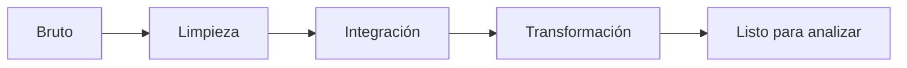

# 1.4. Preproceso de datos

El preproceso convierte el bruto en algo **interpretable y relacionable**. Es el paso en el que más tiempo se invierte. Cierra **b)** (conocimiento a partir del volumen) y **d)** (un conjunto complejo, cruzado).

Hay dos entornos. En UT1 **ejecutas** el monolítico (pandas, un equipo). El de clúster (Spark) lo **reconoces**: misma receta, otras APIs, otro coste.



## Punto de partida

Un dataset de clientes, reservas o logs. Conserva el original. Trabaja sobre una **copia**. Documenta cada regla (qué nulo imputaste, qué duplicado tiraste).

## Limpieza (pandas)

### Valores faltantes

No hay una sola receta:

- Si la fila no sirve para la pregunta → bórrala.
- Si el hueco es recuperable → imputa (media, mediana, valor por grupo: mediana de importe **por hotel**, no global).
- Si el hueco es información → déjalo y **cuéntalo** en el informe.

```python
df["edad"] = df["edad"].fillna(df["edad"].median())
```

### Duplicados

`drop_duplicates()` si la fila entera se repite. Si quieres **el registro más reciente por cliente**, no basta con eso: ordena por fecha y quédate uno.

### Tipos

Un número que llega como `"10"` no se suma. Convierte. Las fechas, a `datetime` (ya lo hiciste en [1.3](extraccion.md)). Aparta el lote que no parsea; no lo cueles para que el notebook “acabe en verde”.

### Irrelevantes

Tira columnas que la pregunta no usa. En Big Data eso además **abaratará** la lectura columnar ([1.5](formatos.md)).

### Outliers

Un precio −1 o una edad 300. IQR o reglas de negocio (el hotel no vende noches negativas). No borres un outlier sin mirar: a veces **es** el fraude.

## Integración (construir el dataset complejo)

**Concatenar** apila filas del mismo esquema (logs de enero + febrero).

**Unir (join)** cruza por clave: reservas ⋈ cobros por `id_reserva`; el resultado **relaciona** dos orígenes (d).

```python
reservas.merge(cobros, on="id_reserva", how="inner")
```

- Inner: solo coincidencias (reservas cobradas).
- Left: todas las reservas; cobro nulo = sin pago.
- Coherencia: misma clave, mismo tipo, mismos códigos de hotel.

Colisiones: `ciudad_x` / `ciudad_y`. Renombra **antes**.

## Transformación

| Técnica | Para qué | Cuidado |
| --- | --- | --- |
| Min-max [0, 1] | Igualar escalas | Sensible a outliers |
| Z-score | Centrar en media 0 | Asume campana; los extremos pesan |
| Binning | Edad → rangos | El corte es una decisión de negocio |
| Encoding | Categorías a número | One-hot explota si hay 10 000 ciudades |
| Variables derivadas | Mes, día de la semana, recencia | Sin **fuga**: no uses el futuro para predecir el pasado |

Mini-receta:

1. Lee con tipos explícitos.
2. Deduplica y corrige nulos.
3. Cruza claves.
4. Deriva lo mínimo para la pregunta.
5. Escribe un fichero **nuevo** y un recuento de filas in/out.

!!! failure "Errores frecuentes"
    Imputar antes de filtrar el segmento; encodear y luego filtrar; `collect()` de todo el clúster a pandas; borrar duplicados sin definir la clave de negocio.

## A escala (reconocer, no desplegar)

En un clúster **no** haces el mismo `for`. Spark usa expresiones de columna, `dropDuplicates`, ventanas, `broadcast` si la dimensión es pequeña, y escribe Parquet particionado.

| En pandas | En clúster (idea) |
| --- | --- |
| `fillna` | `na.fill` / imputación **por grupo** |
| `drop_duplicates()` | Ventana: último `ts` por `id` |
| Join | Broadcast vs sort-merge; *skew* en claves calientes |
| `to_csv` | Parquet `partitionBy` fecha; evitar *small files* |

`df.collect()` / `toPandas()` de 200 GB **tira** el monolito. Calidad (completitud, unicidad) y coste (shuffle, ficheros diminutos) son de primera clase. Structured Streaming y watermarks quedan para más adelante.

!!! example "Actividad de ejemplo"
    1. Monolítico: limpia [clientes_actividad.csv](../assets/practicas/clientes_actividad.csv) y resume por ciudad (actividad de [1.3](extraccion.md)).  
    2. Sobre el papel: si el mismo CSV ocupara 200 GB, ¿qué operación de pandas **no** copiarías tal cual a Spark y por qué?

El detalle de MLlib (scalers, `StringIndexer`) no es evidencia de esta UT1. Sí lo es dejar un dataset **relacionado** y documentar las reglas.
