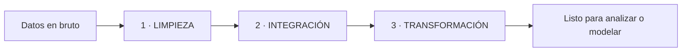

# 1.4. Preproceso de datos

Guion de aula: documentos *PREPROCESO* y *PREPROCESO_NEW* de Moodle (el segundo amplía la parte de pandas con código, receta y errores frecuentes; el bloque de clúster es el mismo en los dos) y el apartado *data wrangling* del eXe de extracción.

El preproceso convierte el bruto en algo **fácil de interpretar y de relacionar**. Es el primer paso del análisis y **el que más tiempo consume** (el eXe de extracción lo estima en torno al **80 %** del proyecto). Sin él, cualquier modelo o informe posterior hereda la basura.

Cierra el criterio **b)** (sacar conocimiento del volumen) y el **d)** (dejar un conjunto **complejo y relacionado**).

## Dos entornos, la misma receta

El material de aula insiste en esta distinción, y es la que marca la frontera de la UT1:

| Entorno | Qué es | En esta unidad |
| --- | --- | --- |
| **Monolítico** | pandas en **un solo equipo** | Lo **ejecutas** tú: es la evidencia de la práctica |
| ***Cluster-aware*** | Datos repartidos en un clúster (PySpark) | Lo **reconoces**: misma receta, otras APIs, otro coste |

Las **tres fases** no cambian de un entorno a otro:



Lo que cambia es **cómo** se hace cada una cuando el dataset no cabe en tu portátil.

---

# Parte A — Entorno monolítico (pandas)

Objetivo: dejar los datos **limpios, integrados y transformados** para analizarlos o entrenar modelos, trabajando solo con pandas en un equipo.

## Punto de partida

Conserva el original intacto. Trabaja sobre una **copia** y **documenta cada regla** (qué nulo imputaste, qué duplicado tiraste, por qué).

```python
import pandas as pd

df = pd.read_csv("data.csv")
df.info()        # tipos y nulos por columna
df.sample(5)     # vistazo rápido a datos reales
```

`info()` antes que nada: te dice de golpe cuántas filas hay, qué tipo ha adivinado pandas y dónde faltan valores. Si `precio` sale como `object`, ya sabes que llega como texto.

## 1. Limpieza

Es la fase inicial: ordenar los datos, hacerlos legibles y arreglar los problemas evidentes.

### 1.1. Valores faltantes (*missing values*)

**Qué es:** celdas vacías o `NaN`.

**Por qué importa:** sesgan los resultados o rompen los cálculos (una media con nulos no es la media).

**Tres salidas, y hay que elegir una a conciencia:**

| Opción | Cuándo | pandas |
| --- | --- | --- |
| **Eliminar** | Pocos nulos y la fila no sirve para la pregunta | `dropna()` |
| **Imputar** | El hueco es recuperable (media, mediana, moda, regla de negocio) | `fillna()` |
| **Marcar** | El hueco **es** información (nadie rellenó ese campo) | `isna()` como bandera |

```python
# % de nulos por columna, de mayor a menor: por aquí se empieza
(df.isna().mean() * 100).sort_values(ascending=False)

# eliminar filas con cualquier nulo
df_drop = df.dropna()

# imputar numérico con la mediana (más robusta que la media ante outliers)
df["edad"] = df["edad"].fillna(df["edad"].median())

# imputar categórico con una etiqueta explícita
df["ciudad"] = df["ciudad"].fillna("Desconocido")
```

Dos avisos de aula:

- **Mediana, no media**, cuando hay valores extremos: la media se va detrás del outlier.
- **Imputa por grupo** cuando las poblaciones son distintas: la mediana de importe **por hotel**, no la global. Mezclar un hotel de costa con uno de ciudad inventa datos.

### 1.2. Registros duplicados

**Qué es:** filas repetidas.

**Por qué importa:** duplican la evidencia y sesgan las métricas (dos veces el mismo cliente = dos clientes).

```python
df.duplicated().sum()          # cuántas filas están repetidas enteras
df = df.drop_duplicates()      # se queda con la primera aparición
```

`drop_duplicates()` sin más vale si la **fila entera** se repite. Si lo que quieres es **el registro más reciente por cliente**, hay que decirlo:

```python
df = (
    df.sort_values("fecha")
      .drop_duplicates(subset="id_cliente", keep="last")
)
```

Antes de borrar, define la **clave de negocio**: ¿qué significa “el mismo registro”? Sin esa frase, deduplicar es tirar datos a ciegas.

### 1.3. Conversión de tipos

**Qué es:** columnas con el tipo equivocado (números como texto, fechas como cadena).

Un `"10"` no se suma, y un `"2026-03-01"` no se puede ordenar por mes.

```python
# a numérico; errors="coerce" pone NaN en lo que no pueda convertir
df["precio"] = pd.to_numeric(df["precio"], errors="coerce")

# a fecha
df["fecha"] = pd.to_datetime(df["fecha"], errors="coerce")

# a categórico (ahorra memoria si hay pocos valores distintos)
df["categoria"] = df["categoria"].astype("category")
```

`errors="coerce"` es cómodo, pero **convierte el problema en nulos silenciosos**. Cuenta cuántos ha creado y mira qué había ahí:

```python
malos = df[df["precio"].isna()]
print(len(malos))
```

No cueles el lote que no parsea para que el notebook “acabe en verde”.

### 1.4. Datos irrelevantes

En casi cualquier base hay información que no sirve para tu pregunta, y que ocupa espacio y tiempo.

```python
df = df.drop(columns=["nota_interna", "comentario_largo"])

# o quedarte solo con las filas de interés
df = df.query("country == 'ES'")
```

En Big Data esto además **abarata la lectura columnar** ([1.5](formatos.md)): lo que no está, no se escanea.

### 1.5. Valores atípicos (*outliers*)

**Qué son:** observaciones que se desvían mucho de la tendencia general; valores extremos alejados de la mayoría.

**Detectar** con IQR o z-score. **Actuar** con una de estas tres:

| Acción | Cuándo |
| --- | --- |
| **Capar** (*winsorizar*) | El valor es plausible pero extremo: lo limitas al percentil 1/99 o a los bigotes del IQR |
| **Eliminar** | Es un error evidente (precio −1, edad 300) |
| **Dejar y explicar** | Es el dato interesante |

```python
col = "ingresos"
Q1, Q3 = df[col].quantile([0.25, 0.75])
IQR = Q3 - Q1
low, high = Q1 - 1.5 * IQR, Q3 + 1.5 * IQR

df[col] = df[col].clip(lower=low, upper=high)   # capar
```

!!! warning "El material dice «es importante su eliminación». Con matices"
    Un outlier **no** es automáticamente un error. En detección de fraude, en averías o en picos de tráfico, el outlier **es** la señal que buscas. Mira el caso antes de borrarlo, y si lo capas o lo quitas, **déjalo escrito** en el cuaderno.

## 2. Integración

Reunir datos de fuentes dispares en **una tabla consistente y utilizable**. Aquí se construye el “conjunto complejo” del criterio **d)**.

### 2.1. Concatenar (apilar filas)

Mismo esquema, más filas: enero + febrero.

```python
df_enero = pd.read_csv("ventas_enero.csv")
df_feb = pd.read_csv("ventas_feb.csv")

df_ventas = pd.concat([df_enero, df_feb], ignore_index=True)
```

`ignore_index=True` renumera; si no, arrastras índices repetidos y luego te muerden.

### 2.2. Unir (*merge* / *join*) por claves

Esquemas distintos que comparten una clave: ventas ⋈ productos por `ProductID`, reservas ⋈ cobros por `id_reserva`.

```python
df_prod = pd.read_csv("productos.csv")    # ProductID, Category, …
df_sales = pd.read_csv("ventas.csv")      # ProductID, Units, Price, …

df_full = df_sales.merge(df_prod, on="ProductID", how="inner")
```

| `how` | Qué te deja |
| --- | --- |
| `inner` | Solo las coincidencias (ventas con producto conocido) |
| `left` | Todo lo de la izquierda; lo que no cruza queda a nulo |
| `right` / `outer` | Variantes menos habituales, según la pregunta |

El `how` **no** es un detalle técnico: `inner` te hace perder silenciosamente las ventas cuyo producto no está en el maestro. Si quieres **verlas**, usa `left` y cuenta los nulos.

### 2.3. Colisiones y coherencia

Después de cruzar, comprueba **siempre**:

```python
# ¿la clave del maestro es realmente única?
df_prod["ProductID"].duplicated().sum()

# ¿han aparecido nulos nuevos? Señal de claves perdidas
df_full.isna().mean().sort_values(ascending=False).head()
```

- Clave duplicada en el maestro → el *merge* **multiplica filas**. Es el error que más infla un informe.
- Nulos nuevos tras el *merge* → claves que no cruzan (tipos distintos, espacios, mayúsculas).
- Alinea **nombres, unidades y monedas** antes de mezclar. No sumes euros con dólares.
- Columnas homónimas salen como `ciudad_x` / `ciudad_y`. Renombra **antes**, o usa `suffixes=("_venta", "_maestro")` para saber de dónde viene cada una.

## 3. Transformación

Cambiar la **escala o la distribución** para que los datos encajen en el análisis posterior. Importa sobre todo con algoritmos que asumen una escala o una distribución concreta.

### 3.1. Normalización min-max, rango [0, 1]

Lleva las columnas numéricas a una **escala común** sin distorsionar las diferencias relativas. Útil cuando las variables tienen **unidades distintas** (euros y kilómetros) o límites conocidos, y con distribuciones no normales.

Fórmula: `(x - min) / (max - min)`.

```python
for col in ["A", "B"]:
    df[f"{col}_minmax"] = (df[col] - df[col].min()) / (df[col].max() - df[col].min())
```

Equivalente en scikit-learn: `MinMaxScaler`.

**Cuidado:** es muy sensible a outliers. Un solo valor enorme **aprieta** todo el resto contra el cero.

### 3.2. Estandarización (z-score)

Deja media 0 y desviación 1. Útil cuando los datos se parecen a una normal y el modelo asume esa escala.

Fórmula: `(x - media) / desviación`.

```python
for col in ["A", "B"]:
    df[f"{col}_z"] = (df[col] - df[col].mean()) / df[col].std(ddof=0)
```

Equivalente en scikit-learn: `StandardScaler`.

!!! note "`std()` y `std(ddof=0)` no dan lo mismo"
    pandas usa por defecto `ddof=1` (desviación **muestral**); NumPy y `StandardScaler` usan `ddof=0` (poblacional). Con muchas filas la diferencia es mínima, pero **elige una y sé consistente**, porque el material de aula usa las dos formas en páginas distintas.

Pista rápida del documento:

- Si quieres preservar los outliers tal cual, recuerda que min-max los aprieta.
- Si hay outliers fuertes, usa **escalado robusto** (mediana y rango interquartílico, `RobustScaler`) o **capa antes** de escalar.

### 3.3. Discretización (*binning*)

Convierte continuo en categorías. Útil para reglas de negocio y para gráficos legibles: una edad continua pasa a `joven`, `adulto`, `mayor`.

```python
# intervalos fijos, definidos por negocio
df["edad_bin"] = pd.cut(
    df["edad"],
    bins=[0, 18, 30, 50, 120],
    labels=["menor", "joven", "adulto", "mayor"],
    include_lowest=True,
)

# cuantiles: mismo número de casos en cada bin
df["ingresos_q"] = pd.qcut(df["ingresos"], q=4, labels=["Q1", "Q2", "Q3", "Q4"])
```

`cut` frente a `qcut` es una decisión, no un detalle: `cut` respeta el significado de negocio (mayoría de edad, jubilación); `qcut` garantiza grupos del mismo tamaño y aguanta mejor las distribuciones sesgadas. **El corte es una decisión de negocio y hay que justificarla.**

### 3.4. Codificación de categóricas (*encoding*)

Pasar texto a número para poder analizarlo o modelarlo.

**Integer / label encoding:** cada etiqueta a un entero.

```python
df["ciudad_code"] = df["ciudad"].astype("category").cat.codes
```

Rápido, pero **introduce un orden que no existe**: deja implícito que `Madrid (2) > Bilbao (1)`. Solo para categorías realmente **ordinales** (bajo < medio < alto) o para modelos de árbol.

**One-hot encoding (*dummies*):** cada etiqueta a un vector binario.

```python
df = pd.get_dummies(df, columns=["ciudad", "categoria"], drop_first=True)
```

Seguro para nominales, pero **explota en columnas** si hay 10 000 ciudades. Si la cardinalidad es alta, agrupa las categorías raras en `Otras` antes de codificar.

### 3.5. Variables derivadas (*feature engineering*)

Crear columnas nuevas a partir de las que ya tienes.

```python
df["fecha"] = pd.to_datetime(df["fecha"], errors="coerce")
df["anio"] = df["fecha"].dt.year
df["mes"] = df["fecha"].dt.month
df["dow"] = df["fecha"].dt.dayofweek       # 0 = lunes

df["precio_total"] = df["unidades"] * df["precio_unitario"]
```

De una fecha salen año, mes, trimestre y día de la semana (y con eso ya puedes responder “¿qué días se vende más?”). De un texto, longitudes, recuentos y banderas.

**Sin fuga de información:** no construyas una variable con datos del futuro para explicar el pasado. En series temporales, las ventanas miran **hacia atrás**.

## Mini-receta de punta a punta

El pipeline completo del documento, en orden:

```python
import pandas as pd

# 1) CARGAR Y REVISAR
df = pd.read_csv("data.csv")
df.info()
df.head()

# 2) LIMPIEZA
df = df.drop_duplicates()
df["edad"] = pd.to_numeric(df["edad"], errors="coerce")
df["edad"] = df["edad"].fillna(df["edad"].median())      # mediana YA numérica
df["ciudad"] = df["ciudad"].fillna("Desconocido")

Q1, Q3 = df["ingresos"].quantile([0.25, 0.75])
IQR = Q3 - Q1
df["ingresos"] = df["ingresos"].clip(Q1 - 1.5 * IQR, Q3 + 1.5 * IQR)

# 3) INTEGRACIÓN
prod = pd.read_csv("productos.csv")
df = df.merge(prod, on="ProductID", how="inner")

# 4) TRANSFORMACIÓN
df = pd.get_dummies(df, columns=["categoria"], drop_first=True)
for col in ["ingresos", "gasto"]:
    df[f"{col}_z"] = (df[col] - df[col].mean()) / df[col].std(ddof=0)

# 5) GUARDAR EL RESULTADO EN UN FICHERO NUEVO
df.to_csv("data_preprocesada.csv", index=False)
```

Y un paso que el documento no numera pero se pide en la entrega: **cuenta filas de entrada y de salida**.

```python
print(f"entraron {len(pd.read_csv('data.csv'))} filas, salieron {len(df)}")
```

Si se han perdido 3 000 filas y no sabes por qué, el preproceso no está terminado.

## Errores frecuentes

Del documento, más los que salen en clase:

1. **Escalar antes de partir en train/test.** Los parámetros (media, min, max) se calculan en *train* y se aplican a *test*. En un trabajo exploratorio monolítico basta con documentarlo, pero el criterio es ese.
2. **One-hot con muchas categorías:** columnas que se multiplican. Agrupa las categorías raras.
3. **Imputar sin pensar:** no es lo mismo la mediana que un 0. Anota la decisión y su impacto.
4. **Unidades mezcladas:** normaliza monedas y medidas **antes** de mezclar fuentes.
5. **Imputar antes de filtrar el segmento:** calculas la mediana con filas que luego vas a tirar.
6. **Codificar y luego filtrar:** te quedan columnas *dummy* de categorías que ya no existen.
7. **Deduplicar sin clave de negocio.**
8. **`errors="coerce"` sin contar los nulos** que ha creado.

## Ejemplo en Google Colab

El documento reserva una página *Ejemplo sencillo en Google Colab* que se quedó **sin enlace**. Usa el cuaderno de [Inicio con Python](inicio-python.md), que hace este mismo recorrido (CSV sucio → limpio → recuento), o el [cuaderno de filtro de 1.3](extraccion.md).

La limpieza de [clientes_actividad.csv](../assets/practicas/clientes_actividad.csv) **se planifica** en [1.6](planificacion.md) y **se ejecuta** en la actividad 1 de [1.3](extraccion.md). El ETL inicial está en [1.1](ciclo-analisis.md).

---

# Parte B — Entorno *cluster-aware* (reconocer, no desplegar)

Mismo problema, datos **repartidos en un clúster** de nodos. Las tres fases siguen, pero entran en juego el particionado, la distribución, la replicación, los formatos columnares, los *joins* a escala, la calidad y el coste. Los ejemplos son PySpark.

!!! info "Alcance en la UT1"
    Esto se **reconoce**, no se despliega. La evidencia de la unidad es el pandas de la parte A. Lo de aquí te sirve para responder la pregunta de examen: *“¿qué cambiarías si el CSV pesara 200 GB?”*.

## Principios que cambian

1. **Datos y cómputo distribuidos.** El dataset se parte en muchos ficheros o bloques y **el cómputo viaja a los datos**, no al revés.
2. **El formato y el *layout* importan.** Parquet u ORC con compresión (Snappy, ZSTD), **particionado** por columnas de alta selectividad (`fecha`, `region`) y *bucketing* si repites *joins* por la misma clave. Ver [1.5](formatos.md).
3. **Esquema y ACID.** Capas tipo **Delta Lake, Apache Iceberg o Hudi** añaden evolución de esquema, *upserts* y *time travel*.
4. **Operar a escala no es “hacer lo mismo que en pandas”.** Evita `collect()` y `toPandas()`, usa operadores nativos (Catalyst en Spark) y piensa en *shuffles*, *skew* y estrategia de *join*.
5. **Calidad y coste son de primera clase:** *small files*, particiones desbalanceadas, duplicados distribuidos.

`df.collect()` o `toPandas()` sobre 200 GB **tira el driver**. Es el error número uno al pasar de pandas a Spark.

## 1. Limpieza a escala

### 1.1. Valores faltantes

Evita las lógicas fila a fila: usa **expresiones columnares** y agregados por grupo o partición. La imputación suele ser **por grupo** (`region`, `segmento`) para no mezclar poblaciones. Herramientas: `na.fill`, `na.replace` o el `Imputer` de MLlib.

```python
from pyspark.sql import functions as F

by_region = df.groupBy("region").agg(
    F.expr("percentile_approx(valor, 0.5)").alias("mediana")
)

df = (
    df.join(by_region, "region", "left")
      .withColumn("valor_imp", F.coalesce("valor", "mediana"))
      .drop("mediana")
)
```

`percentile_approx` en lugar de la mediana exacta: calcular la mediana exacta de forma distribuida obliga a ordenar todo el dataset.

### 1.2. Duplicados distribuidos

`dropDuplicates(["clave"])` funciona. Si hay que conservar **el más reciente**, hace falta una ventana:

```python
from pyspark.sql.window import Window

w = Window.partitionBy("id").orderBy(F.col("ts").desc())
df = (
    df.withColumn("rn", F.row_number().over(w))
      .where("rn = 1")
      .drop("rn")
)
```

**Skew:** si una clave es muchísimo más frecuente que las demás, una tarea se come todo el trabajo. Se mitiga con *salting* (añadir una “sal” aleatoria o por hash para repartir carga) o con combinaciones del lado del *map*.

### 1.3. Tipos y parseo robusto

- **Define siempre el esquema** al leer CSV o JSON. Que Spark lo infiera cuesta una pasada extra y puede acertar mal (el mismo problema que el crawler de [1.7](laboratorio-aws.md)).
- Activa `badRecordsPath` para que las filas mal formadas se guarden **en otra ruta** en lugar de tumbar el *job*.
- Convierte a *timestamp* con **zona horaria coherente**.
- Las reglas de validación, distribuidas con `when` / `otherwise`, **no** en Python puro.

### 1.4. Columnas irrelevantes

**Proyección temprana** (`select` cuanto antes) para habilitar *column pruning* y *predicate pushdown* en Parquet u ORC. Y documenta las columnas eliminadas, porque impacta en coste y almacenamiento.

### 1.5. Outliers

Estadística **robusta**, calculada de forma distribuida:

```python
Q1, Q3 = df.approxQuantile("importe", [0.25, 0.75], 0.01)
IQR = Q3 - Q1

df = df.withColumn(
    "importe_clip",
    F.when(F.col("importe") < Q1 - 1.5 * IQR, Q1 - 1.5 * IQR)
     .when(F.col("importe") > Q3 + 1.5 * IQR, Q3 + 1.5 * IQR)
     .otherwise(F.col("importe")),
)
```

!!! success "Checklist «limpieza en clúster»"
    - [ ] Lectura con esquema y modo tolerante (`badRecordsPath`).
    - [ ] Imputación por grupo o *bucket* operativo.
    - [ ] Deduplicación con ventana y orden por `ts`.
    - [ ] Proyección temprana y filtros con *pushdown*.
    - [ ] Outliers tratados con estadística robusta.

## 2. Integración multi-origen en distribuido

### 2.1. Estrategias de *join*

**Broadcast hash join** cuando una tabla es pequeña: se replica en todos los nodos y se evita el *shuffle*.

```python
small = spark.read.parquet("/dim/maestra")
fact = spark.read.parquet("/hechos/ventas")

joined = fact.join(F.broadcast(small), "id", "left")
```

**Sort-merge join** para grandes volúmenes en los dos lados (mejor si comparten *partitioner* y orden).

**Skew en el join:** detecta las claves calientes y aplica *salting*, o deja que actúe *Adaptive Query Execution*.

### 2.2. Esquemas distintos, claves y conflictos

- **Armoniza tipos y nombres antes** del *join*. Un `id` `string` no cruza con un `id` `int`.
- Si hay nulos en la clave, comparación **null-safe**: `expr("a <=> b")`.
- **Datos tardíos** (*late arriving*): `MERGE` / *upsert* con Delta o Iceberg, o rehacer solo las particiones afectadas.

### 2.3. ACID y *upserts* en el lago

Con Delta o Iceberg consolidas sin reescribir la tabla entera:

```sql
MERGE INTO silver.fact f
USING staging s
  ON f.id = s.id
WHEN MATCHED THEN UPDATE SET *
WHEN NOT MATCHED THEN INSERT *
```

!!! success "Checklist «integración en clúster»"
    - [ ] Estrategia de *join* elegida a conciencia (*broadcast* o *sort-merge*).
    - [ ] *Skew* mitigado (*salting* o AQE).
    - [ ] Esquemas alineados y claves definidas.
    - [ ] Plan para los datos tardíos (`MERGE` o sobrescritura selectiva).

## 3. Transformación a escala

Las técnicas son las mismas; cambian las APIs y hay que pensar en la **cardinalidad**.

### 3.1. Escalado con MLlib

Transformadores nativos, **nunca UDFs** (una UDF de Python rompe la optimización de Catalyst).

```python
from pyspark.ml.feature import StandardScaler, VectorAssembler

vec = VectorAssembler(inputCols=["x1", "x2"], outputCol="features_raw")
df_vec = vec.transform(df)

scaler = StandardScaler(
    withMean=True, withStd=True, inputCol="features_raw", outputCol="features"
)
df_scaled = scaler.fit(df_vec).transform(df_vec)
```

### 3.2. Discretización

`QuantileDiscretizer` para *bins* por cuantiles: más robusto en distribuciones sesgadas. Es el `qcut` del clúster.

### 3.3. Encoding categórico

```python
from pyspark.ml.feature import OneHotEncoder, StringIndexer

idx = StringIndexer(inputCol="categoria", outputCol="cat_idx", handleInvalid="keep")
ohe = OneHotEncoder(inputCols=["cat_idx"], outputCols=["cat_ohe"])
```

`handleInvalid="keep"` evita que una categoría nueva en producción tumbe el *job*. Con **alta cardinalidad**, no explosiones columnas: *feature hashing* (`HashingTF`, `FeatureHasher`) o codificación por frecuencia.

### 3.4. Variables derivadas

- **Fechas:** funciones nativas (`year`, `month`, `dayofweek`; ventanas con *watermarks* si es *streaming*).
- **Geo:** rejillas tipo H3 o *bucketing* por área.
- **Sin fuga temporal:** en series, ventanas hacia atrás con `rowsBetween` / `rangeBetween`.

### 3.5. Escritura eficiente

```python
(
    df_final.repartition(200, "fecha")
    .write.mode("overwrite")
    .partitionBy("fecha")
    .format("parquet")
    .save("/silver/preproceso/")
)
```

Particiona por las columnas por las que **vas a filtrar**, y compacta (`coalesce` / `repartition`) para no generar miles de ficheros diminutos: el *small files problem* mata el rendimiento de lectura.

!!! success "Checklist «transformación en clúster»"
    - [ ] Transformadores nativos de MLlib, no UDFs.
    - [ ] Discretización por cuantiles cuando proceda.
    - [ ] Derivadas con funciones *built-in* y sin fuga temporal.
    - [ ] Escritura particionada y compactada.

## 4. Calidad, observabilidad y coste

Capa que el documento añade sobre las tres fases, y que conecta con el criterio **g)** ([costes y calidad](costes-calidad.md)):

- **Calidad distribuida:** reglas con [Great Expectations](https://greatexpectations.io/) o Deequ, o validación con consultas. Registra **completitud, unicidad y validez por partición**.
- **Linaje y metadatos:** guarda `ingest_ts`, `source`, `version` y qué expectativas pasaron o fallaron.
- **Coste y rendimiento:** evita *small files*, prefiltra en la lectura (*pushdown*), cachea **solo** lo que reutilizas, limita las *repartitions* y documenta el dimensionado del clúster.

## 5. Streaming (opcional)

Limpieza e integración en tiempo real con **Structured Streaming**: *watermarks* para datos tardíos, ventanas para agregados y *exactly-once* en destinos ACID (Delta, Iceberg). Preprocesos **ligeros** en el flujo y **pesados** en micro-lotes hacia la capa *silver*. Más en [análisis en tiempo real](tiempo-real.md).

## 6. Mini-pipeline de punta a punta (batch)

```python
from pyspark.sql import functions as F
from pyspark.sql.window import Window
from pyspark.ml import Pipeline
from pyspark.ml.feature import OneHotEncoder, StringIndexer

# 1) Lectura robusta con esquema explícito
schema = "id string, ts timestamp, region string, importe double, categoria string"
df = (
    spark.read.schema(schema)
    .option("badRecordsPath", "/bronze/_bad")
    .csv("/bronze/ventas/*.csv")
)

# 2) Limpieza: outliers por IQR y deduplicación por id conservando el último ts
Q1, Q3 = df.approxQuantile("importe", [0.25, 0.75], 0.01)
IQR = Q3 - Q1
df = df.withColumn(
    "importe",
    F.when(F.col("importe") < Q1 - 1.5 * IQR, Q1 - 1.5 * IQR)
     .when(F.col("importe") > Q3 + 1.5 * IQR, Q3 + 1.5 * IQR)
     .otherwise(F.col("importe")),
)

w = Window.partitionBy("id").orderBy(F.col("ts").desc())
df = df.withColumn("rn", F.row_number().over(w)).where("rn = 1").drop("rn")

# 3) Integración: join con la dimensión maestra (broadcast)
dim = spark.read.parquet("/dim/maestra")
df = df.join(F.broadcast(dim), "id", "left")

# 4) Transformación: derivadas de fecha y encoding
df = df.withColumn("anio", F.year("ts")).withColumn("mes", F.month("ts"))

idx = StringIndexer(inputCol="categoria", outputCol="categoria_idx", handleInvalid="keep")
ohe = OneHotEncoder(inputCols=["categoria_idx"], outputCols=["categoria_ohe"])
df_feat = Pipeline(stages=[idx, ohe]).fit(df).transform(df)

# 5) Escritura optimizada
(
    df_feat.repartition(200, "anio", "mes")
    .write.mode("overwrite")
    .partitionBy("anio", "mes")
    .parquet("/silver/ventas_preprocesadas/")
)
```

Reconoce el esqueleto: es **la misma mini-receta de pandas** con otras herramientas.

## 7. Cómo migrar de monolítico a clúster

Tabla resumen del documento. Es lo que hay que saber explicar:

| Fase | En pandas | En clúster |
| --- | --- | --- |
| **Limpieza** | `fillna()` | `na.fill()` / `Imputer` de MLlib, imputación **por grupo**, validación distribuida |
| **Duplicados** | `drop_duplicates()` | Ventana: **último registro por clave** ordenando por `ts` |
| **Tipos** | `to_numeric(errors="coerce")` | **Esquema explícito** al leer y `badRecordsPath` |
| **Irrelevantes** | `drop(columns=…)` | *Column pruning* y *predicate pushdown* |
| **Outliers** | z-score simple | IQR y percentiles robustos con `approxQuantile` |
| **Integración** | `merge()` | *Broadcast* frente a *sort-merge*, *skew*, datos tardíos con `MERGE` |
| **Transformación** | pandas y scikit-learn | Transformadores de MLlib (`Scaler`, `QuantileDiscretizer`, `StringIndexer`, `OneHotEncoder`, `FeatureHasher`) |
| **Cierre** | `to_csv()` | Calidad distribuida, escritura **particionada** y checklist antes de guardar |

El detalle fino de MLlib **no** es evidencia de esta UT1. Sí lo es dejar un dataset **relacionado** y **documentar las reglas** que aplicaste.

---

## Actividades

!!! example "Actividad 1 — Preproceso monolítico con pandas"
    Limpia [clientes_actividad.csv](../assets/practicas/clientes_actividad.csv) y obtén el resumen por ciudad (es la actividad 1 de [1.3](extraccion.md), planificada en [1.6](planificacion.md)).

    Entrega el cuaderno con las tres fases separadas y, en una celda Markdown: qué nulos imputaste y con qué, qué duplicados quitaste y con qué clave, y **filas de entrada frente a filas de salida**.

!!! example "Actividad 2 — Preproceso para Big Data en PySpark (sobre el papel)"
    Sin desplegar clúster. Si ese mismo CSV pesara **200 GB**:

    1. ¿Qué operación de pandas **no** copiarías tal cual a Spark, y por qué?
    2. ¿Por qué columna particionarías al escribir, y qué consulta mejora?
    3. ¿Dónde pondrías el `badRecordsPath` y qué harías con lo que caiga ahí?
    4. ¿`broadcast` o `sort-merge` para cruzar con un maestro de 5 MB?

## Erratas y avisos del material original

Si copias el código de los Word tal cual, esto te va a saltar:

1. **Guion largo en lugar de signo menos.** En la fórmula min-max aparece `df['A'].max() –df['A'].min()`: ese `–` es un guion tipográfico y Python lanza `SyntaxError`. Tiene que ser `-`.
2. **Mediana calculada sobre la columna sin convertir.** En la mini-receta, `pd.to_numeric(df['edad'], errors='coerce').fillna(df['edad'].median())` calcula la mediana de la columna **original** (que puede seguir siendo texto). Convierte primero, asigna, y **después** imputa, como está en la [mini-receta de esta página](#mini-receta-de-punta-a-punta).
3. **«Es importante su eliminación» (outliers).** Demasiado tajante; el propio documento se corrige después con «cuidado con perder señal». Mira el caso antes de borrar.
4. **`std()` frente a `std(ddof=0)`.** El material usa las dos en páginas distintas para el mismo z-score. Elige una.
5. **`AvroWriter`, `hdfs_client` y compañía** no aparecen aquí, pero sí en el eXe de [formatos](formatos.md#9-erratas-del-material-original): son de la API de HDFS, no de un fichero local.
6. **La página «Ejemplo sencillo en Google Colab» está vacía** (sin URL). Se sustituye por [Inicio con Python](inicio-python.md).
7. Erratas de tecleo del documento: «no podemos encontrar con dos posibles entornos» (*nos*), «peo en el que los datos», «Conviertimos a timestamp», «distribuídamente».

!!! success "Al terminar 1.4"
    Sabes ejecutar las tres fases en pandas sobre un CSV real, **justificar** cada decisión (qué nulo, qué duplicado, qué corte de *binning*) y explicar qué cambiaría en un clúster nombrando `collect()`, *skew*, particionado y *small files*.
