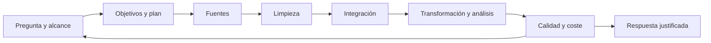

# 1.1. Del dato al problema de análisis

**CE que se trabajan:** b, e, f. Consulta el [texto oficial](ra1.md).

**Al terminar:** formular preguntas medibles y distinguir datos, indicadores e interpretación.

## El encargo de dirección

«Tenemos muchas reservas, pero parece que un canal cancela más. ¿Podemos comprobarlo?» Antes de elegir herramientas, acordamos qué significa cada palabra.

En esta práctica, una reserva es un identificador único. Una cancelación es la presencia de al menos un evento de tipo `cancelacion` asociado a esa reserva. Todos los registros pertenecen al periodo sintético de septiembre de 2026. No modelamos reaperturas ni modificaciones de estado posteriores.

## Preguntas comprobables

1. ¿Cuántas reservas hay por hotel y canal?
2. ¿Qué proporción tiene al menos una cancelación registrada?
3. ¿Cuántas noches se reservaron inicialmente y qué importe nominal suman?

El importe nominal incluye las reservas canceladas: no mide ingresos ni reembolsos. Las noches son noches de la reserva, no habitaciones ocupadas por fecha. Cada indicador debe llevar definición, unidad, población y periodo.

## Plan de trabajo

| Tarea | Depende de | Criterio de terminación |
| --- | --- | --- |
| Definir preguntas | Encargo | Tres preguntas y sus límites |
| Inventariar fuentes | Preguntas | Campos y claves documentados |
| Revisar calidad | Inventario | Errores detectados y decisión registrada |
| Integrar | Fuentes válidas | Una fila por reserva y relaciones verificadas |
| Calcular | Integración | Resultado pequeño contrastado |
| Ampliar | Cálculo correcto | Ejecución registrada con datos mayores |
| Comunicar | Verificación | Conclusiones con límites |

Añade responsable, estimación de tiempo y prioridad. Revisa al final tiempo previsto/real y explica una desviación. El criterio e evalúa la organización del trabajo, no entregar un cronograma inventado después.

## Tarea para practicar en clase

Una persona propone «medir la ocupación con la suma de noches». Escribe qué información falta: inventario de habitaciones, fechas efectivas, habitaciones por reserva y reglas para cancelaciones. Reformula la pregunta para poder responder con los datos disponibles.

??? success "Comprueba tu respuesta"
    Sí podemos medir noches reservadas inicialmente. No podemos calcular una tasa de ocupación fiable con esta fuente. El denominador y la distribución por fechas todavía no están disponibles.

Guarda tu encargo y plan: serán la primera parte de la [entrega](practica.md).

## Del dato al conocimiento

Un dato aislado como `cancelacion` necesita contexto: identificador de reserva, fuente y periodo. La información aparece al organizarlo: «dos de las seis reservas tienen un evento de cancelación». El conocimiento exige interpretar esa información y sus límites: «debemos ampliar la muestra antes de cambiar la política comercial». Analizar consiste en plantear preguntas, contrastarlas con datos y justificar una respuesta, no simplemente ejecutar un programa.

| Nivel de análisis | Pregunta hotelera | Qué permite esta UT |
| --- | --- | --- |
| Descriptivo | ¿Cuántas reservas se cancelaron? | Calcular con una definición verificable |
| Diagnóstico | ¿Con qué canales o fechas se asocian? | Comparar grupos; asociación no implica causa |
| Predictivo | ¿Qué reservas podrían cancelarse? | Comprender la pregunta; entrenar modelos queda fuera del núcleo |
| Prescriptivo | ¿Qué acción conviene tomar? | Reconocer que requiere costes, restricciones y evidencia adicional |

Guardar todos los CSV no responde al encargo: faltan significado, controles y cálculo. Tampoco hace falta reconstruir un lago de datos para resolver una pregunta sobre fuentes ya disponibles.

### Contrato del indicador

Completa una ficha por pregunta: nombre, población, periodo, unidad, numerador, denominador, exclusiones, fuente y decisión que apoya. Para cancelación global: reservas con al menos un evento de cancelación / reservas del periodo. Los eventos sin reserva se investigan; no aumentan silenciosamente el numerador.

!!! example "Comprobación breve"
    Si llegan dos eventos de cancelación de la misma reserva, ¿cambia el indicador? No, con nuestra definición de existencia. Sí cambiaría un contador de eventos. Escribe ambas consultas en lenguaje natural antes de programarlas.

El plan operativo se desarrolla en [1.3 Planificación](planificacion.md). La tabla inicial de esta página sirve como punto de partida.
